By February 2026, the industry has finally hit the "Memory Wall." 

We’ve seen thousands of impressive AI agent demos that can perform a single, isolated task. But as we try to move these agents into real production workflows—like our [Kairon Retail](./temu-playbook-collapse.md) sourcing pivots—we discover a fatal flaw: **Statelessness.**

Most AI platforms treat an agent session like a transient chat. When the session ends, or the pod restarts, or the rate limit is hit, the agent "forgets" everything it just learned. It loses the context of the brand voice, the supplier's geopolitical risk, and the human feedback it received five minutes ago.

If an agent can't remember its mission across multiple days and multiple restarts, it isn't an "agent." it's just an expensive script.

## The Two Types of Agentic Memory

In our [Kaigents](https://github.com/jensjohansen/kaigents) platform, we realized early on that "Memory" isn't a single feature. It is a dual-plane architecture.

### 1. Short-Term Memory: Task State (Temporal)
When an agent is in the middle of a 10-step [Durable Workflow](./durable-execution-ai-agents.md), it needs to know exactly which step it is on. If step 4 (Analyzing Tariffs) succeeds but step 5 (Contacting Supplier) fails, the agent must be able to resume at step 5 without re-doing the expensive analysis of step 4. 

We use **Temporal** to manage this task-level memory. It ensures that the "State of the Job" is immutable and persistent. The agent doesn't need to "remember" where it is; the infrastructure remembers for it.

### 2. Long-Term Memory: Contextual IQ (QDrant)
The second type of memory is "Contextual IQ." This is the knowledge the agent accumulates over time about your business. 
- *Which suppliers have been slow to respond in the past?*
- *Which brand visual style did the human stakeholder reject last month?*
- *What are the specific 'Red Flag' terms we look for in vendor contracts?*

We use **QDrant** (a high-performance vector database) to store this long-term intelligence. Every reasoning step, every human correction, and every tool result is indexed. When an agent starts a new task, it performs a [Discovery Search](./elastic-agent-builder-context.md) against its own memory plane to bring that historical IQ into the current reasoning cycle.

```mermaid
flowchart TD
    A[New Task Arrives] --> B{Memory Retrieval}
    B -->|Task State| C[Temporal: Where was I?]
    B -->|Context IQ| D[QDrant: What did I learn?]
    C --> E[Agent Reasoning]
    D --> E
    E --> F[Execute Action]
    F -->|Result| G{Memory Update}
    G -->|Update State| C
    G -->|Index Insight| D
    
    style C fill:#1e1e2e,stroke:#3b82f6,stroke-width:2px
    style D fill:#1e1e2e,stroke:#eab308,stroke-width:2px
```

## The "Hindsight" Insight: Forgetting the Mission

I’ve spent 40+ years managing teams, and I’ve learned that the most common cause of failure is **Context Drift**. A team starts with a clear PRD, but over the weeks, the core mission gets "diluted" as people forget the original constraints or lose track of the earlier decisions.

AI agents are even more prone to this drift. Without durable memory, they will "re-learn" the same mistakes every Monday morning. 

In our lab, the moment our agents "clicked" into production quality was the moment we stopped relying on the LLM's raw context window and started building the **Persistent Memory Plane**. When an agent can say, *"I remember you rejected this visual style three weeks ago, so I've pivoted to this alternative,"* you have moved from a tool to a partner.

## The Bottom Line

A stateless agent is a "Goldfish Agent." It is brilliant for a second, then it’s gone. 

To build a business that "Minds the Store," you need **Durable Memory**. You need a platform that treats state as a first-class citizen and uses vector storage to turn today's experience into tomorrow's intelligence. 

Stop prompting your agents to "remember." Build a stack that ensures they never forget.

---

*40+ years of engineering has taught me that intelligence without memory is just a random number generator. If you want your AI strategy to scale, you have to solve for the state. Don't let your intelligence disappear when the session ends.*
