By January 2026, the industry has finally hit the "Observability Wall." 

We’ve seen thousands of impressive AI agent demos. Agents that can plan a marketing campaign, write a complex refactor, or manage a supply chain pivot. On stage, with a curated set of inputs, they look like magic. 

But in the cold light of production—where inputs are messy, APIs are rate-limited, and context windows are finite—that magic often turns into a "Silent Failure." The agent is "thinking," but it’s actually stuck in a logic loop. It successfully called a tool, but it didn't understand the error message. It made a decision that cost the company $5,000, and no one knows *why*.

If you can't see what your agent is doing, you can't trust it. And if you can't trust it, you can't put it in production.

## Why the "Cool Demo" Fails

The reason most AI agent platforms fail when they move beyond the prototype phase is that they treat observability as an afterthought. They might give you a log of the final output, or maybe a stream of the model’s raw tokens. 

But in a multi-agent, autonomous system, that’s not enough. You need to see the **Path of Reasoning**. 

A production-grade agentic system isn't a black box; it’s a series of tool calls, reasoning steps, memory retrievals, and decision points. If you don't have visibility into each of those steps, you are flying blind. When the agent fails—and it will fail—you won't have the data you need to fix the "Behavioral Guidance" or adjust the "Quality Gate."

## The Kaigents Approach: Monitoring the Intelligence

When we built [Kaigents](https://github.com/jensjohansen/kaigents), we didn't start with the model integration. We started with the data plane. We realized that to make autonomous agents reliable enough for the enterprise, we had to make them the most observable parts of our infrastructure.

We’ve moved beyond simple log files and into a unified observability stack that treats "AI Reasoning" as a first-class citizen.

### 1. Real-Time Telemetry: Prometheus & Grafana
Every Kaigent agent emits a stream of real-time metrics. We track token usage, model latency, and tool invocation success rates in **Prometheus**. Our **Grafana** dashboards don't just show CPU and RAM; they show the "Mental Health" of the agent pool. We can see in real-time if an agent is hitting a rate limit or if its reasoning steps are becoming abnormally long—an early warning sign of a logic loop.

### 2. The Truth Layer: Structured Audit Trails
In Kaigents, every decision is recorded in a versioned, immutable audit trail. This isn't just a log; it’s a structured record of:
- The **Context** provided to the agent.
- The **Reasoning** steps the agent took.
- The **Tool Calls** (including the exact JSON payload and response).
- The **Human-in-the-loop** approvals or rejections.

This audit trail is what allows us to meet compliance requirements for ISO 27001 and SOC 2. But more importantly, it’s what allows our developers to sleep at night.

### 3. Visualizing the reasoning
Our dashboard doesn't just show "Success" or "Failure." It shows the *graph* of the agent's work. You can drill down into any specific task and see exactly where the agent went off the rails. 

```mermaid
flowchart LR
    A[Task Started] --> B{Reasoning Step 1}
    B -->|Tool Call| C[S3 Search]
    C --> D{Reasoning Step 2}
    D -->|Tool Call| E[Python Executor]
    E --> F{Quality Gate}
    F -->|Fail| G[Rework Loop]
    F -->|Pass| H[Task Complete]
    
    style B fill:#1e1e2e,stroke:#eab308
    style D fill:#1e1e2e,stroke:#eab308
    style F fill:#1e1e2e,stroke:#3b82f6
```

## Trust is a Function of Visibility

I’ve spent 40+ years managing engineering teams. I know that trust isn't built on "perfect performance"; it’s built on **accountability**. You trust a human team member because you can see their work, review their decisions, and understand their reasoning. 

Why should we expect anything less from our AI agents?

In early 2026, the organizations that are actually seeing ROI from AI agents are the ones that have invested in the observability layer. They aren't just "running agents"; they are *managing* them. They have the metrics to prove they are working, the traces to fix them when they aren't, and the audit trails to prove they are compliant.

## The Bottom Line

If your AI agent strategy doesn't include a plan for observability, it isn't a strategy—it's a hope. 

The demo might be cool, but production is a different game. Build your observability first. Make your agents visible. Only then will you have a system you can actually trust to "Mind the Store."

---

*I’ve seen dozens of 'miracle technologies' fail because they were built as black boxes. In the agentic era, transparency is the only path to production. If you're building with Kaigents, you're building with the lights on.*
