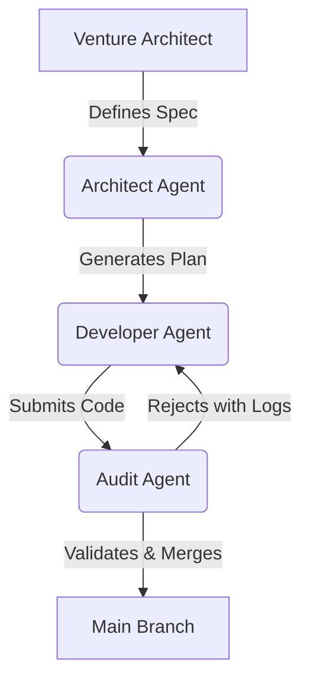

I’ve spent 40+ years watching technology attempt to solve the "productivity" problem. From the first spreadsheets to the current LLM explosion, the pattern is usually the same: we give a single human a more powerful tool and hope they work 10% faster. 

But as we sit here in May 2026, we are hitting the limits of the **Individual Assistant** model. 

The "Assistant" is a productivity booster for a single person. It’s valuable, but it is linear. If you have ten engineers and you give each of them an AI coding assistant, you might get a modest increase in individual code output. However, you haven't solved the core bottleneck of software delivery: the handoffs, the testing gates, the coordination, and the alignment. The real leap—the one that actually changes the trajectory of a business—happens when you move from individual augmentation to **Team Augmentation**.

## The Symmetry of 24/7 Operations

When you augment a human team member with an AI assistant, they get faster at their individual tasks—writing code, summarizing emails, or generating boilerplate. But these assistants exist in silos. They have no concept of what the developer in the next virtual "room" is doing. They don't know that the UI team just changed a CSS class that will break the backend's validation logic.

When you move to an orchestrated agent layer, you create what I call **Exponential Symmetry**.

This isn't about helping individuals work faster; it's about making the *team* operate as a single, cohesive unit that never sleeps. In my 40+ years of engineering leadership, the most successful teams were always the ones with the best **Orchestration**, not just the best individual stars. The same is true for AI.

1. **Seamless Handoffs**: Agents can handle the "scaffolding" between development, QA, and deployment. Instead of a pull request sitting idle because a reviewer is in a different time zone, a specialized "Reviewer Agent" can perform the first 80% of the audit, verifying architectural compliance and running regression suites before the human reviewer even wakes up.
2. **Always-On Quality Pressure**: When the entire team is augmented, the [Quality Gates](./why-ai-poc-failed-production.md) are active 24/7. This creates a constant, automated pressure on the work produced, drastically reducing the "rework tax" that kills high-scale engineering efforts.
3. **Collective Memory**: Unlike a single-session assistant, a team-level agent layer maintains the [State and Context](./ai-agents-statefulness-challenge.md) of the entire project. It indexes the repository, reads the design docs, and cross-references pull requests to ensure that every new line of code aligns with the long-term vision.

## The Failure of the "Oracle" Model

Many organizations are still trying to find the one "Oracle" model—the single LLM that can answer every question and solve every problem. This is a mistake. 

In production, an orchestrated team of specialized agents will consistently out-perform a single model. Why? Because you can give each agent a specific, isolated scope. One agent handles the [Architectural Spec](./beyond-system-prompt-behavioral-guidance.md), another focuses on the [Implementation](./zencoder-leap-to-autonomy.md), and a third is dedicated to the [Audit and Governance](./ai-agent-governance-over-tools.md).

This modular approach mimics the structure of high-performing human teams. It prevents "context drift" and ensures that the model is always focused on the specific constraints of its role. This is the philosophy behind platforms like Kaigents—not to build a better chatbot, but to build a substrate for **Team Augmentation**.

## Orchestration as the Mentor's Lever

If you are a technical leader in 2026, your role is shifting from managing people to governing outcomes. You need to stop asking how AI can help your engineers work faster and start asking how an **Orchestrated Agent Layer** can make your team operate with 24/7 symmetry.

The goal is to automate the *process*, not just the *task*. When the process is automated, the "Automation Dividend" becomes clear: your humans are freed from the bureaucracy of handoffs and status meetings, allowing them to focus on the high-judgment, high-value work that AI still cannot touch.

Individual productivity is a linear gain. Team symmetry is an exponential transformation.

---

*John K. Johansen is a Venture Architect who has spent 40+ years leading engineering transitions from mainframes to autonomous agent teams.*
