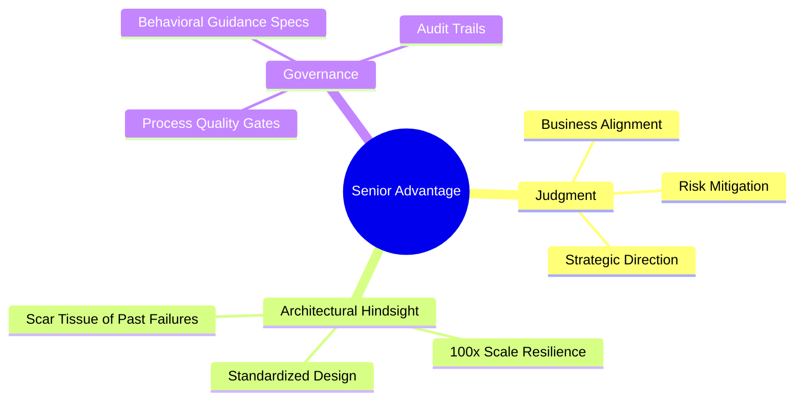

There is a pervasive, almost uniform myth in May 2026 that artificial intelligence is exclusively a "Young Person's Game." 

The popular narrative suggests that twenty-something digital natives who grew up chatting with LLMs will naturally out-prompt, out-pace, and out-compete seasoned industry veterans. We are told that decades of professional experience are now merely "legacy baggage" that slows us down in a hyper-agile, AI-native world.

In my 40+ years of software engineering and leadership, I’ve seen this exact same script written and performed during the PC revolution, the birth of the World Wide Web, and the transition to Mobile/Cloud computing. 

Each time, the industry tries to write off senior professionals. And each time, the same reality asserts itself. 

Standing here today, I can tell you that the prevailing narrative is dead wrong: **AI is the most powerful Career Extender ever built for the senior professional.**

## The Senior's Moat: Deep Context over Raw Syntax

To understand why seniors hold the ultimate advantage in an AI-driven economy, we must realize that AI has commoditized the lowest common denominator of knowledge work: **Execution**. 

AI can write boilerplate code, auto-generate standard unit tests, or compile marketing copies at the speed of light. But because execution is now virtually free, the value of **judgment, context, and oversight** has skyrocketed. 

A senior professional has something a 22-year-old coding assistant user simply cannot possess: **Hindsight and Deep Domain Context**.

Seniors bring three distinct, high-value multipliers to the table that AI cannot replicate:

### 1. Judgment over Pure Logic

An AI model is highly logical, but it has no business context. It can instantly output ten different code architectures or product strategies, but it has no capacity to decide which one matches your specific regulatory landscape, financial constraints, or long-term vision. 

**Judgment** is the senior's superpower. It is the ability to choose between what is "Technically Perfect" and what is "Strategically Right" for the survival of the enterprise.

### 2. Architectural Hindsight and Scar Tissue

A junior engineer looks at a newly generated AI architecture and assumes it is perfect because it runs on their local laptop. 

A senior engineer looks at it and immediately notices the structural bottlenecks that will cause it to crash at 100x production scale. They have the "scar tissue" of previous transitions. They use AI as a high-powered shovel to implement their proven, battle-tested design patterns, rather than treating the AI as an oracle of truth.

### 3. Governance as a Native Skill

The primary bottleneck in AI deployments today is not model intelligence; it is [Management and Governance](./ai-agent-governance-over-tools.md). 

Senior professionals have spent decades managing teams, setting up standard operating procedures, and establishing quality control pipelines. They are naturally suited to write high-fidelity [Behavioral Guidance](./beyond-system-prompt-behavioral-guidance.md) specs that keep autonomous agent teams aligned and productive.

## AI Handles the Drudgery: The Senior as Venture Architect

The true magic of AI for a senior professional is that it completely removes the **Technical Tax of Execution**. 

In the past, if I wanted to design and deploy a complex database refactor, a new API endpoint, or a cloud migration pipeline, I had to spend days writing boilerplate code, or recruit and manage a team of junior developers to do it for me. 

Today, I can direct [Zencoder](./zencoder-leap-to-autonomy.md) to implement a complex refactor or write a full test suite in minutes. Tasks that used to require weeks of coordinate-and-wait management are now executed instantly.

This allows the senior professional to spend 100% of their time on **High-Value Decisions** where their wisdom actually moves the needle. I am no longer bogged down by the mechanics of syntax or bureaucratic coordination. I am operating as a pure **Venture Architect**.

## The Extended Horizon: A Second Act

If you have 30 or 40 years of lived experience in your industry, AI is not your replacement; it is your ultimate multiplier. It allows you to build a highly lucrative [Fractional CTO business](./fractional-cto-value-proposition.md) or launch a specialized, AI-augmented [MindTheStore playbook](./dignified-income-automated-economy.md) with near-zero overhead. 

Your decades of experience are not legacy baggage. They are the premium **Operating System** that the AI agents run on.

Don't retire. Augment. Your judgment has never been more valuable.

---

*John K. Johansen is a Venture Architect who is more productive today than at any other point in his 40+ year career, thanks to the power of autonomous AI augmentation.*
