By January 2026, the dust has started to settle on the great "AI Employment Anxiety" of the mid-2020s. 

For years, the headlines were dominated by a single, terrifying word: *Replacement*. We were told that AI would replace the artist, the writer, the driver, and the customer service agent. The "Gig Economy" was supposed to be the first casualty—a collection of low-skilled roles easily swallowed by a more efficient algorithm.

But a landmark 2026 study by the Boston Consulting Group (BCG) revealed a much more nuanced reality. Their findings showed that while AI is impacting 55% of all roles in the U.S., it is **reshaping** far more jobs than it is replacing. 

The story of 2026 isn't about the jobs that vanished. it's about the jobs that evolved. And for those of us focused on the mission of [MindTheStore.ai](https://github.com/jensjohansen/kaigents), this is where the real work begins.

## The Augmentation Advantage

The BCG study confirmed something we’ve believed since we started building [Kaigents](https://github.com/jensjohansen/kaigents): AI’s greatest value is in **augmentation**, not automation. 

In a replacement model, the goal is to cut the human out of the loop to save 20% in labor costs. In an augmentation model, the goal is to use an AI agent to empower a human to perform at a level 10x higher than they could alone. 

We’ve seen this play out in our "Invisible Office" experiments for local service pros. A handyman or an IT technician isn't replaced by an AI. Instead, they are *augmented* by an AI agent that handles their scheduling, their quoting, and their lead qualification. The human provides the skill and the judgment; the AI handles the administrative friction that used to cap their income.

## Dignified Income: The MindTheStore Vision

The "reshape" narrative is particularly critical for the audiences we care about most: seniors, students, and at-risk workers. 

For a senior with 40 years of domain expertise, AI isn't a threat; it’s a **legacy-enhancer**. It allows them to "Mind the Store" for a boutique e-commerce brand or act as a technical advisor for a startup, with an AI agent handling the technical complexity of Kubernetes, SecOps, and Data Architecture. They provide the judgment and experience—the "human context" that BCG found remains the bottleneck in AI performance—while the AI provides the execution.

This is the path to **Dignified Income**. It’s about building a platform where people aren't forced into "fads" or "low-skill gigs," but are instead empowered to provide real value in a world that desperately needs human judgment.

```mermaid
flowchart LR
    A[Human Experience] --> B{AI Agent Partner}
    B --> C[Higher Value Output]
    B --> D[Reduced Admin Friction]
    C --> E[Dignified Income]
    D --> E
    
    style B fill:#1e1e2e,stroke:#eab308,stroke-width:2px
    style E fill:#1e1e2e,stroke:#10b981,stroke-width:2px
```

## The Risk of the "Automation Trap"

While BCG was right about the potential for reshaping, they also warned about the "Automation Trap." 

Companies that focus exclusively on replacement often find that their quality collapses, their brand equity erodes, and their "efficiency gains" are eaten by the cost of managing the errors of un-monitored AI. They lose the human context that makes a business resilient.

The winners in 2026 are the ones who recognize that AI is a team member, not a substitute. They build systems that keep the human in the loop for the judgment calls and use the AI to clear the path.

## The Bottom Line

The gig economy isn't dying; it’s maturing. The era of the "low-skill task" is ending, replaced by the era of the **AI-Augmented Professional**. 

If you are a business leader today, don't ask "How can I use AI to cut my headcount?" Ask "How can I use AI to empower my people to do 10x more?" The answer to that question is where the real growth is—and it’s where we build a future that is both profitable and dignified.

---

*I’ve spent 40+ years seeing technology reshape our world. Each time, the fear of replacement is loud, but the reality of augmentation is where the progress actually happens. At 65, I'm not looking to retire from the world; I'm looking to use AI to help more people stay in it.*
