By January 2026, the first wave of "AI Contract Regret" has hit the enterprise market. 

Over the past two years, thousands of companies signed "Pilot Agreements" and "Enterprise Licenses" with AI vendors in a desperate attempt to stay competitive. They focused on the seat price, the token limit, and the uptime SLA. 

But they missed the fine print. 

Now, as they try to move those pilots into production—or worse, as they try to pivot to a different provider—they are discovering that their most valuable intellectual property has been quietly "cannibalized" by their vendors.

## The "Training Trap"

The biggest hidden risk in the 2026 AI landscape is what I call the **Training Trap**. 

Most standard AI SaaS contracts include a clause buried in the "Data Usage" section that gives the vendor the right to use "de-identified" or "aggregated" data to "improve the service." In the era of Generative AI, this is a euphemism for training their models on your proprietary context.

- They are learning from your **Prompts**: The way you frame problems is your business strategy.
- They are learning from your **Corrections**: The feedback your engineers give to an AI agent is your "Definition of Done."
- They are learning from your **Derived Insights**: The conclusions the AI reaches using your data become part of the vendor's global intelligence.

By signing these contracts, you aren't just buying a tool. You are paying a competitor to learn your trade secrets.

## The "Model Sovereignty" Gap

The second question nobody asks is: **"Who owns the derived weights?"**

If you use a vendor's platform to fine-tune a model on your specific domain data, who owns that fine-tuned model? In most cases, the vendor owns the infrastructure and the weights. If you decide to leave the platform, you can't "take your intelligence with you." You have to start from scratch.

This is the ultimate form of vendor lock-in. You aren't locked in by your data (which you can export); you are locked in by the *intelligence* that has been distilled from your data.

## The Self-Hosted Moat

This is why, in [Article #4](./self-hosted-ai-2026.md), I argued that the case for self-hosted AI has never been stronger. 

When you run your own AI lab using tools like [Kaigents](https://github.com/jensjohansen/kaigents) and local models like **GPT-OSS 20B**, the IP question disappears. 
1.  **Zero Training Leakage**: Your data and prompts stay on your own silicon (like our AMD mini-PCs). No one is learning from your strategy.
2.  **Total Weight Ownership**: If you fine-tune a model, you own the weights. They are files on your own Rook-Ceph storage. 
3.  **Auditability**: You can prove to your customers and your legal team exactly where their data went.

```mermaid
flowchart TD
    A[Your Data / Process] --> B{SaaS AI Vendor}
    B -->|Training Clause| C[Vendor's Global Intelligence]
    B -->|Proprietary Weights| D[Vendor Lock-in]
    
    E[Your Data / Process] --> F{Self-Hosted AI Lab}
    F -->|Local Inference| G[Private Intelligence]
    F -->|Open Weights| H[IP Sovereignty]
    
    style B fill:#1e1e2e,stroke:#ef4444
    style F fill:#1e1e2e,stroke:#10b981
```

## The Three Questions for Your Legal Team

Before you sign another AI vendor contract this quarter, ask these three questions:

1.  **Do you have the right to use our data (in any form) to train or 'improve' your models?** If the answer is anything other than a firm "No," you are at risk.
2.  **Can we export our fine-tuned weights and prompts in an open format?** If the intelligence is trapped on their platform, you don't own it.
3.  **What is the 'Indemnity Bridge'?** If the model produces an output that violates someone else's IP, who is liable? In 2026, most vendors are still trying to push that risk back onto the customer.

## The Bottom Line

In the agentic era, intelligence is the new oil. Don't sign away your drilling rights just because the setup is easy. 

If you want to protect your business for the next decade, you must prioritize **Model Sovereignty**. Start building your own lab, own your infrastructure, and ensure that the intelligence your business creates remains a private asset, not a public commodity.

---

*40+ years of engineering has taught me that 'Terms of Service' are often 'Terms of Surrender.' In the AI era, don't surrender your intelligence. Build on your own ground.*
