By February 2026, the term "Silicon Sovereignty" has moved from a strategic ambition to a technical reality. As I wrote in [Article #4](./self-hosted-ai-2026.md), the smart money in the enterprise has stopped sending its most valuable intellectual property to the cloud and started bringing its intelligence home.

But the real story of this transition isn't about massive, power-hungry GPU clusters. It’s about a piece of silicon that most people ignored for years: the **AMD Ryzen AI NPU**.

In our self-hosted AI lab, built on a cluster of AMD mini-PCs, the NPU (Neural Processing Unit) has become the workhorse of our production environment. Here is why this "hidden" chip changed everything for the agentic enterprise.

## The iGPU Ceiling vs. the NPU Breakthrough

When we first started experimenting with local LLMs on Kubernetes, we relied on the iGPUs (Integrated GPUs) of our Ryzen chips. It worked, but it was far from ideal. Kubernetes has always struggled with iGPU passthrough—we were often forced to dedicate an entire iGPU to a single container per node. In a six-node cluster, that meant we could only run six concurrent models.

More importantly, the iGPU was always a "contended" resource. It was fighting for memory bandwidth with the CPU and the display output.

The breakthrough came when we unlocked the **NPU**. 

Unlike the GPU, which is a general-purpose parallel processor, the NPU is a specialized engine designed for one thing: the matrix math that drives deep learning. In our early 2026 tests, the combination of **AMD Ryzen AI** hardware and **Lemonade Server** allowed us to offload our inference from the GPU to the NPU with striking results. 

We weren't just running "tiny" models anymore. We were running 20B and 30B models—like **GPT-OSS 20B** and **Qwen3 Coder 30B**—with [Time To First Token (TTFT)](./choosing-on-premises-llms.md) speeds that matched Claude 3.5 and early GPT-5 cloud endpoints.

## Why the NPU is the "Enterprise AI Chip"

In the enterprise, we don't just care about "raw speed." We care about **Efficiency, Density, and Silence**.

1.  **Power Efficiency**: Our NPU-optimized models run at a fraction of the power of a dedicated high-end GPU. We can pack more "Intelligence per Watt" into our Kubernetes nodes, keeping our operational costs near zero.
2.  **Resource Isolation**: Because the NPU is a separate physical engine from the CPU and GPU, we can run our AI agents without stealing cycles from our [HTAP data workloads](./htap-not-a-buzzword.md) or our SecOps scanners. 
3.  **The "Silence" Factor**: An H100 sounds like a jet engine. An AMD mini-PC running a production-grade 30B model on its NPU is nearly silent. You can run an "Enterprise AI Department" in a broom closet or a home office.

```mermaid
flowchart LR
    A[User Request] --> B{AI Orchestrator}
    B -->|High-Frequency Task| C[NPU: GPT-OSS 20B]
    B -->|Coding Task| D[NPU: Qwen3 Coder 30B]
    B -->|Graphics / UI| E[iGPU: Visualization]
    B -->|System Ops| F[CPU: Kubernetes / OS]
    
    style C fill:#1e1e2e,stroke:#eab308,stroke-width:2px
    style D fill:#1e1e2e,stroke:#eab308,stroke-width:2px
```

## The "Hindsight" Insight: Optimization is Everything

If you’re struggling to get performance out of your local hardware, you’re likely making the mistake I made in mid-2025: assuming the tool (Ollama, vLLM) will handle the optimization for you.

On the AMD platform, **optimization is everything**. 

Progress in our lab was slow until I got into the [AMD Developer Program](./choosing-on-premises-llms.md) and found the "hidden" documentation for NPU-specific quantization. We learned that a model isn't just a collection of weights; it’s a workload that must be mapped precisely to the silicon. Using pre-optimized "NPU-ready" versions of the Qwen3 and GPT-OSS families was what finally allowed us to reach production-grade performance.

## The Bottom Line

The era of "GPU Hunger" is being replaced by the era of "NPU Density." 

If you are a startup leader in 2026, don't just look for a cloud credit. Look at the hardware already sitting in your team's laptops and mini-PCs. The AMD Ryzen AI NPU isn't just a "consumer feature"; it is the foundation of a resilient, private, and low-cost enterprise AI infrastructure. 

Stop renting your intelligence. Unlock the silicon you already own.

---

*40+ years of engineering has taught me that the most powerful tools are often the ones you already have. In the agentic era, that tool is the NPU. If you're building for 'Silicon Sovereignty,' start with the chip that's hiding in plain sight.*
