If you’ve spent any time in the AI agent world, you’ve heard the term "System Prompt." It’s the block of text you give to an LLM to tell it who it is and what it should do. In the early days of 2023 and 2024, "System Prompts" were treated as magic spells—get the words exactly right, and the agent behaves.

By February 2026, we’ve moved past that magical thinking. In production-grade systems like [Kaigents](https://github.com/jensjohansen/kaigents), we no longer talk about system prompts as the primary way to control an agent. Instead, we talk about **Behavioral Guidance**.

This isn't just a semantic change. It is a fundamental shift in how we manage the "intelligence" in our systems.

## The Mentorship Parallel

I’ve spent 40+ years managing and mentoring engineering teams. I’ve often been described as a leader who "gives enough freedom to his team members to come up with creative solutions" while providing "proper direction." 

When you manage a junior human engineer, you don't give them a 5,000-word "System Prompt" every morning and expect them to follow it perfectly. If you did, they would either burn out or stop thinking. 

Instead, you provide **Direction** and **Guardrails**. You explain the business context, the quality standards (your "Definition of Done"), and the escalation path. You give them the *freedom* to solve the problem, but within a governed *framework*.

**Behavioral Guidance is the digital equivalent of that framework.**

## The Technical vs. The Governance Artifact

The distinction between a System Prompt and Behavioral Guidance is the difference between **Code** and **Policy**.

- **System Prompt**: A technical artifact, usually a hidden string in an API call or a config file. It’s "how the machine works." It’s brittle, difficult to version, and hard for a non-technical business owner to audit.
- **Behavioral Guidance**: A governance artifact. In Kaigents, this is a versioned, Markdown-based document that describes the agent's "Job Description." It includes:
    1.  **The Objective**: What the agent is trying to achieve.
    2.  **The Constraints**: What the agent is *not* allowed to do (e.g., "Never contact a supplier directly without human review").
    3.  **The Decision Logic**: How the agent should choose between Path A and Path B.
    4.  **The Escalation Criteria**: When the agent should stop and ask for [Human-in-the-Loop](./human-in-the-loop-design-feature.md) guidance.

```mermaid
flowchart TD
    A[Business Stakeholder] -->|Approves| B{Behavioral Guidance}
    B -->|Versioned / Audited| C[Agent Execution Plane]
    C -->|Uses| D[LLM / Tools]
    D -->|Feedback| B
    
    style B fill:#1e1e2e,stroke:#eab308,stroke-width:2px
    style C fill:#1e1e2e,stroke:#3b82f6,stroke-width:2px
```

## Why This Shift Matters for ROI

The reason so many AI projects fail in production is that they rely on "Prompt Engineering" to solve management problems. They try to "word" the agent into being more accurate, rather than **governing** the agent into being more compliant.

When you use Behavioral Guidance as a first-class citizen:
1.  **Auditability**: Your compliance team can read the guidance and sign off on it. They can’t do that with a JSON system prompt.
2.  **Iterative Improvement**: When an agent makes a mistake, you don't "fix the prompt." You **adjust the guidance**. You treat it as a management intervention, not a bug fix.
3.  **Consistency**: You can apply the same "Corporate Governance" guidance to 1,000 different agents, ensuring they all speak with the same brand voice and follow the same security protocols.

## The Bottom Line

Stop being a "Prompt Engineer." Start being an **Agent Manager**. 

Treat your autonomous systems with the same discipline you apply to your human teams. Define the "Future State" of their behavior through versioned, audited guidance. It’s the only way to build an AI strategy that is as smart as your business and as resilient as your career.

---

*40+ years of engineering has taught me that the best systems are the ones that are easiest to manage. In the agentic era, management is your ultimate competitive moat. Don't prompt your way into a mess. Govern your way into a scale-up.*
