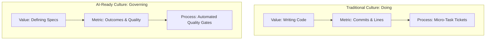

Most engineering managers in May 2026 are still trying to "sprinkle AI" on top of their existing workflows. They purchase a few thousand copilot licenses, distribute them to their developers, and expect a linear 20% to 30% boost in feature delivery. 

But simply giving a developer a faster shovel does not change the layout of the foundation you are digging.

To truly leverage the exponential leverage of autonomous AI, you have to build an **AI-Ready Engineering Culture**. 

This requires a fundamental, psychological shift in how you define the job of a software engineer: moving from a 20th-century culture of "Doing" to a 21st-century culture of **Governing Outcomes**.

In my 40+ years of leading engineering departments, from bare-metal mainframe teams to distributed remote startups, I’ve learned that changing technology is relatively easy. You buy the hardware, install the software, and run the training session. 

Changing culture, however, is the hardest thing a technical leader will ever do. It requires dismantling deep-seated beliefs about what constitutes "valuable work" and rebuilding the team's identity from the ground up.

To transition your team into an AI-ready posture, you must establish these three core cultural pillars:

## 1. Documentation as the Primary Engineering Asset

In a traditional engineering culture, documentation is treated as bureaucratic overhead. It is the boring chore that developers half-heartedly draft *after* the code has already been written and merged. 

In an AI-ready culture, writing high-fidelity **[Behavioral Guidance](./beyond-system-prompt-behavioral-guidance.md)** is the primary, most valuable task of a senior engineer.

Documentation is no longer merely "for other humans to read"; it is the literal **API** that your [orchestrated agent teams](./ai-agent-teams-vs-individual-assistants.md) run on. If your architectural intentions, edge-case definitions, and business boundaries are not written down with extreme clarity and precision, your autonomous agents cannot execute them. 

The most valuable engineer of this era is not the one who can write the most syntax, but the one who can express complex business logic in clear, structured, and unambiguous prose. An AI-ready culture is a culture of **Professional Technical Writing**.

## 2. Trust is a Quality Gate, Not a Tenure Privilege

In a traditional company, "trust" is a soft, tenure-based privilege. Senior engineers are trusted to bypass certain checks because they "know the system," while junior developers are micromanaged. 

In an AI-augmented team, trust is completely objective. It is defined as a series of automated **[Quality Gates](./why-ai-poc-failed-production.md)**.

You must build a culture where everyone—both human engineers and autonomous agents—is subject to the exact same rigorous, automated [Audit Trails](./ai-agent-governance-over-tools.md). Peer review does not disappear; it moves "Up the Stack." 

Humans stop wasting valuable mental energy reviewing syntax spacing, variable naming, and import alignments. We let autonomous agents handle the mechanical linting and test coverage verification, freeing human engineers to focus 100% of their review cycles on high-level **Architectural Alignment and Strategy**.

## 3. The "Venture Architect" Mindset

In a traditional development shop, engineers view themselves as "ticket-implementers." They take a JIRA card, write the code that satisfies the prompt, submit the PR, and move to the next card. They have very little connection to the economic reality of the business.

An AI-ready team is composed of **Venture Architects**. Every engineer views themselves as a manager of resources. 

They understand that the goal of their job is not to "write more code"—which actually increases technical debt and system complexity—but to **deliver maximum business value with the absolute minimum amount of code**. 

They design [scalable, high-availability systems](./zero-dollar-infrastructure-stack.md) using modular, reusable patterns, using AI agents as high-speed execution engines to implement those patterns with near-zero overhead.

## The Management Challenge

The transition to an AI-ready engineering culture is not a passive process. It requires active, disciplined, and courageous leadership. You must stop managing daily tasks and start **governing outcomes**. 

If you continue to measure your developers by the number of commits they submit or the hours they spend at their desks, you will build a bloated, fragile house of cards. But if you reward clarity of thought, automated quality enforcement, and strategic leverage, you will build an unstoppable, always-on engineering engine.

---

*I help engineering leaders transform their teams into AI-ready organizations that can deliver enterprise-grade results at startup speed.*
