By January 2026, the local LLM scene had become a victim of its own success. Every week, a new model family—Mistral, Phi, Llama, DeepSeek, Qwen—would drop a new variant. For the enterprise CTO trying to build a self-hosted AI lab, this led to a specific kind of "choice paralysis." 

You could easily lose a week just benchmarking models that were already obsolete by Friday.

I spent most of 2025 in that experimentation cycle. I’ve tested nearly every major open-source family. If you're looking to cut through the noise and build a production-grade local stack on AMD hardware, here is exactly what we learned.

## The "Ollama Era" and the iGPU Ceiling

In the early days of our Kubernetes cluster, we relied heavily on **Ollama**. It was (and is) a fantastic tool for getting models running quickly on consumer hardware. We ran our models on the iGPUs of our AMD mini-PCs.

But we hit a ceiling. Because of the way Kubernetes handles iGPU passthrough, we were forced to dedicate the iGPU to only one container per node. With a six-node cluster, we were limited to six concurrent models. We could run Llama 3 for early agent experiments, but it never felt quite right—it lacked the speed and "reasoning depth" of the cloud models we were trying to replace.

The breakthrough came when we moved beyond Ollama and onto **Lemonade Server**. 

Lemonade allowed us to break through the iGPU ceiling. Suddenly, we were able to run much larger 20B and 30B models across our nodes with significant improvements in **Time To First Token (TTFT)** and **Tokens Per Second (TPS)**. The hardware didn't change, but the orchestration did.

## The Winning Stack: January 2026 Edition

After months of rework and "learning the domain space" the hard way, we settled on a three-tier model stack that finally matched (and sometimes beat) the performance of Claude 3.5 Sonnet and GPT-4o for our specific workloads.

### 1. The Reasoning Engine: GPT OSS 20b
For general-purpose reasoning, we stopped worrying about token efficiency and started prioritizing "depth." Reasoning-heavy models beat out non-reasoning variants hands-down when you aren't paying by the token. GPT OSS 20b became our default for complex task planning and behavioral guidance.

### 2. The Coding Powerhouse: Qwen3 Coder 30b A3B Instruct
For coding, the Qwen3 family is the clear winner in early 2026. The 30b A3B Instruct model, running on Lemonade, provides a level of autonomous coding capability that allows tools like [Zencoder](https://github.com/jensjohansen/kaigents) to execute multi-file refactors with minimal human intervention.

### 3. The RAG Stack: QDrant + BGE + Qwen3 4b
Retrieval Augmented Generation (RAG) is only as good as its retrieval. We moved away from "all-in-one" solutions and built a specialized stack:
- **Vector Store**: QDrant
- **Reranking**: BGE Reranker
- **Embeddings**: Qwen3 4b Embedding model

```mermaid
flowchart TD
    A[User Request] --> B{Reasoning Engine\nGPT OSS 20b}
    B --> C[Coding Task]
    B --> D[Information Search]
    C --> E[Qwen3 Coder 30b]
    D --> F[RAG Stack\nQDrant/BGE/Qwen3 4b]
    E --> G[Output]
    F --> G
    
    style B fill:#1e1e2e,stroke:#eab308
    style E fill:#1e1e2e,stroke:#eab308
    style F fill:#1e1e2e,stroke:#eab308
```

## The "AMD Secret" and the Documentation Trap

If there is one piece of advice I can give to anyone starting this journey: **don't trust the public documentation.**

One of the biggest hurdles we faced wasn't the technology—it was the obfuscation. AMD, for reasons known only to them, tends to hide their best AI work from the general public. Public-facing docs on how to optimize self-hosted models for Ryzen AI hardware are notoriously unreliable and often outdated.

Progress was slow until I joined the **AMD Developer Program**. Only after gaining access to restricted documentation—documents clearly not meant for general consumption—did we finally understand how to unlock the true potential of the NPUs and GPUs on our nodes. 

If you are struggling to get performance out of your AMD-based AI lab, stop searching Google. Get into the developer program. The real answers are behind the curtain.

## Summary: Stop Benchmarking, Start Building

If you want to stop losing weeks to model selection, here is the January 2026 shortcut:
1.  Move from Ollama to a more robust orchestrator like **Lemonade Server** once you hit the iGPU limit.
2.  Standardize on **GPT OSS 20b** for reasoning and **Qwen3 Coder 30b** for code.
3.  Invest in a dedicated RAG stack (BGE/QDrant) rather than relying on the LLM's raw context window.
4.  Get your hands on the *real* hardware documentation.

The transition from "AI experiment" to "AI department" happens the moment you stop treating the LLM as a magic black box and start treating it as a governed part of your infrastructure.

---

*40+ years in engineering have taught me that documentation is often a marketing artifact, not a technical one. In the AI era, that's more true than ever. If you want to move fast, find the people who are actually running the hardware in production.*
