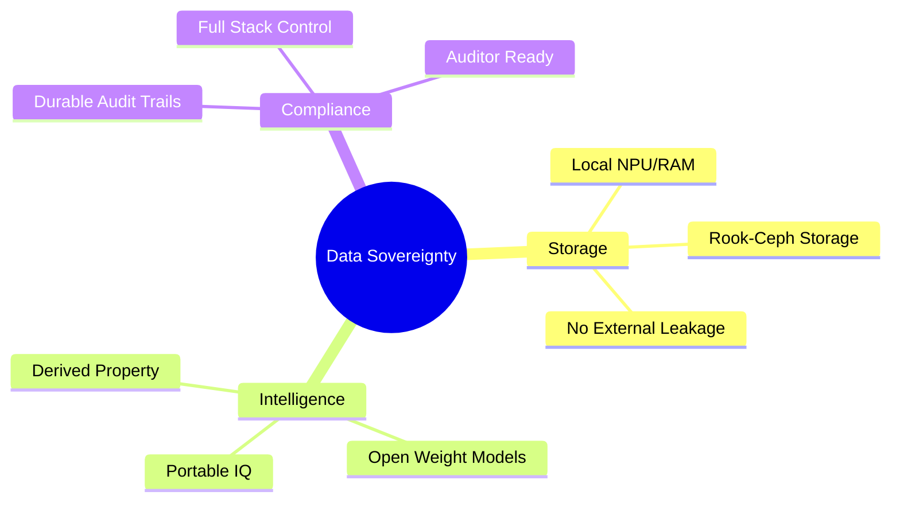

By February 2026, the term "Data Sovereignty" has moved beyond its origins in geography and into the realm of **Intelligence Ownership**. 

In [Article #19](./ai-vendor-contracts-ip-protection.md), I discussed the "Training Trap"—the hidden clause in most AI SaaS contracts that allows vendors to learn from your business strategy. But the problem goes deeper than just training. It’s about the very definition of "Control."

If you are a startup leader or an enterprise CTO, your legal team is likely still operating on the 2020 playbook: *"As long as the data is stored in the U.S. and we have a BAA, we are safe."*

**In the agentic era, that playbook is dangerously incomplete.** Here is what your legal team actually needs to know about AI data sovereignty in 2026.

## 1. The "Derived Intelligence" Leakage

Traditional data sovereignty is about where the "Bytes" live. But in AI, the value isn't in the bytes; it’s in the **Derived Intelligence**. 

Every time an autonomous agent processes your proprietary data, it creates a trail of reasoning, a set of weights, and a collection of "hidden" insights. If that processing happens in a vendor's cloud, those insights often become the vendor's property—even if the raw data is technically "deleted" after the session.

Your legal team must ensure that your contracts explicitly define **Derived Intelligence** as your property. In our [self-hosted AI lab](./self-hosted-ai-2026.md), this problem is solved by default. Because the reasoning happens on our own [AMD mini-PCs](./amd-ryzen-ai-npu-enterprise-chip.md), the "Intelligence" never leaves our four walls.

## 2. Model Sovereignty vs. Vendor Lock-in

"Model Sovereignty" is the right to take your intelligence with you. 

Most AI platforms today are "Black Boxes." You feed them data, they get smarter, and you pay a subscription fee. If you decide to leave, you can export your raw data, but you lose the "Custom IQ" you’ve built over months of fine-tuning and feedback.

Legal teams need to look for **Open Weight Guarantees**. We standardize on models like **GPT-OSS 20B** and **Qwen3 Coder 30B** specifically because we own the weights. If we move from our local lab to a private VPC, we take the exact same "IQ" with us. No one can shut off our intelligence.

## 3. The Auditability of the "Black Box"

Regulated industries (Fintech, Healthtech, Govtech) have a strict requirement for **Explicability**. You must be able to prove *why* a system made a specific decision.

If you are using a third-party API, you are relying on the vendor's word. If you are running an autonomous system on [Kaigents](https://github.com/jensjohansen/kaigents) in your own lab, you have the [Durable Audit Trail](./ai-agent-observability.md). You own the full stack of reasoning, from the raw prompt to the final tool call. That is the "Compliance Shield" that satisfies auditors for GDPR, HIPAA, and SOC 2.

## The "Hindsight" Insight: Sovereignty as a Valuation Asset

I’ve spent 40+ years seeing how technical debt can kill a valuation. In 2026, the biggest liability on a startup's balance sheet is "Intelligence Debt"—the dependency on a proprietary model that the company doesn't own or control.

When a potential acquirer looks at your business, they will ask: *"If the AI vendor triples their price tomorrow, or gets acquired by a competitor, does this business still exist?"* 

If the answer is "No," your valuation collapses. If you can prove **Silicon Sovereignty**, your business is an asset, not a lease.

## The Bottom Line

Data sovereignty is no longer a legal "checkbox." It is a strategic mandate. 

If you aren't building for sovereignty today, you are building on rented land. Get your legal team in the room, show them the [self-hosted alternatives](./running-llms-locally-2026.md), and start bringing your intelligence home.

---

*40+ years of engineering has taught me that the person who owns the foundation owns the house. In the agentic era, that foundation is your intelligence stack. Don't sign it away.*
