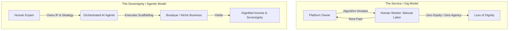

The most dangerous aspect of the artificial intelligence transition in May 2026 is not the loss of corporate payroll checks—it is the systemic loss of human **Dignity**.

In my 40+ years of software engineering and leadership, I’ve managed and observed multiple sweeping waves of automation. Each time the technology leap occurs, the exact same industrial pattern repeats: we focus obsessively on the "efficiency" of the machine and the reduction of corporate overhead, while completely ignoring the "sovereignty" of the displaced human workers.

When a highly skilled, mid-career professional or senior practitioner is told that their accumulated knowledge is suddenly obsolete, and they are forced into the gig economy to perform manual, algorithmically dictated labor (such as driving for rideshare platforms or packing warehouse boxes), they have not merely lost a stable paycheck. They have lost their sense of contribution, their agency, and their professional dignity.

Dignity is not a luxury. It is a fundamental human need. And true dignity requires more than simple economic subsistence or UBI checks—it requires the active, valued exercise of **Human Judgment and Domain Expertise.**

## Defining Dignified Income

Dignified Income is not a wage paid by an employer who holds all the leverage. It is income generated when a human being acts as the **Governor of an Outcome**, augmented and supported by an autonomous AI substrate. It is about moving from being a replaceable cog in a massive corporate machine to being the sovereign **Architect of a Venture**.

To build a future of dignified work in an automated economy, we must design our technical platforms and startup strategies around these three core insights:

### 1. Sovereignty over Service

Traditional gig work platforms (such as Uber, DoorDash, or Upwork) operate on a service model. The human is a servant to a proprietary algorithm that they have zero control over, providing raw manual or intellectual labor while the platform captures the real enterprise value. 

In contrast, **Dignified Income** is built on a sovereignty model. The human worker owns the core [Intellectual Property](./air-gapped-ai-ultimate-control.md) and the underlying [Tech Stack](./zero-dollar-infrastructure-stack.md). They utilize AI agents as their personal digital employees, allowing them to capture 100% of the value they generate.

### 2. The Automation Dividend as a Personal Toolkit

We must proactively use the massive [productivity gains of AI](./the-automation-dividend.md) to lower the technical barrier to entry for independent business ownership. 

If an [orchestrated agent team](./ai-agent-teams-vs-individual-assistants.md) can autonomously handle the complex, expensive "scaffolding" of an enterprise—the code base, the inventory databases, the marketing schedules, and the API plumbing—then a single individual with deep domain knowledge can successfully own and operate an enterprise that previously required a staff of ten. The agent team acts as a force multiplier for their individual judgment.

### 3. Restoration over Displacement

The primary, non-negotiable mission of **MindTheStore.ai** is to restore professional dignity by providing the operational playbooks and substrates for this new sovereign model. 

We don't build AI to help massive retailers replace their checkout clerks. Instead, we help a displaced local retailer or a retired boutique owner pivot from a failing dropshipping business model to a highly profitable, AI-augmented e-commerce store. 

They aren't "using AI" to do a job for someone else; they are using AI to **own their future, protect their IP, and build a lasting legacy**.

## The Future of Work

The goal of technological progress in May 2026 should absolutely not be to protect the static, low-agency "jobs" of the past. 

Rather, it should be to build the sovereign, dignified **incomes** of the future. 

By giving every displaced worker, senior professional, and aspiring builder access to their own "Venture Architect" agentic toolkit, we ensure that the transition to an automated economy is not a "Great Displacement" of human labor, but the "Great Restoration" of human sovereignty and dignity.

---

*I founded MindTheStore.ai to build the platform for dignified, AI-augmented income. Join us.*
