If you’ve been following my recent articles on the [e-commerce clobbering](./temu-playbook-collapse.md) of 2026, you know that the "middleman" model is officially obsolete. But knowing that the model is dead is different from knowing how to build the one that replaces it.

At [Kairon Retail](https://github.com/jensjohansen/kaigents), we’ve codified our "Renovation" workflow into a practical playbook. This is the exact process we use to help distressed store owners move from low-margin resellers to resilient, boutique brands. 

Here is the 2026 Transition Playbook.

## Stage 1: The "Validate-Then-Brand" Phase (Days 1-14)

The biggest mistake of the 2024 era was committing to a "private label" order before the market was proven. In 2026, we use a hybrid approach to minimize risk.

1.  **Autonomous Sourcing**: We deploy AI agents to scrape global trade data and identify 3-5 alternative manufacturers in tariff-neutral regions (e.g., Vietnam, Mexico, or domestic U.S.). 
2.  **The "Shadow" Dropship**: We use the identified manufacturers to set up a small-scale dropshipping test. We don't worry about margins yet; we are testing **Product Market Fit** and **Shipping Reliability**.
3.  **Data Analysis**: Our agents monitor the conversion rates and customer feedback. If the product "clicks," we move to Stage 2. If it doesn't, we pivot the sourcing agent to a new niche within 48 hours.

## Stage 2: The "Creative Regeneration" Phase (Days 15-30)

Once a product is validated, you must move from "factory generic" to "boutique premium." You cannot win in a high-tariff world without a brand that justifies a price premium.

1.  **Lifestyle Image Pipeline**: We use our hybrid NPU/Cloud AI pipeline (Z-Image-Turbo) to regenerate all product visuals. We move from white-background factory shots to high-end lifestyle imagery that resonates with a specific, local audience.
2.  **Voice Standardization**: AI agents rewrite every customer touchpoint—emails, product descriptions, social ads—to speak with a unified, "Boutique" brand voice.
3.  **Packaging Design**: We work with our new near-shore manufacturers to implement custom, sustainable packaging that enhances the "unboxing" experience. This is the moment the customer stops seeing a "commodity" and starts seeing a "brand."

## Stage 3: The "Operational Stewardship" Phase (Day 31+)

The pivot isn't a one-time event; it’s a new way of working. To prevent the entrepreneur from burning out, we delegate the "administrative friction" to autonomous agents.

1.  **Inventory Stewardship**: Our agents monitor sales velocity and trigger restocking orders from our near-shore partners, managing the complex customs paperwork automatically.
2.  **Inquiry Triage**: 90% of customer inquiries are handled by agents grounded in our brand voice and order data. Only the complex "Judgment" calls reach the human owner.
3.  **Flash-Pivot Monitoring**: The agents continuously scan the market for new tariff threats or competitor moves, allowing the store to pivot its sourcing or its messaging in real-time.

```mermaid
flowchart TD
    subgraph Validate [Stage 1: Validate]
        A[Sourcing Agents] --> B[Shadow Dropship]
        B --> C{Market Fit?}
    end
    
    subgraph Brand [Stage 2: Brand]
        C -->|Yes| D[Creative Pipeline]
        D --> E[Boutique Identity]
    end
    
    subgraph Scale [Stage 3: Scale]
        E --> F[Operational Agents]
        F --> G[Durable Revenue]
    end
    
    C -->|No| A
    
    style C fill:#1e1e2e,stroke:#eab308,stroke-width:2px
    style G fill:#1e1e2e,stroke:#10b981,stroke-width:2px
```

## The "Hindsight" Insight: From Exhaustion to Exit

Many of the entrepreneurs we work with are "clobbered" not just by the market, but by the sheer volume of manual work required to keep a store alive.

The value of this playbook isn't just in the margins; it’s in the **Exit Potential**. A dropshipping store is a job. A branded, AI-augmented boutique is an **Asset**. By building a business that runs on [Durable Execution](./durable-execution-ai-agents.md) and [Governed AI](./ai-agent-governance-over-tools.md), you are creating something that a serial entrepreneur can buy and scale.

## The Bottom Line

If your store is currently "distressed," don't look for a cheaper way to do the old thing. Use the tools of 2026 to do a new thing. 

Follow the playbook: Validate fast, brand deep, and scale with agents. It’s the only way to move from "Middleman" to "Owner."

---

*40+ years of engineering has taught me that a good process is more valuable than a good product. This playbook is our 'Science of Business Process Optimization' for the e-commerce era. If you're ready to renovate, the blueprint is right here.*
