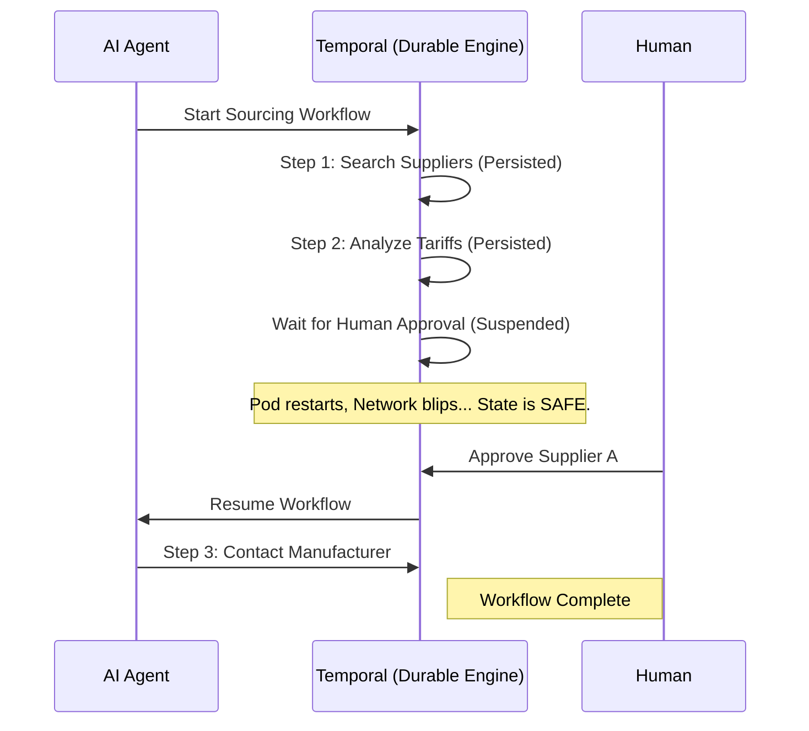

By January 2026, we’ve moved past the "Single-Prompt Chat" era. We are now in the era of multi-step, multi-agent workflows. 

An agent might spend three hours researching a competitor, two days waiting for a human to approve a sourcing pivot, and another four hours regenerating a product catalog. These aren't just "functions"; they are **long-running business processes**.

The problem is that the traditional ways we build software are remarkably bad at handling these processes. In a standard microservices architecture, if a service restarts, or an API times out, or a network blips, the state of the process is often lost. You have to write complex "retry" logic, manage "idempotency" keys, and pray that you don't end up with a corrupted state.

This is where **Durable Execution** changes everything.

## The Flaky Reality of AI

AI is non-deterministic. A model might give you a perfect answer 95% of the time, and a 404 error or a hallucination the other 5%. Your agents are calling external tools that might be rate-limited. They are running on Kubernetes clusters where pods can be rescheduled at any moment.

If your agent is in the middle of a 10-step workflow and the system crashes at step 7, what happens? 

In most platforms, the agent just "dies." The state is gone. The work is lost. You have to start over from step 1, wasting tokens and time.

This is why we built [Kaigents](https://github.com/jensjohansen/kaigents) on top of **Temporal**.

## What is Durable Execution?

Durable execution (and specifically Temporal) ensures that your workflow state is persisted automatically. If your infrastructure fails, your workflow doesn't. When the system comes back up, the workflow resumes *exactly where it left off*. 

For an AI agent, this means:
1.  **Infinite Retries**: If a model API is down, the agent just waits and tries again later, without losing its progress.
2.  **State Persistence**: Every tool call, every reasoning step, and every intermediate variable is saved. 
3.  **Time Travel**: You can look back at any point in the workflow's history to see exactly what the agent was "thinking" before a failure.

## The Human-in-the-Loop Problem

One of the biggest hurdles in autonomous AI is the "Human-in-the-Loop" (HITL) gate. 

A [Kairon Retail](./temu-playbook-collapse.md) sourcing agent might find three potential suppliers and then... stop. It needs a human to review the tariff estimates and choose a winner. This might take five minutes, or it might take five days.

Without durable execution, managing this pause is a nightmare. You have to save the state to a database, build a mechanism to "wake up" the agent later, and ensure that the agent still has its original context when it resumes.

With Temporal, the agent literally just "sleeps." The workflow stays in a suspended state for as long as necessary. When the human clicks "Approve," the agent picks up its context and continues to the next step as if no time had passed.

## Why Workflows Should Never Die

In 40+ years of engineering, I’ve seen enough "silent failures" to last a lifetime. In the agentic era, these failures aren't just annoying; they are expensive and dangerous.

If an agent is managing your supply chain or your customer support, it **cannot** just disappear. It must be as durable as the business processes it is automating. Durable execution isn't a "feature" of an AI platform; it is the foundation.

In early 2026, the distinction is clear: The "Scripted Agents" are for demos. The "Durable Agents" are for production.

## The Bottom Line

If you are building an AI agent team, don't ask how many models it can talk to. Ask what happens when the power goes out in the middle of a task. If the answer isn't "it resumes exactly where it left off," you aren't building for the enterprise.

Stop writing retry logic. Embrace durable execution. Make sure your workflows never die.

---

*I’ve spent 40+ years chasing bugs that were really just state-management failures. Durable execution is the first time in my career I’ve felt like the tools finally caught up with the problem. If you're building with Kaigents, you're building for the long haul.*
