By February 15, 2026, the mid-winter reports for the e-commerce sector are in. The news is as violent as we predicted in [Article #9](./tariffs-and-ecommerce-impact.md). The suspension of the *de minimis* $800 duty-free threshold has triggered a bankruptcy wave among small resellers who relied on direct-from-China low-margin shipping.

But amidst the wreckage, there is a pattern of survival. 

At [Kairon Retail](https://github.com/jensjohansen/kaigents), we’ve been tracking a cohort of "Renovated" stores—businesses that saw the wall coming in 2025 and pivoted. Here are the three things the survivors did differently.

## 1. They Pivoted from Volume to Curation

The most common mistake of the failing stores was trying to "fight the factory." They attempted to lower their margins even further to absorb the new 25% tariffs. It was a race to the bottom that they couldn't win, especially as the manufacturers themselves integrated vertically.

The survivors took a different path: **Boutique Curation**. 

They used AI agents to analyze their customer data and identify the 20% of products that drove 80% of their brand affinity. They cut the generic "noise" and doubled down on high-margin, unique items. Instead of being a storefront for a factory in Guangzhou, they became a "Curated Voice" for a specific lifestyle.

## 2. They Decoupled from the "China Wall"

Survivors moved their supply chains before the tariffs became a crisis. They didn't just look for "cheaper" factories; they looked for **Geographic Resilience**.

Using autonomous sourcing agents, they identified manufacturers in **Vietnam, Mexico, and India**—regions with trade agreements that bypassed the Section 301 tariffs. 

- **Near-Shoring**: The smartest players moved their high-turnover inventory to warehouses in Mexico or Canada, utilizing local AI agents to manage the complex cross-border logistics and "Last-Mile" delivery coordination.
- **Validate-Then-Brand**: They used a "Hybrid" model. They tested new product ideas via dropshipping from tariff-neutral regions, and only once a product was validated did they move to a private-label "Boutique" order.

## 3. They Invested in "Creative Sovereignty"

If your product looks like everyone else's, you have to compete on price. If your product looks unique, you can compete on **Value**.

The surviving stores used AI-powered creative pipelines to regenerate their entire visual identity. They moved away from factory-supplied stock photos and into custom, AI-generated lifestyle imagery that placed their products in the context of their specific target audience.

By owning their creative process—what I call **Creative Sovereignty**—they built brand equity that justified a 40-50% price premium. That premium is what allowed them to absorb the new costs of doing business in 2026.

```mermaid
graph TD
    A[Distressed Store] --> B{The Great Pivot}
    B --> C[Step 1: Curate the Catalog]
    B --> D[Step 2: Source Resiliently]
    B --> E[Step 3: Own the Creative]
    C --> F[Boutique Brand]
    D --> F
    E --> F
    F --> G[ROI & Survival]
    
    style B fill:#1e1e2e,stroke:#eab308,stroke-width:2px
    style G fill:#1e1e2e,stroke:#10b981,stroke-width:2px
```

## The "Hindsight" Insight: Speed to Pivot

I’ve seen dozens of industry "clobberings" in 40+ years. The winners are never the ones with the biggest budgets; they are the ones with the highest **Speed to Pivot**.

In 2026, that speed is enabled by AI. The stores that survived were those that could use an AI team to find a new supplier in 48 hours, regenerate a product catalog in 4 hours, and update their multi-channel listings in minutes. They used [Kaigents](https://github.com/jensjohansen/kaigents) not as a cost-cutting tool, but as a **Survival Accelerator**.

## The Bottom Line

The era of the "Lazy Dropshipper" is over. The era of the **AI-Augmented Curator** has begun.

If you are a store owner today, the wall is already here. You cannot wait for the tariffs to go away. You have to renovate. Pivot to curation, source for resilience, and own your creative. It’s the only way to "Mind the Store" in a high-friction world.

---

*I’ve spent 40+ years seeing markets shift and trade routes change. This isn't just a retail crisis; it's a technical evolution. If you're willing to embrace the pivot, the opportunities have never been greater.*
