On January 23, 2026, Elastic officially reached General Availability for their Agent Builder. For many in the enterprise space, this was the moment "Retrieval" finally became a first-class citizen in the agentic stack.

Elastic’s pitch was clear: build context-driven agents that can handle messy, unstructured enterprise data. But while the marketing focus was on the ease of building, the technical significance lies in how we think about "Context" itself.

If you’ve spent 40+ years in this industry, you know that the most expensive mistake you can make is using a complex tool to solve a simple problem. 

## The Static vs. Dynamic Divide

I often tell my clients: **There is no reason to use an AI agent to automate a static process.**

If your business process follows a fixed, predictable set of steps with known inputs and outputs, you should use normal procedural automation. It is cheaper, it is faster, and it scales without the "hallucination tax." Procedural code—the kind we’ve been writing since the mainframe days—is the best governor for a static world.

But the world isn't always static.

An AI agent, or "intelligent automation," is only justified when the process is **dynamic**. When the environment changes, when the inputs are unpredictable, or when the "best" path forward hasn't been written into a script yet. 

This is where the agent moves from "executor" to "discoverer."

## The "Discovery" Engine

For a process to be dynamic, an agent needs to do three things that procedural code cannot:
1.  **Discover** the different patterns or paths available to solve the problem.
2.  **Choose** the most effective pattern based on the current context.
3.  **Evaluate** the result to determine if it needs to iterate or fail over to a different approach.

This "Discovery" phase is where Search (and specifically Elastic's approach) becomes the central nervous system of the agent. An agent is only as smart as the data it can find. If it can't "search" your enterprise context—your messy PDFs, your slack threads, your historical Jira tickets—it can't discover the patterns it needs to act autonomously.

```mermaid
flowchart TD
    A[Dynamic Task Arrives] --> B[Search / Discovery]
    B -->|Finds Patterns| C{Evaluate Context}
    C -->|Choose Path A| D[Execute Action]
    C -->|Choose Path B| E[Execute Action]
    D --> F{Evaluate Result}
    E --> F
    F -->|Success| G[Task Complete]
    F -->|Fail| B
    
    style B fill:#1e1e2e,stroke:#eab308,stroke-width:2px
```

## What Elastic Got Right

What Elastic understood—and what their Agent Builder GA solidifies—is that the "Agent" is really just a sophisticated interface for a search engine. 

By making "Context Engineering" a native part of the builder, they recognized that the value isn't in the LLM's raw intelligence; it’s in the LLM's ability to navigate a massive, messy search index and pull out the specific "Discovery" points it needs to make a decision.

In early 2026, the term "Enterprise Context" has moved beyond being a synonym for "RAG." It now means providing the agent with the **Reasoning Substrate** it needs to handle dynamic tasks.

## The Bottom Line for CTOs

If you are evaluating AI agent platforms this quarter, don't ask how many models they support. Ask how they handle **Discovery**. 

- Can the agent find the "hidden" knowledge in your unstructured data? 
- Can it evaluate which historical pattern is most relevant to the current failure? 
- Does it have the search depth to pivot when its first approach fails?

If your process is static, write a script. If it’s dynamic, build an agent—but build it on top of a search engine that can actually find what it needs to win.

---

*40+ years of engineering has taught me that discovery is the hardest part of any job. We’ve finally reached the point where we can delegate that discovery to our tools. But only if we give them the right map.*
