In [Article #6](./htap-not-a-buzzword.md), I made the case that HTAP (Hybrid Transactional/Analytical Processing) is the pattern that separates successful scale-ups from funding failures. But to truly unlock the power of HTAP, you need a specific way of thinking about your data.

You need to stop thinking in "Tables" and start thinking in **Events**.

By February 2026, the most resilient data architectures are built on the combination of **Event Sourcing** and **HTAP**. This isn't just a technical preference; it’s a business strategy that I first saw used to great effect during my time at DevFactory. 

Here is why this combination is the "Holy Grail" for the agentic enterprise.

## The Problem: The "Stale Table" Trap

Most applications are built on a "Current State" model. If a customer changes their address, you overwrite the `address` field in the `users` table. The old address is gone. 

If you want to know *why* they changed their address, or *how often* they’ve moved, you’re out of luck. You have to add "audit logging" as a sidecar, which almost always drifts from the truth.

In an AI-driven world, this "Current State" model is a liability. Your autonomous agents need to know the **History of Intent**. They need to see the sequence of decisions that led to a specific state to avoid the [Read Replica Trap](./read-replica-trap.md) and to understand the context of a failure.

## The Solution: Event Sourcing

In an Event Sourcing architecture, you don't store the "Current State." Instead, you store every single event that has ever happened to your system as an immutable, append-only log.

- **Event 1**: User A registered.
- **Event 2**: User A added a product to their cart.
- **Event 3**: User A changed their shipping preference.

To get the "Current State," you simply "replay" the events. The log is the **Single Source of Truth**. Everything else—the dashboards, the user profile, the search index—is just a "view" derived from that log.

## The HTAP Force Multiplier

The magic happens when you land those events into an HTAP-ready format like **Apache Iceberg** on S3-compatible storage.

Because the events are landing in real-time, your query engine (like **Trino**) can analyze them as they happen. You don't need a separate ETL pipeline to "move" data to a warehouse. The events are already where they need to be.

At DevFactory, this allowed us to ingest **millions of business events per hour** and report on them in real-time. We skipped the "Batch ETL" step entirely. 

```mermaid
flowchart LR
    A[Business App] -->|Commit| B{Event Store\nApache Iceberg}
    B -->|Real-time View| C[Transactional State]
    B -->|Real-time View| D[Analytical Insights\nTrino]
    B -->|Real-time View| E[AI Agent Context]
    
    style B fill:#1e1e2e,stroke:#eab308,stroke-width:2px
```

## Why This Matters for AI Agents

For an autonomous AI agent, this pattern combination provides three critical advantages:

1.  **Immediacy**: The agent can "see" the result of its own actions (and others) the millisecond they are committed to the event log. No waiting for eventual consistency.
2.  **Explainability**: When an agent makes a decision, it can query the event history to see exactly what happened before. The [Audit Trail](./ai-agent-observability.md) isn't a separate document; it's the core data structure.
3.  **Low TCO**: By using open-source tools (Iceberg, Trino, MinIO), we can run this petabyte-scale architecture for nearly zero marginal cost on our own [AMD mini-PC cluster](./zero-dollar-infrastructure-stack.md).

## The Bottom Line

Event Sourcing and HTAP aren't "academic" concepts for high-frequency traders anymore. They are the building blocks of a modern, agent-ready business.

If you are starting a new project in 2026, don't start with a "Users Table." Start with an **Event Log**. Land it in an open, HTAP-ready format. It is the only way to ensure that your business stays transparent, auditable, and ready for the scale that is coming.

---

*I’ve spent 40+ years seeing data architectures grow increasingly complex. The move toward unified, event-driven HTAP is a return to simplicity. It's the most robust way to build a future-proof business.*
