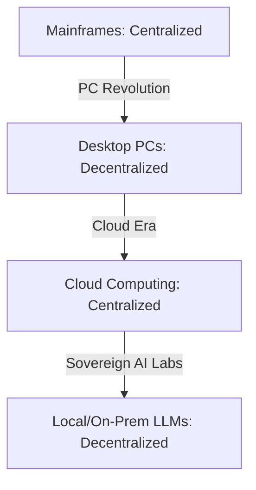

By May 2026, the artificial intelligence agent revolution has officially moved from a series of high-interest technology demos to a daily, running operational reality. We’ve witnessed the GA releases of massive enterprise platforms, the rapid collapse of the traditional dropshipping model, and the emergence of a fierce, self-hosted drive toward "Silicon Sovereignty." 

Standing at this particular intersection of history, I find myself looking back as often as I look forward.

I’ve spent 40+ years in the software engineering trenches. I’ve lived through the transition from IBM Mainframes to the personal computer (PC) revolution, from local PCs to the World Wide Web, from the Web to the Mobile/Cloud era, and now, from the Cloud to the Agentic Era. 

Each time the pendulum swings, the marketing narrative is exactly the same: *"Everything you know is now completely obsolete. The old rules no longer apply. The machine is the new master."*

And each time, the technical reality is exactly the same: **the technology changes, but the human constants are the only things that scale.**

## The Lessons of the Pendulum: Centralized vs. Decentralized

In my career, I’ve watched the database and compute architectures swing back and forth like a giant, slow-moving pendulum.

When I was earning my [IBM certifications](./ibm-bets-on-governance.md) in the mainframe era, we were taught that the system was only as reliable as the rigid governance, strict processes, and central control surrounding it. 

When the PC revolution arrived, the young disruptors of the era claimed that "personal" computing would eliminate the need for such restrictive, bureaucratic controls. 

They were wrong. We simply traded centralized mainframe stability for decentralized desktop chaos—and then spent the next twenty years painstakingly rebuilding the governance, security, and backup layers for the enterprise PC world.

When we moved to the Web, we were told that browser-based agility and rapid deployment cycles would replace the need for disciplined, slow-moving software engineering. We were wrong again. 

We quickly discovered that a bug in a web application could negatively affect millions of global users in a fraction of a second, requiring *more* engineering discipline, automated testing, and release gates, not less.

Now, as we move into the era of autonomous AI agents, the cry is once again for "unconstrained, autonomous intelligence." We are told that the AI is so smart it can manage, debug, and scale itself.

**The machine is wrong. The human constants are the only truth.**

## The Three Constants of 40+ Years

If I could sit down with a young CTO or founder in 2026 and share the three fundamental truths that have remained absolutely unbroken through every single technological transition I’ve lived, they would be these:

### 1. Process is the Ultimate Governor

A brilliant individual engineer can build an incredibly impressive, viral weekend demo. But only a repeatable, disciplined process can build a sustainable, billion-dollar business. 

Whether you are managing a team of human assembly developers in 1985 or orchestrating a fleet of autonomous AI agents in 2026, the [Management Process](./ai-agent-governance-over-tools.md)—the requirements documents, the API specifications, the automated quality gates—is the only thing that prevents the system from collapsing under the weight of its own technical debt.

### 2. Trust is Earned Solely via Observability

You cannot manage, secure, or scale what you cannot see. The [Observability Wall](./ai-agent-observability.md) is the final, make-or-break hurdle of every technology transition. 

In 1990, it was parsing raw local log files. In 2010, it was distributed tracing across microservices. In 2026, it is the agentic audit trail. 

If you do not have absolute visibility into every reasoning step and tool invocation of your systems, you do not have a system; you have an unpredictable, dangerous liability.

### 3. Technology is for Empowerment, Not Replacement

The most successful technological transitions I’ve led—whether it was fixing a highly complex [Salesforce implementation](./slackbot-as-personal-agent.md) at Green Dot, migrating acquired startups at Devfactory, or building a secure, local [AI lab](./self-hosted-ai-2026.md) for enterprise automation—succeeded because they focused on **empowerment**. 

They did not seek to replace the human element; they used the new technology to remove friction, automate mechanical drudgery, and make the humans in the loop ten times more effective. They restored dignity and strategic focus to the work.

## Looking Forward

I am not a luddite. I am currently running my own AI-powered business, collaborating daily with autonomous agent teams to write, audit, and deploy code. I believe the transition to the agentic era is the most profound, exciting, and high-leverage shift of my entire career.

But I am also a pragmatist. I know that the "magic" and novelty of AI will eventually fade, leaving us with the same fundamental engineering challenges we have always had: reliability, security, cost efficiency, and human impact.

My mission is to share the hindsight of these 40+ years to help the next generation of technical leaders avoid the same traps we fell into during the PC, Web, and Cloud eras. Don't fall in love with the temporary magic of the technology. Fall in love with the enduring discipline of engineering.

The machines have arrived, but the human constants are still the ones in charge.

---

*I’ve spent 40+ years learning how to build things that last. If you're building an AI strategy today, don't just build for next week. Build for the next decade. The technology will change, but the principles of good leadership and sound engineering never do.*
