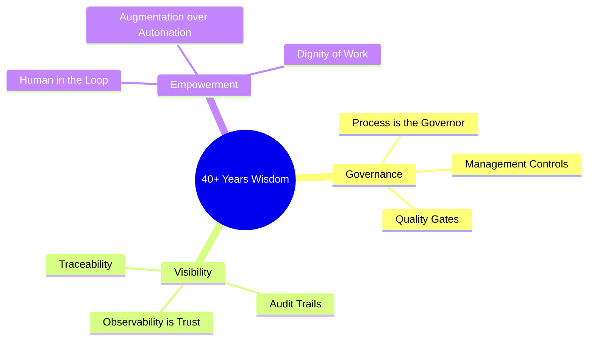

By the final day of January 2026, the AI agent revolution has moved from "impending" to "operational." We’ve seen the GA releases of enterprise platforms, the collapse of the dropshipping e-commerce model, and the emergence of self-hosted "Silicon Sovereignty." 

At 65, standing at this particular intersection of history, I find myself looking back as often as I look forward. 

I’ve spent 40+ years in the software engineering trenches. I’ve lived through the transition from IBM Mainframes to the PC revolution, from the PC to the World Wide Web, from the Web to the Mobile/Cloud era, and now, from the Cloud to the Agentic Era. 

Each time the pendulum swings, the narrative is the same: *"Everything you know is now obsolete. The old rules no longer apply. The machine is the new master."*

And each time, the reality is the same: **The technology changes, but the human constants are the only things that scale.**

## The Lessons of the Pendulum

When I was getting my [IBM certifications](./ibm-bets-on-governance.md) in the mainframe era, we were taught that the system was only as reliable as the governance around it. When the PC revolution arrived, we were told that "personal" computing would eliminate the need for such rigid controls. 

We were wrong. We just traded centralized mainframe governance for decentralized chaos, and then spent twenty years rebuilding the governance layer for the enterprise PC world.

When we moved to the Web, we were told that "browser-based" agility would replace the need for disciplined software engineering. We were wrong again. We just discovered that a bug in a web app could hit a million people in a second, requiring *more* discipline, not less.

Now, as we move into the era of autonomous AI agents, the cry is for "unconstrained intelligence." We are told that the agent is so smart it can manage itself.

**The machine is wrong. The human constant is the only truth.**

## The Three Constants of 40+ Years

If I could sit down with a young CTO in 2026 and share the three things that have remained true through every transition I’ve lived, they would be these:

### 1. Process is the Governor
A brilliant engineer can build a cool demo. A repeatable process can build a billion-dollar business. Whether you are managing a team of human engineers in 1985 or a team of AI agents in 2026, the [Management Process](./ai-agent-governance-over-tools.md)—the PRDs, the technical designs, the quality gates—is the only thing that prevents the system from collapsing under its own weight.

### 2. Trust is Earned via Observability
You cannot manage what you cannot see. The [Observability Wall](./ai-agent-observability.md) is the final hurdle of every technology transition. In 1990, it was log files. In 2010, it was distributed tracing. In 2026, it is the agentic audit trail. If you don't have visibility into the reasoning steps of your system, you don't have a system; you have a liability.

### 3. Technology is for Empowerment, not Replacement
The most successful transitions I’ve led—whether it was fixing a [Salesforce implementation](./slackbot-as-personal-agent.md) at Green Dot or building an [AI lab](./self-hosted-ai-2026.md) for Link Labs—succeeded because they focused on **empowerment**. They used the new technology to make the humans in the loop 10x more effective. They restored dignity to the work by removing the friction.

## Looking Forward from 65

I am not a luddite. I am currently running my own AI-powered business on [Kaigents](https://github.com/jensjohansen/kaigents), collaborating daily with an autonomous agent. I believe this transition is the most profound one of my career.

But I am also a pragmatist. I know that the "magic" of AI will eventually fade, leaving us with the same engineering challenges we’ve always had: reliability, security, cost, and human impact.

At 65, my mission is to share the "hindsight" of these 40+ years to help the next generation avoid the same traps we fell into during the PC and Web eras. Don't fall in love with the magic. Fall in love with the discipline. 

The machines have arrived, but the human constants are still the ones in charge.

---

*I’ve spent 40+ years learning how to build things that last. If you're building an AI strategy today, don't just build for next week. Build for the next decade. The technology will change, but the principles of good leadership and sound engineering never do.*
