If you’ve ever found yourself saying, *"I just need to log in to the server and tweak one config setting,"* you are building technical debt that will eventually bankrupt your agility.

In my 40+ years of engineering, I’ve seen hundreds of projects fail not because of a bad model or a slow database, but because of **Snowflake Servers**. These are systems where the "true" state of the infrastructure exists only in the memory of the person who manually configured it. 

In early 2026, for a two-person team managing a production [Three-Node Cluster](./three-node-k8s-minimum-viable-production.md), the "Manual Tweak" is a luxury we can't afford. That’s why we’ve embraced **GitOps**.

## The Core Concept: Git as the Governor

GitOps is a simple but profound idea: Your Git repository is the only "Source of Truth" for your infrastructure. 

You don't "run a command" to deploy a new version of [Kaigents](https://github.com/jensjohansen/kaigents). You don't "click a button" to open a firewall port. Instead, you describe the **Desired State** of your system in a YAML file, commit it to Git, and push.

A background process (an "operator") watches that repository. If the actual state of your cluster doesn't match the desired state in Git, the operator automatically fixes it.

- **Human changes Git** -> Cluster updates to match.
- **Hardware failure changes Cluster** -> Cluster self-heals back to Git's definition.

## Infrastructure as Code (without the overhead)

For small teams, the "overhead" of GitOps used to be the complex setup of tools like ArgoCD or Flux. But in 2026, the ecosystem has matured. 

We use a "Shoestring GitOps" stack that runs natively on our local [AMD mini-PCs](./amd-ryzen-ai-npu-enterprise-chip.md):
1.  **Repository: Gitea**: Our self-hosted, lightweight Git server. No cloud data leakage.
2.  **Operator: Flux**: A tiny, set-it-and-forget-it agent that runs in our K8s cluster and syncs our manifests.
3.  **Secrets: Sealed Secrets**: We keep our encrypted passwords and API keys right in the Git repo, safe and versioned.

Everything—from the [MetalLB](./open-source-ai-landscape-2026.md) network configuration to the specific quantization parameters for our [GPT-OSS models](./running-llms-locally-2026.md)—is a line of code in our Git repository.

```mermaid
flowchart LR
    A[Human / AI Team] -->|Commit & Push| B[Git Repo: Gitea]
    B -->|Notify| C{Flux Operator}
    C -->|Pull & Sync| D[K8s Cluster]
    D -->|Drift Detected| C
    
    style B fill:#1e1e2e,stroke:#eab308,stroke-width:2px
    style C fill:#1e1e2e,stroke:#3b82f6,stroke-width:2px
```

## The "Turnaround" Value: Disaster Recovery in Minutes

The true test of an engineering process isn't when things are going well. it's when everything is on fire.

Last month, we had a major power surge in the lab. Two of our three nodes were corrupted at the OS level. In a traditional "manual" setup, this would have been a week of rework—re-installing packages, re-configuring networks, trying to remember what version of the coding proxy we were running.

With GitOps, it was a non-event. 
1.  We re-flashed the OS on the mini-PCs (10 minutes).
2.  We re-joined them to the cluster (5 minutes).
3.  We pointed Flux at our Gitea repo.

**Five minutes later, the entire production stack was back to its exact state from before the surge.** That is the ROI of GitOps.

## The Bottom Line

GitOps isn't "extra work" for small teams; it is the **Great Simplifier**. 

It eliminates the "snowflake" problem, provides a built-in audit trail for every change, and makes disaster recovery a boring, 15-minute task. If you want to move fast in the agentic era, stop logging into servers. Start committing to Git.

---

*40+ years of engineering has taught me that your memory is your worst enemy in a crisis. Don't trust yourself to 'remember' how a system is configured. Trust the code in your Git repo. It's the only truth that survives the fire.*
