If you look at the technical debt of a struggling Series A startup, you will almost always find a "data wall." 

On one side, they have a transactional database (Postgres or MySQL) keeping the lights on. On the other, they have a bloated data warehouse (Redshift or Snowflake) where data goes to die, or at least to be queried twelve hours after it actually mattered. The bridge between them is a brittle, expensive ETL pipeline that breaks once a week.

When people talk about HTAP (Hybrid Transactional/Analytical Processing), they often treat it as a high-end niche for high-frequency trading. But in 2026, HTAP is simply the design pattern that allows a startup to survive.

## The Crossover Insight: Renovating the $1M Startup

My eye-opener on this topic came during my time at DevFactory, the engineering arm of Crossover for Work. My job was a specific kind of technical triage: we would buy startups with roughly $1M in annual revenue that had failed to close their next funding round. 

We had a repeatable process: analyze the tech, identify the failing design patterns, and substitute the "AWS equivalent" implementations to make the company profitable in three months and scalable in six. 

One of the companies we acquired had implemented their own real-time analytics engine using an HTAP approach. Before analyzing their martech stack, I would have sworn that real-time analytics at petabyte scale was impossible for a company of that size. I assumed you needed massive pre-aggregation, complex OLAP cubes, and a team of data engineers just to keep the lights on.

I was wrong. Using S3 and Athena, we were able to ingest and report on millions of business events per hour in real time. We skipped the pre-aggregation. We skipped the Redshift costs. We went straight from event to insight.

## The "Modern Data Stack" vs. The HTAP Reality

For years, the industry pushed a "Modern Data Stack" that was essentially a collection of expensive silos. You were told you needed one tool for ingestion, one for storage, one for transformation, and one for visualization. 

By January 2026, that architecture is a liability. 

The HTAP pattern collapses those silos. It recognizes that the distinction between "transactional" and "analytical" data is often artificial. In a well-designed system, your business events are your analytics. 

At DevFactory, we realized that if you treat your data as a continuous stream of events landing in an open format, the "reporting" is just a query away. You don't need to move the data; you just need to query it where it lives.

```mermaid
flowchart LR
    A[Business Events] --> B[S3-Compatible Storage]
    B --> C{Open Format\nApache Iceberg}
    C --> D[Transactional Apps]
    C --> E[Real-time Analytics\nTrino]
    
    style C fill:#1e1e2e,stroke:#eab308,stroke-width:2px
```

## Building the 2026 Startup Data Lake

Today, I apply those same lessons to the startups I advise, but with a focus on lowering the Total Cost of Ownership (TCO) even further. 

We no longer start with proprietary cloud services. We build data lakes using **open-source S3-compatible storage** (like MinIO or Ceph) combined with **Apache Iceberg** table formats and **Trino** as the query engine.

- **Apache Iceberg** gives us the enterprise-grade table features (schema evolution, time travel, atomic transactions) on top of cheap object storage.
- **Trino** gives us the "Athena experience"—the ability to run high-performance SQL across petabytes of data—without the cloud lock-in.

This is what I call "Enterprise Infrastructure on a Shoestring." It’s an architecture that can be run in a self-hosted AI lab (like our [Kaigents](https://github.com/jensjohansen/kaigents) environment) for almost zero marginal cost. 

When the startup's revenue justifies it, the risk profile can be improved by migrating to enterprise-class support or managed cloud versions of these same tools. But the *pattern* stays the same. You never hit the "data wall."

## The Decision You're Already Living With

Every time you choose a database, you're making an HTAP decision. You're deciding how much friction you're willing to tolerate between an event happening and an insight being generated.

If you’re still thinking in terms of "Batch ETL," you’re building a business that operates on yesterday's news. If you embrace the HTAP pattern—open formats, decoupled compute and storage, and real-time query engines—you’re building a business that can react as fast as its customers do.

HTAP isn't a buzzword. It's the difference between a startup that scales and a startup that needs a renovation.

---

*I’ve spent 40+ years seeing data silos rise and fall. The current shift toward open, unified data formats is the most significant change I've seen in a decade. If you aren't architecting for HTAP today, you're building technical debt for tomorrow.*
