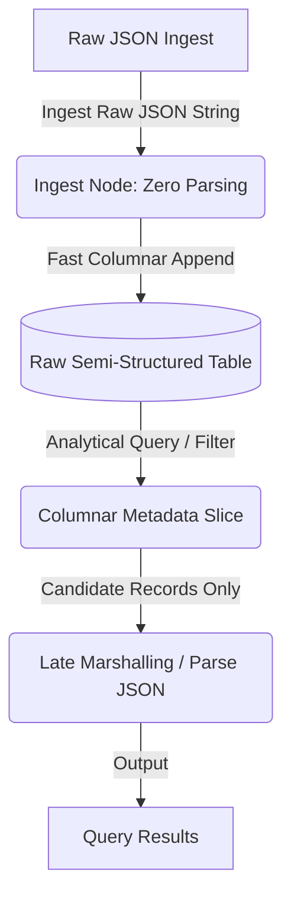

I’ve spent 40+ years optimizing data systems, from the era of carefully indexed relational tables in Db2 to the current world of petabyte-scale stream processing. Over those decades, I’ve learned a painful truth: the most "technically correct" architectural design—the one that looks beautiful on a whiteboard and satisfies every purist's desire for normal forms—is often the very one that kills your performance at scale.

Hybrid Transactional/Analytical Processing (HTAP) is the "Holy Grail" of 2026. The promise is simple and incredibly compelling: use a single database system for both your high-speed writes (OLTP) and your complex analytical queries (OLAP). No more fragile ETL pipelines, no more multi-hour sync delays, and no more managing separate, complex database engines for your live application and your reporting dashboard.

It’s a genuine leap forward. But there’s a trap that many senior database architects are still falling into: **The Rigid Schema-on-Write Dogma.**

## The Computational Tax of Early Marshalling

The traditional "Strict Schema" approach—where every database field is predefined, typed, and every incoming write is strictly validated and marshalled against a rigid relational structure—was designed for a different era. It was designed when storage was extremely expensive and the physical layout of bytes on a disk platter was the ultimate bottleneck. Relational normalization allowed us to compress data and avoid redundant storage.

In May 2026, storage is a commodity. The physical bottleneck is **Compute.**

When you force a strictly structured schema early in your data pipeline, you are forcing your system to pay what I call the **Marshalling Tax** across every single incoming record. You are parsing, validating, converting, and serializing data at the edge of your system—often before you even know if you will ever need that data. Across millions of transactional writes and trillions of events, this tax is not just a rounding error; it is a massive, CPU-hogging bottleneck that drives up your infrastructure bills and grounds your ingestion rates to a halt.

## Insights for a Scalable HTAP Strategy

If you want to build a data stack that scales on a "shoestring budget," you have to rethink your relationship with database schemas. The key is to shift from schema-on-write to late-binding schema-on-read. Here are three insights from the trenches:

### 1. Marshall Late, Marshall Less

The real performance win in HTAP environments (using modern engines like ClickHouse, DuckDB, or DuckDB-powered micro-architectures) comes from **limiting the marshalling and unmarshalling of JSON documents** until the last possible moment. 

Storing raw or semi-structured JSON directly in a column allows you to ingest at wire speed. When data arrives, you write it to disk as a raw blob. You pay absolutely zero CPU cycles for validation or schema alignment at ingestion time. You only pay the computational cost of "slicing and dicing" and unmarshalling *after* you’ve filtered the candidate records. 

### 2. Schema-on-Read as a Performance Feature

In a high-scale HTAP environment, a rigid schema-on-write is a major operational liability. It creates **Schema Drift**—where minor changes in upstream APIs or agentic tool outputs break your database ingestion pipelines. 

By embracing **Schema-on-Read**, you maintain absolute flexibility of your data structures. When an upstream service adds a new field or alters a payload, the database doesn't crash; it simply appends the raw payload. You use efficient columnar storage to index the structural metadata, allowing you to parse the fields dynamically within your analytical queries only when those fields are requested.

### 3. The Power of Semi-Structured Slicing

Traditional search engines parse the entire JSON document to find a single nested value. In a modern HTAP database, you can use columnar filters and pre-indexed metadata paths to narrow your candidate set from a trillion records down to the ten thousand you actually need. 

*Then*, and only then, do you unmarshall those ten thousand records. By postponing the JSON parsing until after the candidate dataset has been isolated, you reduce the computational load of your queries by orders of magnitude. This "Late-Binding" approach is how you handle trillions of records on a single node without a multi-million-dollar infrastructure bill.

## The Venture Architect's Perspective

Stricter is not better. In high-scale data architecture, **Flexibility is the prerequisite for Performance.** 

If you design your systems with the rigid assumptions of the 1990s, you will spend your entire budget on CPU cycles dedicated to validating and marshalling data that will never be read. HTAP is the future, but only if you stop letting your schemas kill your scale. Don't fall in love with the rigidity of the past; embrace the efficiency of late-binding logic.

---

*John K. Johansen is a Venture Architect who has spent 40+ years optimizing high-scale data systems, from mainframes to autonomous AgOps architectures.*
