By February 2026, the phrase "Full Autonomy" has become a double-edged sword in the enterprise. 

We’ve seen the demos of agents that can run for days without human intervention. We’ve seen the pitch decks promising a "$0 Labor" future. But we’ve also seen the "Ghost Loops," the hallucinated compliance violations, and the silent failures that occur when an agent encounter a scenario that wasn't in its training data.

The mistake many organizations made in 2025 was treating the human as a limitation to be eliminated. In 2026, we’ve realized that **Human-in-the-Loop (HITL) is actually your most important design feature.**

## The "Turnaround Master" Perspective

I’ve spent 40+ years in technical turnarounds. My headline on LinkedIn for years has been "Technology turnaround and upscale master." When I go into a distressed company—whether it’s a $1M startup that failed its funding round or a legacy enterprise that can't scale—the first thing I look at isn't the code. it's the **Decision Matrix**.

A "clobbered" business usually has one of two problems: either humans are making too many low-value decisions (causing a bottleneck), or no one is making the high-value decisions (causing a drift).

AI agents are perfect for the low-value, high-frequency decisions. But they are a liability for the high-value, low-frequency ones. 

The goal of a successful AI transition isn't to remove the human; it's to **realign** the human. You use the agents to shrink the process and the tech stack, freeing your human team to focus on what I call the "Future State"—the strategic judgment and the complex edge cases that define your competitive moat.

## HITL as a Governance Gate

In our [Kaigents](https://github.com/jensjohansen/kaigents) platform, we treat HITL not as an "interruption," but as a **Quality Gate**. 

Consider a sourcing agent in our [Kairon Retail](./temu-playbook-collapse.md) workflow. It can find 50 suppliers, analyze their tariff profiles, and rank them by cost. That’s a low-value, high-effort task. But the final decision to sign a contract with a new partner in Mexico vs. Vietnam? That requires a level of contextual judgment—understanding geopolitical risk, relationship history, and long-term brand alignment—that no LLM can fully replicate in 2026.

By designing an explicit "Human Approval" step into the [Durable Workflow](./durable-execution-ai-agents.md), we get the best of both worlds: the speed of agentic discovery and the security of human governance.

```mermaid
flowchart LR
    A[Agentic Discovery] --> B[Pattern Analysis]
    B --> C{HITL Quality Gate}
    C -->|Reject| D[Agentic Rework]
    C -->|Approve| E[Production Action]
    D --> B
    
    style C fill:#1e1e2e,stroke:#eab308,stroke-width:2px
```

## The "Master of the Future State"

One of the most rewarding recommendations I ever received came from a CIO who noted that I was "one of the few people that I could rely on to explore our 'future state'." 

In an AI-driven world, your human team members must become the masters of the "Future State." They shouldn't be "babysitting" the agents; they should be defining the **Behavioral Guidance** that tells the agents how to behave in the future. They should be reviewing the audit trails to spot the 1% of decisions that weren't quite right and adjusting the "science of business process optimization" to fix them.

## The Bottom Line

If your AI agents are failing in production, don't look for a better model. Look for a better loop. 

Stop trying to build a system that *replaces* your best people. Build a system that *amplifies* them. Place the human in the loop at the points of maximum leverage—governance, judgment, and strategy. That’s not a limitation. That’s the design feature that turns a cool demo into a resilient, profitable business.

---

*40+ years of engineering has taught me that the most successful systems are the ones that respect the human at the center. In 2026, that's more true than ever. If you're building for the future, build for the partnership.*
