By mid-January 2026, the AI news cycle had stabilized into a predictable pattern. Every Tuesday, a new open-weight model would claim a 3% improvement in coding benchmarks. Every Thursday, a startup would announce a "revolutionary" wrapper around a public API. But the announcement that actually mattered for the Fortune 500 came from a much older source.

IBM, in partnership with e&, unveiled a suite of "Enterprise-Grade Agentic AI" specifically designed to transform governance and compliance. 

To a lot of younger engineers, "governance" sounds like a synonym for "slowing down." It sounds like committees, red tape, and the death of innovation. But if you’ve been in this industry as long as I have, you know that the exact opposite is true. Governance isn't the brake; it's the reason a high-performance car can safely drive at 200 mph.

## The Longevity of the Governor

My introduction to the concept of governance wasn't in a lecture hall or a cloud-native workshop. It was during my IBM certifications in Systems Engineering for their mainframe lines. 

Back then, the stakes were different but the principles were the same. If you were managing an IBM 3090 or a later zSeries, you weren't just "running code." You were maintaining the central nervous system of a global business. You learned quickly that "moving fast and breaking things" was a recipe for catastrophe.

IBM has survived and thrived for over a century not just because they built good hardware, but because they understood the *science of business process optimization*. They recognized early on that human error is the only constant in engineering. The solution isn't to hope for smarter humans; the solution is to build repeatable, governed processes that make success the default outcome.

When I look at IBM’s current strategy with watsonx.governance and their recent Agentic AI announcements, I see that same mainframe-era DNA. While everyone else was racing to build the most "creative" model, IBM bet that the enterprise would eventually care more about *accountability* than creativity.

## Why 2026 Is the Year of the Governor

In 2024 and 2025, the industry was obsessed with "Agentic Reasoning." Can the agent use a tool? Can it plan a trip? Can it write a function?

By 2026, the question changed. Now the question is: **"Who is responsible when the agent makes a mistake?"**

IBM’s bet was that the "Governor"—the layer that sits above the AI, monitoring its tool calls, checking its outputs against compliance rules, and managing its risk profile—is more valuable to a bank or a healthcare provider than the underlying model. 

They realized that in a world where models are becoming commodities (with Llama, Mistral, and Qwen matching or beating proprietary models), the value isn't in the *engine*. The value is in the *management layer*.

```mermaid
flowchart LR
    A[Raw AI Model] --> B{Governance Layer}
    B -->|Passed| C[Production Action]
    B -->|Flagged| D[Human-in-the-Loop]
    B -->|Blocked| E[Audit Trail / Alert]
    
    style B fill:#1e1e2e,stroke:#eab308,stroke-width:2px
```

## Governance as an Accelerator

The great irony of 2026 is that the companies moving the fastest with AI are the ones with the strictest governance.

If you don't have a governor, every new AI agent you deploy is a new security risk and a new compliance headache. You have to move slowly because you’re terrified of what might happen if the agent goes off the rails.

But if you have a platform that handles behavioral guidance, quality gates, and audit trails natively—like what IBM is building, and what we’ve aimed for with [Kaigents](https://github.com/jensjohansen/kaigents)—you can deploy with confidence. You can move faster because you know the safety net is already in place.

## The Lesson for the Rest of Us

Most engineers only learn the basics: that repeatable processes reduce error. That’s "Governance 101." 

But "Governance 401"—the level IBM has operated at for decades—is realizing that governance is a business strategy. It is the mechanism by which you turn a high-risk innovation into a low-risk commodity. It is how you scale a team of 10 to a team of 1,000 without the quality collapsing.

IBM's bet on governance in 2026 isn't just a product launch; it's a reminder of a timeless truth in engineering: The systems that last are the systems that are managed. 

As we move deeper into the era of autonomous agents, don't just look for the fastest model. Look for the best governor. That’s where the longevity is.

---

*I’ve spent 40+ years seeing technical fads come and go. The things that stick are the things that solve for management and reliability. If you're building an AI strategy for a startup or an enterprise, don't skip the governance layer. It's the only way to reach the finish line.*
