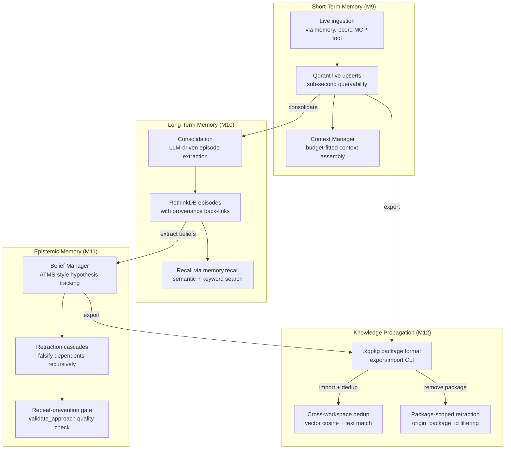

Back in February I wrote about why [stateless agents fail at real work](./ai-agent-memory-statelessness-failure.md). The thesis was simple: an agent that forgets everything when its session ends is just an expensive script. You wouldn't hire an employee who lost all memory at 5 PM every day. Why would you deploy an AI agent that does the same thing?

At the time, Kaigents had a basic two-plane memory architecture: Temporal for task state, Qdrant for contextual retrieval. It was enough to prove the concept. But after six months of running agents in production on our [on-premise AMD K8s cluster](./sovereign-stack-private-ai-kubernetes-amd.md), I realized that "memory" is not one thing. It is at least four things, and they are as different from each other as your working memory is from your ability to learn from your mistakes.

So we built all four. The code is on [GitHub](https://github.com/jensjohansen/kaigents), and this article is a guided tour of what is there and why.

---

## Why "Add Memory" Is the Wrong Instruction

The first instinct of most agent platforms is to bolt a vector database onto the side of an LLM and call it "memory." This is roughly equivalent to handing someone a filing cabinet and calling it a brain. The filing cabinet is useful, but it is not what makes you intelligent.

Human memory is not a single system. Cognitive science has identified at least four distinct memory systems, each serving a different purpose, each with its own acquisition mechanism, retention profile, and failure mode:

1. **Working memory** — the active buffer where you hold information you are using right now. Small, fast, constantly overwritten.
2. **Episodic memory** — your autobiographical record of what happened, when, and in what context. Consolidated from experience, recalled with effort.
3. **Epistemic memory** — your belief system, including what you have learned is true, what you have learned is false, and the dependency chains between your beliefs. This is what lets you say "I tried that approach last time and it failed, so let me try something different."
4. **Knowledge transfer** — not a memory system per se, but the mechanism by which one person's accumulated experience becomes another person's starting point. Teaching, mentoring, writing things down.

When you give an agent "a vector database," you are giving it a crude approximation of episodic memory with none of the other three. The agent can retrieve similar past contexts, but it cannot hold a working buffer, it cannot distinguish hypothesis from outcome, and it cannot teach another agent what it learned.

Kaigents now has all four. Here is how each one maps to its human counterpart and how we built it.

---

## Tier 1: Short-Term Memory — The Working Buffer

### The Human Analog

Your working memory holds the handful of items you are actively manipulating right now. You are reading this sentence, and your working memory is holding the subject of the previous sentence so the pronoun "your" makes sense. It is small (roughly 4-7 items), fast, and constantly being overwritten as you shift attention.

When you are in a meeting and someone says "the supplier in Shenzhen quoted $3.20 per unit," your working memory holds that fact for the duration of the conversation. You do not need to "search" for it — it is just there, available to your reasoning process in milliseconds.

### What We Built

Kaigents' short-term memory is the **Live Case File**. When an agent is working on a task, every piece of information that arrives during that work request — documents, messages, tool results, user corrections — is streamed into a [Qdrant](https://qdrant.tech) vector collection with LSM-style live upserts. The material is queryable within sub-seconds. No re-indexing, no batch job, no "wait while we process your input."

The agent does not need to choose between "ingest this" and "reason about this." It does both simultaneously. The ingestion path is an [MCP tool](./mcp-enterprise-managed-authorization.md) (`memory.record`), which means it goes through the same policy controls, allowlisting, and audit trail as every other tool call.

We also built a **Context Manager** that sits between the memory tiers and the model. Not every model has a 128K context window. Some of the most capable local models — the ones you can actually run on an [AMD Ryzen AI NPU](./amd-ryzen-ai-npu-enterprise-chip.md) — have 4K or 8K windows. The Context Manager assembles a budget-fitted context from the available memory so the agent is effective regardless of which model it is running on. Think of this as your brain's ability to focus on the relevant subset of your working memory rather than dumping everything you know into every thought.

### Where to Look in the Code

The `MemoryManager` struct in [`kaigents-memory/src/lib.rs`](https://github.com/jensjohansen/kaigents/blob/main/engine/crates/kaigents-memory/src/lib.rs) is the entry point. The `record` method handles short-term ingestion. The `fit_to_budget` function in `kaigents-core/src/context_manager.rs` handles context window management.

---

## Tier 2: Long-Term Memory — Consolidation and Recall

### The Human Analog

Episodic memory is your autobiographical record. You remember the meeting where the supplier quoted $3.20, but you do not remember every word of the conversation. Your brain consolidated the raw experience into a summary episode: "Met with Shenzhen supplier on Tuesday. They quoted $3.20/unit for 10K MOQ. Lead time 45 days."

The consolidation process is not passive. Your brain actively reflects on experience, extracting lessons and discarding noise. This is why sleep matters — consolidation happens during sleep, and sleep deprivation degrades episodic memory formation.

When you start a new task, you do not replay every past experience. You recall relevant episodes — "the last time I negotiated with a Chinese supplier, starting at 40% below their quote worked well" — and use them as precedence.

### What We Built

After each run, Kaigents triggers a **consolidation** step. The agent's run timeline — every work attempt, every tool call, every result, every human correction — is fed to a local LLM (served via [Lemonade Server](./model-serving-2-lemonade-server.md) on our AMD hardware) that extracts a summary episode. The episode is stored in RethinkDB with provenance back-links to the original work request.

When a future work request starts, the agent calls `memory.recall` — another MCP tool — to search both the vector store (semantic similarity) and the episode store (keyword filtering). The recalled episodes arrive with provenance: the agent can tell you *which* past work request produced this memory and *why* it is relevant.

The consolidation is not a dumb summary. The LLM is prompted to extract lessons — what worked, what didn't, what was surprising — following the Reflexion pattern from the research literature: record episode, reflect into heuristics, retrieve on future tasks. The agent improves by reading its own past, not by retraining.

### Where to Look in the Code

The `consolidate_run_memory` method in `kaigents-memory/src/lib.rs` handles episode extraction. The `recall` method handles cross-request retrieval. Episodes are stored in the `memory_episodes` table in RethinkDB. The full architecture is documented in [`docs/architecture/agent-memory-proposal.md`](https://github.com/jensjohansen/kaigents/blob/main/docs/architecture/agent-memory-proposal.md).

---

## Tier 3: Epistemic Memory — Belief Revision and Retraction Cascades

### The Human Analog

This is the memory system that most agent platforms completely ignore, and it is the one that matters most for production quality.

Epistemic memory is your belief system. Not just what you know, but what you *believe to be true*, what you *believe to be false*, and the dependency chains between your beliefs. When you learn that a supplier's quote was actually $4.50 (not $3.20 as you initially recorded), you don't just update one fact. You re-evaluate every conclusion you drew from the $3.20 assumption: the margin calculation, the go/no-go decision, the competitive analysis.

This is called a **retraction cascade**. A falsified hypothesis invalidates every belief that depended on it. Your brain does this automatically — when you learn a foundational assumption was wrong, you feel the cognitive dominoes falling.

Humans also have the ability to deliberately re-verify a defeated belief. "I tried approach X and it failed, but that was three years ago — the landscape has changed. Let me try again, but this time informed by knowing why it failed last time." This is not naive retry. It is informed re-verification that carries the failure history forward.

### What We Built

This is the differentiator. We built a **Belief Manager** into the Kaigents engine that implements an assumption-based truth maintenance system (ATMS) — a concept from classical symbolic AI that is being rebuilt for LLM agents.

Every hypothesis the agent forms is a first-class record with:
- A **confidence level**
- An **assumption set** — the other hypotheses this belief depends on
- A **falsification condition** — what would prove it wrong
- A **status**: pending, confirmed, or falsified

When an outcome arrives (an experiment is closed), the hypothesis is marked confirmed or falsified. If falsified, a **retraction cascade** automatically invalidates every belief whose assumption set contained the falsified hypothesis. The cascade is recursive: if belief B depended on belief A, and belief C depended on belief B, then falsifying A invalidates both B and C.

Falsified hypotheses are not deleted. They are retained with a `valid_to` timestamp, so the agent can answer "what did we used to believe and why was it wrong?" This is critical for auditability — you want to know what your agent tried and why it stopped trying.

Re-verification is an explicit action (`experiment.reverify`), not an automatic retry. When an agent wants to re-test a falsified approach, it must deliberately re-open the assumption context, and the failure history is carried forward so the re-test is informed by the original failure mode.

We also built a **repeat-prevention quality gate**. When an agent proposes an approach that a recalled, falsified hypothesis warns against, the Belief Manager surfaces it as a system message. The agent may proceed only by explicitly invoking re-verification — making the deliberate-reverification requirement auditable in the run timeline.

No major cloud provider offers this. The epistemic layer remains open-source-only, which is one of the strongest arguments for a sovereign build.

### Where to Look in the Code

The `BeliefManager` is implemented in `kaigents-memory/src/lib.rs`. Key methods: `record_belief`, `close_experiment` (triggers retraction cascades), `reverify_hypothesis`, and `validate_approach` (the repeat-prevention gate). Hypotheses are stored in the `memory_beliefs` table in RethinkDB. The research basis is in [`docs/research/agent-context-and-memory-research.md`](https://github.com/jensjohansen/kaigents/blob/main/docs/research/agent-context-and-memory-research.md), Section 5.

---

## Tier 4: Knowledge Propagation — Teaching Agents What Other Agents Learned

### The Human Analog

This is not a memory system in the cognitive science sense. It is the mechanism by which one person's accumulated experience becomes another person's starting point. Onboarding documents. Mentorship. Apprenticeship. The institutional knowledge that makes a senior engineer 10x more productive than a junior one, even when the junior one is smarter.

When a new engineer joins a team, they don't start from scratch. They inherit the team's playbooks, postmortems, and "things we tried that didn't work" lists. This is knowledge transfer, and it is the difference between an organization that learns and an organization that repeats its mistakes with different people.

### What We Built

We defined a **`.kgpkg` package format** — a tar.gz archive containing:

- `manifest.json` — metadata including the embedding model used, schema version, and package type
- `points.jsonl` — Qdrant vector points (the semantic memory)
- `episodes.jsonl` — consolidated episodes (the episodic memory)
- `beliefs.jsonl` — hypotheses and their outcomes (the epistemic memory)

An agent that has been working for months in one workspace can export its accumulated experience into a `.kgpkg` file. A new agent in a different workspace can import that file and start with the predecessor's knowledge — without re-ingesting the source material, without re-computing embeddings, without re-running consolidation.

The import process handles three hard problems:

1. **Embedding model lock**: We standardize on a single embedding model across all Kaigents workspaces. This eliminates the "vector space mismatch" problem — vectors produced by model A are meaningless to model B. The model ID is stored in the package manifest and validated on import.

2. **Cross-workspace deduplication**: When importing, the system checks for duplicates. Qdrant points are compared by vector cosine similarity (threshold >0.95). Episodes and beliefs are compared by exact text match in RethinkDB. Duplicates are skipped, and the import result includes skip counts so you know what was already there.

3. **Provenance preservation**: Every imported memory carries `origin_workspace_id` and `origin_package_id` fields. The receiving agent knows this knowledge came from somewhere else, and a **source priority ordering** in the `MemoryPolicy` CRD lets you declare which sources take precedence when there are conflicts.

Package-scoped retraction cascades ensure that if you remove an imported package, only the beliefs that came from that package are falsified — not beliefs from other packages that happened to share a dependency. This is the mechanical implementation of "uninstall this plugin without breaking the rest of the system."

### Where to Look in the Code

The `export_memory` and `import_memory` methods in `kaigents-memory/src/lib.rs` handle the package format. The `remove_package` method handles package-scoped retraction. The CLI commands `kaigents-cli memory export` and `kaigents-cli memory import` are wired in `kaigents-cli/src/main.rs`. The research basis, including 11 challenges and their dispositions, is in [`docs/research/knowledge-propagation-research.md`](https://github.com/jensjohansen/kaigents/blob/main/docs/research/knowledge-propagation-research.md).

---

## How It All Fits Together

The architecture is documented in detail in the [agent memory proposal](https://github.com/jensjohansen/kaigents/blob/main/docs/architecture/agent-memory-proposal.md). The implementation tracker with acceptance criteria for each milestone is in the [implementation tracker](https://github.com/jensjohansen/kaigents/blob/main/docs/implementation/kaigents-implementation-tracker.md).

---

## What We Did Not Build (Yet)

Honesty matters more than marketing. Three things from the original design are intentionally deferred:

1. **NebulaGraph temporal graph layer**: The design calls for a bi-temporal knowledge graph with as-of queries and LLM-driven entity/edge extraction. We stubbed it. The current system uses RethinkDB filter queries instead of graph traversals for retraction cascades. This is sufficient for simple dependency chains but does not support multi-hop graph reasoning. Building this properly on NebulaGraph (the only commercial-safe graph backend) is a multi-quarter effort.

2. **Context Manager v2 (summarization/compression)**: The current Context Manager uses a selection/truncation strategy — it picks the most relevant items and truncates to fit the model's window. The design also calls for summarization (compress older context into a summary) and hierarchical demotion (core to recall to archival, the Letta/MemGPT pattern). These are not implemented. The truncation strategy is sufficient for current workloads but will need summarization for very long-running agents.

3. **Temporal-based consolidation**: Consolidation currently runs in-process at the end of each run. The design calls for it to be a durable Temporal workflow that can be paused, resumed, and survive crashes. If the runner crashes during consolidation, the episode is lost. This is acceptable for the current PoC scope but must be hardened for production.

These three deviations are documented in [Section 13 of the memory proposal](https://github.com/jensjohansen/kaigents/blob/main/docs/architecture/agent-memory-proposal.md). I believe in documenting what you did not build as clearly as what you did.

---

## The Testing Story

I have shipped enough software to know that "it compiles" is not the same as "it works." The memory subsystem has:

- **22 unit tests** in the core crate (context management, model serving, resource definitions)
- **19 unit tests** in the memory crate (record, search, consolidate, recall, belief management, export, import, dedup)
- **3 integration tests** that run against live infrastructure — a real Qdrant instance, a real RethinkDB cluster, and a real Lemonade Server serving `gpt-oss-20b` and `nomic-embed-text` on our AMD hardware

The integration tests verify the full M9-M12 flow end-to-end: record memories, search them, consolidate into episodes, recall with provenance, record beliefs, close experiments with retraction cascades, validate approaches, export to `.kgpkg`, import into a new workspace, and confirm deduplication works. They also verify 3-level retraction cascades and package-scoped retraction in isolation.

All 44 tests pass. Both the default and RethinkDB feature builds compile with zero warnings.

---

## Why This Matters

I have been building software for 40 years. The pattern is always the same: the first version of any system is stateless and simple. It works for demos. Then you try to use it in production, and you discover that statelessness is a feature for web servers and a fatal flaw for anything that needs to learn.

The agent platforms that will survive the next two years are the ones that solve memory properly. Not "we have a vector database" memory. Real memory — working buffers, episodic consolidation, belief revision with retraction cascades, and knowledge transfer between agents.

The [Kaigents memory subsystem](https://github.com/jensjohansen/kaigents) is MIT-licensed and running on our cluster today. The code is not a demo. It is not a wrapper around someone else's API. It is a from-scratch implementation of four memory tiers in Rust, backed by Qdrant and RethinkDB, designed for [sovereign on-premise deployment](./sovereign-stack-private-ai-kubernetes-amd.md) on AMD hardware.

If you are serious about agent memory — if you want to understand how retraction cascades work, how the `.kgpkg` format is structured, or how the Context Manager fits a 4K context window — go read the code. Start with [`start_here.md`](https://github.com/jensjohansen/kaigents/blob/main/start_here.md), then read the [memory proposal](https://github.com/jensjohansen/kaigents/blob/main/docs/architecture/agent-memory-proposal.md), then read [`kaigents-memory/src/lib.rs`](https://github.com/jensjohansen/kaigents/blob/main/engine/crates/kaigents-memory/src/lib.rs).

The repository is at [github.com/jensjohansen/kaigents](https://github.com/jensjohansen/kaigents). Clone it. Read it. Break it. Send me a pull request.

---

*John K. Johansen is the creator of Kaigents and a strategist for AI-driven business transformation. He has been building systems that remember for four decades — the first 35 years with human teams, the last 5 with AI agents.*
