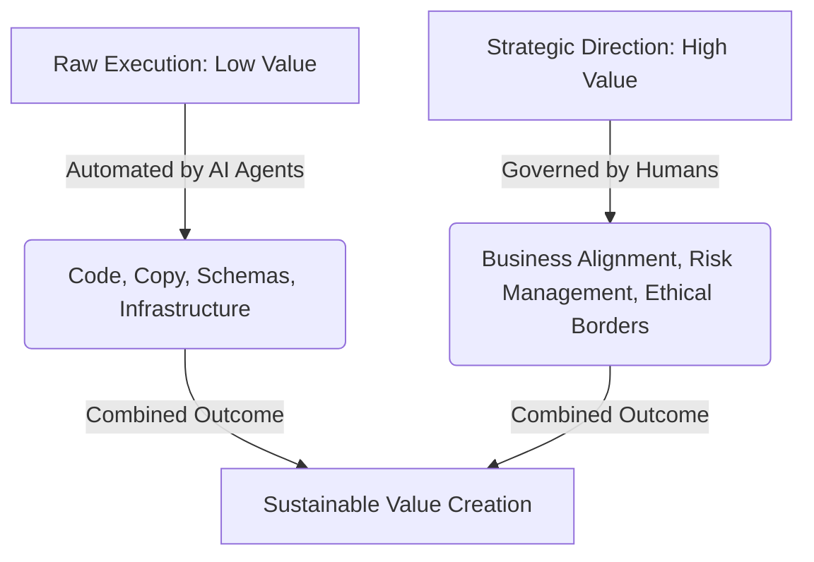

The anxiety permeating the knowledge work sector in May 2026 often boils down to one fundamental, deeply personal question: "What will I do when the AI can do my job faster, cheaper, and without sleeping?"

For developers, designers, lawyers, marketers, and analysts, the threat of obsolescence feels very real. But standing here at this particular intersection of history, the actual shape of the transformation is becoming clear. 

The shift we are experiencing is not toward human obsolescence; rather, it is a profound reallocation of value. AI is exceptionally good at **Execution**, but it is still fundamentally and permanently reliant on human beings for **Strategy and Judgment**.

In my 40+ years of engineering leadership, I’ve managed teams through multiple waves of intense automation. I’ve seen compiler advancements eliminate assembly writing, visual builders replace manual UI scripting, and cloud platforms automate server provisioning. 

Each time, the alarmists claimed that software engineers would be wiped out. Yet, each time, the exact opposite happened: the "Knowledge Worker" was promoted to a higher level of abstraction—shifting from a manual writer of syntax to **The Manager of the Outcome**.

## The Execution Paradox: Cheap Execution Elevates Intent

In economics, there is a concept known as the Jevons Paradox: as a resource becomes more efficient and cheaper to consume, the total demand for it actually increases. 

With AI, the cost of **Execution** (writing boilerplate code, drafting a legal brief, generating a marketing campaign structure) has dropped to near zero. 

Because execution is so cheap, the volume of work produced is skyrocketing. And as the volume of work increases, the value of **Knowing What to Build**—and verifying that it aligns with the business's core intent—becomes significantly higher.

To thrive as a knowledge worker in this agentic era, you must pivot your career strategy to focus on the three uniquely human skills that AI cannot replicate:

### 1. Judgment over Logic

An AI model can analyze a codebase or a market dataset and instantly generate ten different ways to solve a problem. It can write the logical scripts for each approach flawlessly. 

What it **cannot** do is decide which of those ten approaches aligns with your company's risk tolerance, your long-term architectural vision, your brand's unique identity, or your cash-flow constraints. 

**Judgment** is the ability to choose between what is "Technically Correct" and what is "Strategically Right." This is the core capability of the modern [Venture Architect](./forty-years-of-engineering-transitions.md). It is a skill earned only through years of experiencing the real-world consequences of both good and bad decisions.

### 2. The Moat of Domain Expertise and Deep Context

An LLM can summarize a medical research paper, a complex tax code, or an engineering standard in seconds. However, it lacks the [Lived Experience](./mind-the-store-mission.md) of a seasoned practitioner who has spent decades observing how those rules behave in the messy, chaotic, and non-deterministic real world. 

This "Deep Context" is the one thing that cannot be scraped and trained into a model’s static weights. It must be lived. In the agentic era, your domain expertise is the **Operating System** that the AI agents run on. The agents provide the muscle, but you provide the soul and the direction.

### 3. From Doing to Governing

The high-value knowledge worker of 2026 does not view themselves as an "implementer" who manually types out code or drafts reports. 

Instead, they act as a **Governor**. They write the high-fidelity [Behavioral Guidance](./beyond-system-prompt-behavioral-guidance.md), they design the automated [Quality Gates](./why-ai-poc-failed-production.md), and they exercise the final, authoritative judgment on the agent's output. They move from being the person who swings the hammer to the architect who signs off on the blueprint.

## The Ultimate Career Extender

For senior professionals, AI is not a threat; it is the most powerful **Career Extender** in history. It removes the physical tax and mental drudgery of execution, allowing a single expert with deep judgment to deliver the output of an entire traditional department. 

Stop fearing the automation of execution. Embrace your role as the governor. Your decades of experience, context, and judgment are more valuable today than they have ever been.

---

*I help senior professionals and businesses transition to an AI-augmented model where their expertise is the most valuable asset in the room.*
