There is a long-standing myth that you shouldn't touch Kubernetes until you have at least fifty engineers and a burning need to scale to a million concurrent users. For years, the advice for startups was: "Stick to a simple VPS or a PaaS until it hurts."

By January 2026, that advice has officially aged into obsolescence. 

My journey with Kubernetes didn't start in a high-growth "cloud-native" unicorn. It started at DevFactory, where we managed a portfolio of acquired startups. Even though we were an AWS-only shop at the time, we used Kubernetes to solve a problem that every startup faces: how to manage complex, multi-tenant environments with a tiny team without sacrificing reliability.

Today, in our self-hosted AI lab built on AMD mini-PCs, we use Kubernetes to achieve enterprise-level resilience on commodity hardware. If you're a startup leader in 2026, here are the three things that actually matter about Kubernetes.

## 1. Resilience over Scale (The Self-Healing Promise)

Most people think Kubernetes is about *scaling*. It isn't. For a startup, Kubernetes is about **resilience**.

When you run your workloads on a few AMD mini-PCs in a local lab, or even on a small cluster in the cloud, hardware will fail. A node will lock up. A process will leak memory. In a traditional setup, that means a 3 AM alarm and a manual restart.

Kubernetes turns that hardware failure into a non-event. Because it is a "declarative" system, you don't tell it to *run* a container; you tell it what the "desired state" of your system is. If a node in our AMD cluster dies, Kubernetes notices within seconds and reschedules the AI agents and data workloads onto the surviving nodes. 

For a startup, "self-healing" is a force multiplier. It allows a single engineer to manage an infrastructure that would have required a whole NOC team a decade ago.

## 2. GitOps & Automated Ops (The repeatable "Sec/Prod/Dev Ops")

At DevFactory, we learned that the only way to make a $1M startup profitable was to eliminate manual intervention. We needed a repeatable process for Dev, Sec, and Prod Ops.

Kubernetes enables this through **GitOps**. When your entire infrastructure is defined as code (YAML or Helm charts) and stored in Git, your cluster becomes a reflection of your repository. 

- Want to deploy a new version of [Kaigents](https://github.com/jensjohansen/kaigents)? You don't "log in" to a server. You push a commit.
- Need to audit your security posture? You check your Git history. 
- Disaster recovery? You point a new cluster at your Git repo and wait ten minutes.

This "Infrastructure as Code" approach isn't just about speed; it's about eliminating the "snowflake" servers that eventually kill startup agility.

## 3. Resource Efficiency (The "Bin Packing" Win)

Startups are almost always resource-constrained—whether that's cloud budget or physical hardware in a lab. 

Traditional VPS-based hosting is incredibly wasteful. You end up with five different servers, each running at 10% CPU, because you're afraid to mix workloads. Kubernetes solves this through "Bin Packing." It looks at the CPU, RAM, and NPU requirements of every workload—from a heavy Qwen3 Coder model to a tiny HTAP event collector—and packs them onto your hardware for maximum utilization.

In our local AI lab, this efficiency is what allows us to run a full enterprise-grade agentic platform on a handful of AMD Ryzen AI chips. We aren't paying for "idle" time; we are squeezing every cycle out of the silicon we own.

```mermaid
flowchart TD
    A[Git Repository] -->|Commit| B[GitOps Operator]
    B -->|Sync| C[Kubernetes API]
    C --> D{Cluster Controller}
    D -->|Node Fails| E[Automatic Rescheduling]
    D -->|Resource Check| F[Efficient Bin Packing]
    D -->|Health Check| G[Self-Healing Restarts]
    
    style D fill:#1e1e2e,stroke:#eab308,stroke-width:2px
```

## The "Cloud Agnostic" Moat

The final, often overlooked benefit of starting with Kubernetes is cloud agnosticism. 

Even if you start in a local lab to protect your IP (as we discussed in [Article #4](./self-hosted-ai-2026.md)), Kubernetes gives you an exit ramp. If you suddenly need to scale beyond your local hardware, you can move those same YAML manifests to EKS, GKE, or Azure without a rewrite. 

You aren't locked into a provider's proprietary PaaS. You own your orchestration.

## The Bottom Line

If you think Kubernetes is too complex for your startup, you're likely over-indexing on the *setup* and under-indexing on the *operational life*. The "complexity" of learning Kubernetes is a one-time cost. The "simplicity" of a VPS is a recurring tax on your time and reliability.

In 2026, Kubernetes isn't a luxury for the big players. It's the standard operating system for any startup that wants to stay up.

---

*40+ years of engineering has taught me that "simple" tools often lead to "complex" failures. Kubernetes is a complex tool that leads to simple, predictable operations. For a startup, that's a trade worth making every single time.*
