If you look at the technical post-mortems of the 2020-2024 startup wave, you’ll find a recurring theme: **Early-Onset Microservices.** 

Founders, fearing they would eventually reach "Google-scale," built complex, distributed systems before they even had their first 1,000 users. They paid a massive "Complexity Tax"—spending 50% of their engineering time on service discovery, network latency, and distributed tracing instead of building product features.

As a [turnaround master](https://www.linkedin.com/in/johnkjohansen/), I’ve spent much of my career de-tangling these messes. I’ve seen startups with 10 engineers managing 40 different microservices, each with its own repo, database, and deployment pipeline. It is the definition of a "stalled" project.

In February 2026, the verdict is in: **For an AI-accelerated startup, the Monolith is the superior architecture.**

## The Agentic Twist: Why Agents Love Monoliths

The most interesting shift of the last year wasn't the return to monoliths for simplicity's sake (though that is a valid reason). it's that **AI agents are dramatically more productive in a cohesive codebase.**

When we use Zencoder.ai to develop [Kaigents](https://github.com/jensjohansen/kaigents) or our [Kairon Retail](./temu-playbook-collapse.md) platform, we’ve found that the agent performs best when it has the **Full Context** of the application. 

- **Context Depth**: In a monolith, the agent can "see" the relationship between the auth layer, the data store, and the business logic in a single scan. It can perform multi-file refactors and global quality checks with minimal hallucination.
- **Dependency Simplicity**: An agent trying to navigate 40 different microservice repos spends 80% of its tokens just trying to understand the "invisible" contracts between services. In a monolith, the contracts are visible, versioned, and easily discoverable.

## The "Modular Monolith" on Kubernetes

I am not advocating for a "Big Ball of Mud." The 2026 verdict is for the **Modular Monolith**.

We build our applications as a single, cohesive codebase, but we design them with strict internal boundaries (using clear module patterns). This allows us to:
1.  **Develop Fast**: Our human-agent team can iterate on the entire system without fighting cross-service network errors.
2.  **Deploy for Resilience**: Because we run on [Kubernetes](./three-node-k8s-minimum-viable-production.md), we can scale the monolith across multiple nodes for high availability. 
3.  **Audit for Governance**: Our [SecOps stack](./open-source-license-audit.md) has a single "surface area" to scan, ensuring that we catch compliance issues before they are fragmented across dozen of repositories.

```mermaid
graph TD
    A[Human + AI Team] --> B{Single Git Repo}
    B --> C[Cohesive Logic]
    B --> D[Modular Boundaries]
    C --> E[Kubernetes Deployment]
    D --> E
    E --> F[Simple Ops / High Speed]
    
    style B fill:#1e1e2e,stroke:#eab308,stroke-width:2px
    style F fill:#1e1e2e,stroke:#10b981,stroke-width:2px
```

## The "Hindsight" Insight: Design Simplicity

One of the most rewarding pieces of feedback I’ve received in my career is that I strive for "well engineered and simple solutions." 

In 40+ years, I’ve never seen a project fail because the monolith was "too simple." I’ve seen dozens fail because the microservices were "too complex." As an engineer, your job is to **Deliver Value Quickly**. The Monolith is the quickest path to value because it eliminates the "Babel Problem" of distributed communication.

## The Bottom Line

If you are a two-person startup today, don't build for the "Future Scale" of a billion users. Build for the **Current Speed** of your human-agent partnership. 

Embrace the Majestic Monolith. Use your AI agent to its full potential by giving it the context it needs. You can always break out a microservice later if you actually hit the limit—but in 2026, with the power of modern [NPUs](./amd-ryzen-ai-npu-enterprise-chip.md) and Kubernetes, you likely won't hit that limit for years.

---

*40+ years of engineering has taught me that the best architecture is the one that lets you ship on a Friday afternoon and sleep through the night. In the agentic era, that's the monolith. Keep it simple, keep it cohesive, and keep it fast.*
