By January 2026, the industry has largely solved the "Single Agent" problem. We know how to give a model a tool, a prompt, and a task. But as we move toward complex, autonomous workflows—like those in [Kairon Retail](./temu-playbook-collapse.md) or [MindTheStore](./ai-gig-economy-reshape-not-replace.md)—we are discovering that a collection of smart agents does not automatically make a smart team.

In fact, without a robust coordination layer, a multi-agent system quickly becomes an "Agentic Babel": a cacophony of disconnected processes that misunderstand each other, duplicate work, and eventually crash.

I’ve spent 40+ years managing engineering teams. I’ve seen this exact same pattern in human organizations. The failure of a multi-agent system is almost never a failure of individual "intelligence." it's a failure of **Management and Governance**.

## The Babel Problem: Context Drift

In a multi-agent system, Agent A performs a task (e.g., sourcing a supplier) and passes the result to Agent B (e.g., generating product visuals). 

The technical challenge is the API hand-off. But the *management* challenge is the **Context Drift**. 

If Agent A discovered that the supplier has a specific "brand voice" restriction, but that insight isn't explicitly codified and passed in a way that Agent B understands, Agent B will generate visuals that violate the brand. Agent B hasn't "failed"; it just didn't have the context.

In a human team, we solve this with stand-ups, PRDs, and shared documentation. In an agentic team, we solve this with a **Shared Context Plane**.

## The Kaigents Solution: Management as Infrastructure

When we built [Kaigents](https://github.com/jensjohansen/kaigents), we didn't treat coordination as a sequence of API calls. We treated it as an orchestration of **Durable Workflows**.

### 1. The Shared Intelligence Layer
In Kaigents, agents don't just "pass messages." They operate on a shared, versioned context. When the "Sourcing Agent" discovers a constraint, it doesn't just put it in a log; it updates the "Mission Context" that all other agents in the team share. This ensures that every agent is working from the same "Single Source of Truth."

### 2. The "Operational Steward"
Every complex multi-agent team in Kaigents has a designated **Operational Steward**. This isn't just another agent; it’s a specific pattern of durable execution (backed by Temporal). The Steward’s job is to:
- **Monitor the hand-offs**: Ensure Agent B started once Agent A finished.
- **Manage the State**: If the system restarts, the Steward ensures the team resumes exactly where it left off.
- **Enforce Quality Gates**: If Agent B's output doesn't match the criteria defined in the PRD, the Steward triggers a "Rework Loop" for Agent B rather than passing a bad result forward.

```mermaid
flowchart TD
    A[Task Arrives] --> B[Operational Steward]
    B --> C[Agent A: Sourcing]
    C -->|Update| D{Shared Mission Context}
    D --> E[Agent B: Creative]
    B -->|Monitor| C
    B -->|Monitor| E
    E --> F{Quality Gate}
    F -->|Fail| E
    F -->|Pass| G[Task Complete]
    
    style B fill:#1e1e2e,stroke:#eab308,stroke-width:2px
    style D fill:#1e1e2e,stroke:#3b82f6,stroke-width:2px
```

## The "Human-Agent" Parallel

I’ve often said that the best way to design a multi-agent system is to imagine how you would manage a team of junior human engineers. 

You wouldn't just give them a Slack channel and hope they finish the project. You would give them a clear objective, a set of standards, a way to share their work-in-progress, and a senior engineer (the "Steward") to guide them and catch their mistakes.

The technical complexity of AI agents—the non-determinism, the token limits, the hallucination risks—makes this "Management Layer" even more critical. In 2026, the companies that are winning with AI agents aren't the ones with the "smartest" models. They are the ones with the best **Governance Infrastructure**.

## The Bottom Line

If your multi-agent strategy is just "Agents talking to Agents," you are building a house of cards. 

To build a resilient, enterprise-grade AI team, you must solve the coordination problem at the management level. You need shared context, durable state, and explicit quality gates. You need an orchestration layer like Kaigents that treats coordination as a first-class citizen.

Stop worrying about the "API hand-off." Start worrying about the "Context hand-off." That’s where the intelligence actually lives.

---

*40+ years of engineering has taught me that teamwork is a discipline, not an accident. That’s just as true for silicon as it is for carbon. If you're building for the enterprise, build for the team.*
