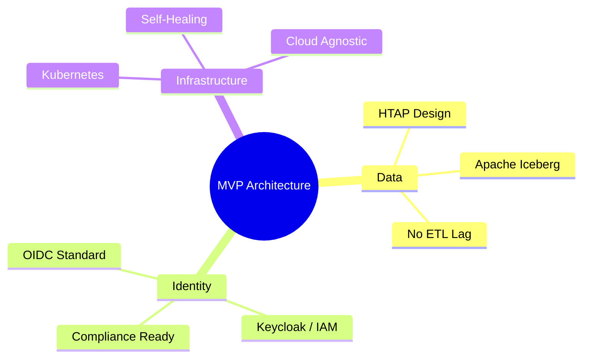

If you’ve spent 40+ years in the software trenches, you’ve developed a sixth sense for "Success Disasters." These are the projects that achieve product-market fit so quickly that they collapse under their own weight because the "week one" architecture wasn't ready for year three.

In my work as a [turnaround and upscale master](https://www.linkedin.com/in/johnkjohansen/), I’m often called in to fix these disasters. 

A startup has a million dollars in revenue and a tech stack that is on fire. The "fix" usually involves a painful, expensive re-platforming that distracts the team from innovation for six months. 

If you are building an AI startup in early 2026, here are the three architectural decisions you must get right in week one to ensure you don't need me to fix your company in 2029.

## 1. Start with the "Data Lakehouse" (HTAP)

The most common week-one mistake is starting with a single, massive Postgres database and assuming you'll "figure out analytics later." 

By the time you need analytics, your data is trapped in silos and your ETL pipelines are breaking. Instead, start with an [HTAP (Hybrid Transactional/Analytical Processing)](./htap-not-a-buzzword.md) mindset. 

Use an open format like **Apache Iceberg** from day one. It doesn't cost more to set up, but it ensures that your business events are ready for real-time reporting and AI agent training without a massive migration. Don't build a database; build a **Single Source of Truth**.

## 2. Standardize Identity (OIDC) from the First Commit

"We'll just use a simple username/password hash for now" is the most dangerous sentence in startup engineering. 

Identity is the foundation of security, compliance, and [Governance](./ai-agent-governance-over-tools.md). If you don't start with a standard OIDC (OpenID Connect) provider—like **Keycloak** or a mature managed service—you will spend the next three years fighting account migrations and security audits. 

Identity isn't just an "Auth" feature; it’s the control plane for your entire enterprise strategy. Start with a provider that supports MFA and SSO from day one. It is the "Governance Anchor" your AI agents will eventually need.

## 3. Containerize for Resilience (Kubernetes)

There is a myth that Kubernetes is "over-engineering" for an MVP. For years, founders were told to "just use a simple VPS."

In 2026, that is bad advice. Starting with a [Three-Node Kubernetes Cluster](./three-node-k8s-minimum-viable-production.md) (even locally on our [AMD mini-PCs](./zero-dollar-infrastructure-stack.md)) gives you **Technical Insurance**. 

Kubernetes gives you:
- **Self-Healing**: Your app stays up when a node fails.
- **Portability**: You can move from your local lab to EKS or GKE in an afternoon without changing a single line of code.
- **Durable Workflows**: You have the substrate required to run [Temporal](./durable-execution-ai-agents.md) for long-running agentic processes.

## The "Hindsight" Insight: Assess Costs and Benefits

I’ve always been a "risk taker," but a calculated one. The "Cost" of setting up K8s, Iceberg, and Keycloak in week one is roughly 24 hours of engineering time. The "Benefit" is a three-year head start on your competitors who will eventually have to stop everything and rewrite their stack.

As an engineer, your job isn't to ship code. it's to **Deliver Value Quickly**. The "Quickest" path is the one that doesn't have a $500,000 "Re-platforming Tax" waiting at the end of the runway.

## The Bottom Line

Don't build for the "Now." Build for the **Future State**. 

Choose the tools that can grow with you. Standardize on open formats, robust identity, and resilient orchestration from the very first commit. It’s the difference between a startup that scales and a startup that needs a turnaround.

---

*40+ years of engineering has taught me that 'shortcuts' are usually just 'detours.' Build the foundation right the first time. Your future self (and your future investors) will thank you.*
