By January 2026, the "Golden Age" of permissive open-source AI is facing its first real test. We’ve seen the "License Shock" of 2024, and we’ve watched as once-permissive libraries shifted to more restrictive business models. 

For a startup CTO, the challenge of 2026 is no longer about finding *any* tool that works. it's about building a stack that is **Future-Proof**. 

If you're building on top of [Kaigents](https://github.com/jensjohansen/kaigents) or any other agentic platform, you need to look beyond the model and at the "Durable Plumbing" that makes a business run. Here is the open-source landscape we’ve used to build a production AI lab on a startup budget.

## The "Durable Plumbing" (Core K8s Tools)

If you are running on-premise hardware (like our AMD mini-PCs), your Kubernetes cluster needs more than just a model server. It needs the utilities that turn a collection of nodes into an enterprise-grade platform.

- **Storage: Rook-Ceph**: For any stateful AI workload—especially those involving **HTAP** or long-term memory—you need distributed storage. Rook-Ceph allows us to manage petabytes of data with the same resilience as a cloud provider's block storage, but on our own silicon.
- **Networking: MetalLB**: In a local lab, you don't have a cloud load balancer. MetalLB gives us that "Cloud Experience" on our own network, allowing our agents and dashboards to be reachable via standard IPs.
- **Security: Cert-Manager & Keycloak**: Encryption and Identity are not optional. Cert-Manager handles our automated TLS rotation, while Keycloak provides the OIDC backbone for everything from our Grafana dashboards to our agent CLI.
- **DevOps Backbone: Gitea & Harbor**: To maintain "Silicon Sovereignty," we don't host our code or images on public clouds. We use **Gitea** (or self-hosted GitLab) for version control and **Harbor** as our private container registry. Harbor is particularly critical because it integrates with our SecOps stack to perform vulnerability scanning on every image before it is allowed into our production cluster.

## The SecOps & Compliance Shield

As we discussed in [Article #8](./open-source-license-audit.md), compliance is a business accelerator. In 2026, we don't just "do security"; we automate it using a suite of OSS tools:
- **Discovery**: Fossology for licenses, SecureCodeBox for automated release scans.
- **Monitoring**: Falco for runtime security, Wazuh for XDR/SIEM.
- **Strategic Management**: DefectDojo for vulnerability aggregation, and **Ciso Assistant** to map everything to ISO 27001 or SOC 2.

## The "Vendoring" Strategy: Protecting Your IP

One of the most important lessons I’ve learned in 40+ years of engineering is that **you must own your dependencies.**

In the era of "License Shifts," simply pulling the latest version of a library from a CDN or a public repo is a risk. We use a "Vendoring" strategy for all critical open-source products. We mirror the repositories we depend on and we pin to specific, audited versions. 

If a project's licensing model changes overnight (as we saw with several major data tools in 2024), we aren't immediately affected. We have the time to evaluate the change, negotiate a commercial license if necessary, or pivot to a fork before our production systems are compromised.

## Maturity: The Path to Enterprise Support

A common trap for startups is preferring "Free" OSS over everything else. But in early 2026, the smart play is to prefer **OSS with an Enterprise Support Path.**

When you are a $1M/year startup, you can survive on community support and your own engineering grit. But as you move toward $10M or $100M in revenue, your risk profile changes. Your enterprise customers will demand to know that there is a "throat to choke" if a critical piece of your infrastructure fails.

We choose tools like **Trino, Apache Iceberg, and Ceph** not just because they are open-source, but because they have robust enterprise support options (Starburst, Tabular, Red Hat) that we can "turn on" the moment our revenue stream justifies the cost. 

```mermaid
flowchart TD
    A[Startup Phase] -->|Community OSS| B[Rapid Innovation / Low TCO]
    B -->|Revenue Gate| C{Maturity Decision}
    C -->|Option A| D[Vendor the OSS / Maintain Internal]
    C -->|Option B| E[Enable Enterprise Support Path]
    D --> F[Enterprise Revenue Stream]
    E --> F
    
    style B fill:#1e1e2e,stroke:#eab308
    style E fill:#1e1e2e,stroke:#10b981
```

## The Bottom Line

The open-source landscape of 2026 is richer than it has ever been, but it is also more complex. 

Don't just build a "Cool AI Project." Build a "Resilient AI Business." That means choosing tools that offer a path to maturity, automating your compliance from day one, and vendoring your critical dependencies so you never lose control of your intelligence.

---

*40+ years of engineering has taught me that the tools you choose today are the legacy you'll be managing tomorrow. Choose tools that can grow with you, not just tools that are free for today.*
