By mid-February 2026, the "Open Source or SaaS" debate for startups has largely been settled. As I wrote in [Article #14](./open-source-ai-landscape-2026.md), the most resilient businesses are those that own their infrastructure and their intelligent tools. 

But there is a second level to the open-source game that many startups miss. They treat OSS as a "one-way street"—they pull the code, use the tools, and move on. 

In my 40+ years of engineering, I’ve learned that this "extraction-only" approach is a liability. If you want to build a business that lasts, you need an **Open Source Contribution Strategy**. 

Here is why "Good Citizenship" is actually a high-ROI business decision.

## The "Turnaround" Insight: Buying and Fixing

During my time at DevFactory, where we acquired distressed SaaS companies, the first thing I would look at during technical due diligence was the dependency tree.

A company that was built on "abandoned" open-source libraries or one that had created massive "private forks" was a huge risk. They were trapped in a maintenance nightmare, unable to upgrade their stack without breaking their custom hacks.

On the other hand, a company that was an active contributor to its core tools (like [Kubernetes](./three-node-k8s-minimum-viable-production.md), [Temporal](./durable-execution-ai-agents.md), or [Trino](./event-sourcing-htap-pattern.md)) was a much more attractive acquisition target. Why? Because they had a seat at the table. They weren't just "users"; they were **Stakeholders**.

## The ROI of Contribution

For a two-person team in 2026, spending time contributing back to a project like **Kaigents** or **Flux** might feel like a distraction from building your product. But it pays dividends in three specific ways:

### 1. Influence the Roadmap
When you contribute code, bug fixes, or documentation, you build credibility with the maintainers. If you suddenly need a specific feature to support your [Kairon Retail](./temu-playbook-collapse.md) pivot, your request carries weight. You can help guide the project toward the "Future State" that benefits your business.

### 2. Reduce the "Upgrade Tax"
If you find a bug in an OSS tool and fix it in a private fork, you now have to maintain that fork forever. Every time the main project releases an update, you have to manually merge your changes. If you contribute that fix back to the main repository, the project maintainers take over the burden of testing and supporting that code. You eliminate the "Upgrade Tax."

### 3. Attract the Best Talent
In 2026, the most talented engineers (carbon and [silicon](./zero-dollar-infrastructure-stack.md)) want to work on projects that have a wider impact. By being a visible contributor to the OSS community, you build a "Talent Magnet" that makes hiring easier and cheaper.

```mermaid
flowchart LR
    A[Start-up] -->|Contribute| B{OSS Community}
    B -->|Influence| C[Project Roadmap]
    B -->|Support| D[Mainstream Maintenance]
    B -->|Credibility| E[Talent Attraction]
    C --> F[Business Agility]
    D --> F
    E --> F
    
    style B fill:#1e1e2e,stroke:#eab308,stroke-width:2px
    style F fill:#1e1e2e,stroke:#10b981,stroke-width:2px
```

## The "Hindsight" Insight: Assess Costs and Benefits

I’ve always been a "risk taker," as one of my former colleagues noted, but only after "assessing costs and benefits really well."

The "Cost" of open-source contribution is your time. The "Benefit" is a massive reduction in long-term technical debt and a significant increase in your company's valuation. When you show a potential investor or acquirer that you are a core part of the ecosystem you rely on, you aren't just selling code; you are selling **Resilience**.

## The Bottom Line

Don't just use open source. **Join it.**

Whether it’s submitting a pull request to fix a typo in the documentation or releasing your own platform components (as I’ve done with [Kaigents](https://github.com/jensjohansen/kaigents)), an active contribution strategy is the ultimate "Enterprise Accelerator." 

Stop being a tenant in the open-source world. Become a co-owner.

---

*40+ years of engineering has taught me that the best way to predict the future of a tool is to help build it. If you want to own your intelligence, you have to contribute to the tools that create it.*
