If you’ve been following my series on [Open Source Strategy](./open-source-contribution-strategy.md), you know that I treat the relationship with the community as a business partnership. But even the best partnerships have moments of friction. 

A critical tool you rely on—perhaps **Rook-Ceph** or **Trino**—is missing a feature you need for your [HTAP pipeline](./event-sourcing-htap-pattern.md). Your lead engineer says, *"We can just fork it and add the feature in a weekend."*

In my 40+ years of engineering, I’ve seen that "weekend hack" turn into a multi-year "Maintenance Trap" that eventually kills the startup's agility. 

As an architect who "assesses costs and benefits really well," I’ve developed a simple decision framework for knowing when to fork and when to contribute.

## The Cost of the "Private Fork"

A private fork is like taking a high-interest loan. You get the feature "now," but you pay a recurring "Success Tax" forever.
- **Merge Fatigue**: Every time the upstream project releases a security patch or a new version, you have to manually merge it into your fork.
- **Isolation**: You lose access to the community's bug fixes, documentation updates, and performance optimizations.
- **Valuation Drag**: During an acquisition or funding round, a massive private fork of a core library is a "Red Flag." It signals a high-maintenance tech stack.

## The Decision Framework

Before you click that "Fork" button this quarter, run your decision through these four criteria:

### 1. Strategic Core vs. Commodity Utility
- **Commodity (Contribute)**: If the feature you’re adding is a generic bug fix or a standard utility (e.g., a new storage driver for **Rook-Ceph**), **Contribute Back**. There is zero competitive advantage in owning that code privately, but huge advantage in the community maintaining it for you.
- **Strategic Core (Fork/Modularize)**: If the feature is your company’s unique "Secret Sauce"—something that gives you a 10x edge over competitors—you must keep it private. However, the best approach is to build it as a **Plugin or Operator** rather than a fork of the core engine.

### 2. Community Health & Governance
- **Vibrant (Contribute)**: If the project has an active maintainer pool and a clear governance model, **Contribute**. Your PR will be reviewed, merged, and supported.
- **Abandoned/Hostile (Fork)**: If the maintainer is unresponsive or the project has shifted to a [Hostile License](./open-source-license-audit.md) (BSL/SSPL), you may have to **Fork and Vendor**. This is a defensive move to protect your business continuity.

### 3. Alignment with the "Future State"
- **Aligned (Contribute)**: Does your feature match the long-term vision of the project? If so, the maintainers will welcome it.
- **Divergent (Fork)**: Are you trying to force the tool to do something it wasn't designed for (the [Salesforce/Green Dot mistake](./slackbot-as-personal-agent.md))? If your vision is fundamentally different from the project’s, a fork is inevitable—but recognize that you are now the maintainer of a new project.

### 4. Speed vs. Sustainability
- **Urgent (Fork then Merge)**: If you need the feature for a client delivery tomorrow, fork it today to unblock the team. But make the **Upstream Merge** a required task in the following sprint. Don't let the fork "harden" into technical debt.

```mermaid
graph TD
    A[Need New Feature] --> B{Secret Sauce?}
    B -->|Yes| C[Build as Plugin/Operator]
    B -->|No| D{Community Healthy?}
    D -->|Yes| E[Contribute Back]
    D -->|No| F{Vendor Lock-in Risk?}
    F -->|High| G[Fork & Vendor]
    F -->|Low| E
    
    style E fill:#1e1e2e,stroke:#10b981,stroke-width:2px
    style G fill:#1e1e2e,stroke:#ef4444,stroke-width:2px
```

## The "Hindsight" Insight: Assessing the Risks

I’ve always been a "risk taker," but I take risks on **innovation**, not on **maintenance**. 

The biggest risk you can take in a startup is thinking your team is smarter than a community of 5,000 contributors. You aren't. By choosing to **Contribute Back** whenever possible—as we’ve done with the platform components of [Kaigents](https://github.com/jensjohansen/kaigents)—you are ensuring that your team stays focused on the high-value work that actually drives revenue.

## The Bottom Line

A fork is a marriage. A contribution is a conversation. 

If you want to move fast and stay light in 2026, keep your forks rare and your contributions frequent. It’s the only way to build a tech stack that is as resilient as the community that powers it.

---

*40+ years of engineering has taught me that the code you write is a liability; the value you deliver is the asset. Minimize your liability by letting the community help you maintain it. Your future self will thank you.*
