By mid-January 2026, the honeymoon phase of "just use whatever library works" has officially ended for the startup ecosystem. 

We've seen the "Terraform shock" of 2023 and the "Redis ripple" of 2024. We've watched as major projects shifted from permissive MIT/Apache licenses to Business Source Licenses (BSL) or Server Side Public Licenses (SSPL) overnight. For a startup, these aren't just legal footnotes; they are potential deal-killers during a due diligence audit or a Series B funding round.

The reality of 2026 is that a startup's value is locked in its IP. If that IP is inadvertently "poisoned" by a viral GPL or AGPL license in a critical service, your valuation can vanish in a single legal review.

## The Strategy: Automate the Friction Away

In my 40+ years of engineering management, I've learned that if a process is manual, it won't be done consistently. This is especially true for SecOps and compliance. Most engineers view compliance as a "brake" on their development speed.

Our approach is different: we treat compliance as a data pipeline. 

We don't do "manual audits." We’ve built a suite of automated tools that turn compliance into a continuous background process. By automating the friction, we allow our engineers to move fast while the "governor" ensures we stay within the lines.

## The "Three Musketeers" of 2026 Compliance

To manage a modern AI startup, we’ve standardized on an integrated stack of open-source tools that handle everything from license discovery to strategic risk management.

### 1. License Discovery: Fossology & SecureCodeBox
We recently added **Fossology** to our suite. It is the gold standard for license compliance. Combined with **SecureCodeBox**, we run automated scans on every release. We aren't just looking for CVEs; we are looking for license mismatches. If an engineer pulls in a library with a viral license that violates our corporate policy, we catch it before it hits the main branch.

### 2. Vulnerability Management: DefectDojo
Findings from our scanners (ZAP, SAST, DAST, Harbor, Falco, and Wazuh) are rolled up into **DefectDojo**. This is our functional hub. It allows us to deduplicate findings and prioritize them based on actual risk rather than just "CVSS score."

### 3. Strategic Governance: Ciso Assistant
This is where the magic happens for the CTO. Findings flow from DefectDojo (functional) to Jira (tactical) and finally into **Ciso Assistant** (strategic). 

Ciso Assistant is our ISMS (Information Security Management System). It allows us to map our technical findings directly to compliance frameworks like **ISO 27001, SOC 2, GDPR, HIPAA, and PCI/DSS**. 

```mermaid
flowchart TD
    A[Code Commit / Release] --> B{Automated Scans\nFossology / SecureCodeBox}
    B --> C[Vulnerability Hub\nDefectDojo]
    C -->|Tactical| D[Dev Workflow\nJira]
    C -->|Strategic| E[Compliance ISMS\nCiso Assistant]
    E --> F{Frameworks\nISO 27K / SOC 2 / HIPAA}
    
    style B fill:#1e1e2e,stroke:#eab308
    style C fill:#1e1e2e,stroke:#eab308
    style E fill:#1e1e2e,stroke:#eab308
```

## Why This is a Business Accelerator

When we pitch serial entrepreneurs or serial investors, we don't just show them our code. We show them our Ciso Assistant dashboard.

Being "SOC 2 Ready" or "ISO 27001 Compliant" on day one isn't just about security; it's about **sales velocity**. In the enterprise market of 2026, no one will touch your AI agent if you can't prove how you handle their data and whose licenses you are using. 

By automating our SecOps, we can answer a 200-question security questionnaire in minutes instead of weeks. That speed is a competitive moat.

## The Quarterly Audit Checklist

If you haven't started this process yet, here is the audit you should perform this quarter:

1.  **Inventory Every Dependency**: Use a tool like Fossology to get a clean list of every license in your tree.
2.  **Identify "Viral" Licenses**: Look specifically for GPL/AGPL/SSPL in your proprietary codebases.
3.  **Check for "License Shifts"**: Did a library you've used for two years quietly change its license in a minor version update?
4.  **Map to a Framework**: Even if you aren't pursuing formal certification yet, map your current state to SOC 2 or ISO 27001. It will expose your biggest gaps.

## The Bottom Line

In the agentic era, your infrastructure is your governance. If you're building with tools like [Kaigents](https://github.com/jensjohansen/kaigents), you have the opportunity to bake this compliance into the platform itself.

Don't wait for a "due diligence" event to find out you've built your business on a license violation. Automate your SecOps, turn your compliance into a dashboard, and use it to close deals faster than your competitors.

---

*SecOps is the silent engine of a successful startup. I’ve seen 40+ years of projects fail because they treated security as a 'final step.' In 2026, security is the first step. If you can't prove it's secure, it isn't production-ready.*
