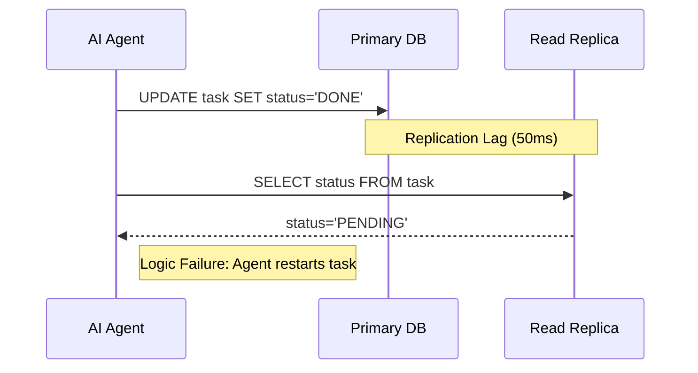

In August 2024, GitHub experienced a significant availability incident—36 minutes of total service disruption—caused by a misconfiguration in their database infrastructure. It was a reminder that even for the giants of the industry, the "invisible plumbing" of the database layer is the most fragile part of the stack.

But for the rest of us, the bigger danger isn't a total outage. it's the "Silent Trap" of eventual consistency.

For two decades, the playbook for scaling a successful startup was predictable: When the primary database gets slow, you add a Read Replica. You move your "GET" requests to the replica, leaving the primary for "POST" and "PUT" requests. It’s an easy win for performance. It’s also the moment you introduce **Eventual Consistency** into your system.

## The Human vs. Agentic Response

Humans are remarkably good at handling eventual consistency. If you post a comment on a social media site and it doesn't appear for three seconds, you might refresh the page. You understand that there is a "delay in the system." You have the context to wait.

**AI agents do not have this context.**

An autonomous AI agent—like those we run on [Kaigents](https://github.com/jensjohansen/kaigents)—operates at a speed and a level of literal-mindedness that makes eventual consistency a logic killer. 

### The Race Condition Scenario:
1.  **Agent Writes**: The agent finishes a task and writes `status: "COMPLETED"` to the primary database.
2.  **Agent Queries**: One millisecond later, the agent queries for its next task: `"SELECT * FROM tasks WHERE status = 'PENDING' LIMIT 1"`.
3.  **The Trap**: The query hits a Read Replica that is currently 50ms behind the primary.
4.  **The Failure**: The replica returns the *old* state. The agent sees the task it just finished as still being `PENDING`. 
5.  **The Ghost Loop**: The agent, being a good worker, picks up the task and starts it *again*.

In a human-driven system, this is a minor UI glitch. In an agent-driven system, this is a "Ghost Loop" that wastes tokens, duplicates work, and can corrupt business state.

## Why 2026 is the End of the "Easy Fix"

By January 2026, the industry has realized that "just add a replica" is no longer a viable architectural default for agentic workloads. As we move from simple RAG chatbots to autonomous agents that actually *do work* in the database, the requirement for **Strong Consistency** has returned with a vengeance.

## How to Escape the Trap

If you're architecting a data layer for AI agents this year, you have three real options to avoid the Read Replica Trap:

### 1. Read-Your-Own-Writes (RYOW)
You can implement logic at the application or proxy layer that ensures a specific agent's queries are routed to the primary database for a short window after they perform a write. This "sticks" the agent to the source of truth while still offloading other read traffic to replicas.

### 2. High-Consistency Engines
We are seeing a resurgence in distributed databases that prioritize strong consistency without sacrificing horizontal scale—think CockroachDB or TiDB. In our [HTAP design patterns](./htap-not-a-buzzword.md), we favor architectures that use open table formats like **Apache Iceberg**, which provide atomic transaction guarantees even on top of distributed object storage.

### 3. State Management outside the DB
For complex agentic workflows, we often use **Temporal** (as we do in Kaigents). Temporal manages the "State" of the workflow in its own persistent, strongly-consistent layer. The database becomes a record of the *result*, but the agent’s logic is driven by a state machine that doesn't suffer from replica lag.

## The Bottom Line

The "Read Replica Trap" is a classic example of a design pattern that was perfect for the Web 2.0 era but is broken for the AI Agent era. 

If you are building an autonomous system, you cannot assume your database is telling the truth unless you’ve architected it for strong consistency. Don't let your agents chase ghosts. Fix your data layer before you scale your agents.

---

*I’ve spent 40+ years seeing 'best practices' become 'technical debt.' The Read Replica is the latest casualty. In the era of autonomous intelligence, the truth must be immediate, not 'eventual.'*
