By February 2026, the question "Can we run this locally?" has been replaced by "Why are we still paying for the API?"

As I noted in my earlier look at [Silicon Sovereignty](./self-hosted-ai-2026.md), the shift to self-hosted AI wasn't just about privacy—it was about performance. Over the last year, we’ve conducted thousands of hours of testing in our [Kaigents](https://github.com/jensjohansen/kaigents) AI lab, and the results are striking. 

If you are still operating on the 2024 assumption that "local" means "slow and stupid," it’s time for a reality check. Here is what is actually possible with local LLMs in early 2026.

## The Performance Reality: Matching the Giants

The most significant change between 2025 and 2026 was the emergence of the "Enterprise-Grade Open Weight" models—specifically the **GPT-OSS 20B** and **Qwen3 Coder 30B** families.

When hosted on our NPU-optimized [Lemonade Servers](./amd-ryzen-ai-npu-enterprise-chip.md), these models aren't just "good for being local." They are genuinely competitive with the industry leaders:

- **Reasoning Quality**: In our multi-agent coordination tests, the **GPT-OSS 20B** (a reasoning-native architecture) matched the logic and planning accuracy of Claude 3.5 Sonnet. Because we don't pay by the token locally, we can let the model "think" longer—a luxury you can't afford with a metered API.
- **Inference Speed**: We are achieving **Time To First Token (TTFT)** of less than 200ms and sustained throughput of **40+ tokens per second** on our AMD mini-PC nodes. For perspective, that is faster than the average human reading speed and indistinguishable from a high-tier cloud endpoint.
- **Context Handling**: With optimized 128k context windows running on local NPU memory, we can ingest entire codebases or multi-day supply chain logs without the "forgetting" issues that plagued earlier local models.

## The Stack That Makes It Work

"Local LLM" is no longer a single binary. It is a distributed stack. In our lab, the winning combination is:
1.  **The Orchestrator**: Kubernetes managing a six-node cluster of AMD Ryzen AI chips.
2.  **The Engine**: Lemonade Server for NPU-accelerated inference.
3.  **The Gateway**: Our own [llm-coding-proxy](./self-hosted-ai-2026.md) that lets tools like Zencoder.ai and Continue.dev talk to our local models as if they were OpenAI endpoints.
4.  **The RAG Plane**: [QDrant and BGE Rerankers](./choosing-on-premises-llms.md) providing the high-fidelity retrieval that makes the models "grounded" in our proprietary data.

```mermaid
graph TD
    A[Autonomous Agent] --> B{llm-coding-proxy}
    B --> C[Node 1: GPT-OSS 20B]
    B --> D[Node 2: Qwen3 Coder 30B]
    B --> E[Node 3: QDrant / RAG]
    C --> F[Silicon Sovereignty]
    D --> F
    E --> F
    
    style F fill:#1e1e2e,stroke:#10b981,stroke-width:2px
```

## The "Hindsight" Insight: Reasoning-per-Watt

In 2024, everyone was obsessed with "Parameter Count." Is it 70B? 400B? 1T? 

In 2026, the only metric that matters for a production AI lab is **Reasoning-per-Watt**. 

We’ve found that a highly optimized 20B reasoning model—one that has been "taught" how to plan and evaluate its own work—outperforms a generic 70B model every single time. And because it’s smaller, it runs faster on our local hardware and consumes less power. 

We’ve stopped chasing "scale" and started chasing "efficiency." That is what has allowed our two-person startup to run a [Zero-Dollar Infrastructure Stack](./zero-dollar-infrastructure-stack.md) that matches the performance of a Series B unicorn.

## The Bottom Line

What is possible in 2026 is **Parity**. 

You can run an AI department on-premise that is as smart, as fast, and as capable as anything you can rent from the cloud. The trade-off is no longer about quality; it’s about **Governance**. 

If you own your intelligence, you own your future. If you’re still waiting for the API response, you’re just a tenant.

---

*40+ years of engineering has taught me that the transition from 'renting' to 'owning' is always the moment a technology matures. In the AI era, that moment is now. If you aren't running local LLMs in 2026, you're leaving your competitive moat on someone else's server.*
