By early 2026, the honeymoon period with cloud-based AI providers was over for many startup CTOs. The realization that every prompt, every snippet of proprietary code, and every internal strategy document was being ingested, indexed, and used to train the next iteration of a model that might eventually compete with them had finally set in.

The phrase "IP Sovereignty" moved from the fringes of cybersecurity into the center of the boardroom.

In May 2025, I proposed a radical (at the time) approach: building a production-grade AI lab on-premise. No massive server racks, no liquid nitrogen cooling—just AMD AI SoC mini-PCs, Kubernetes, and self-hosted models. By January 2026, that bet didn't just pay off; it became our competitive moat.

## The Hardware Breakthrough: Silicon Sovereignty

The shift started with the hardware. For a long time, local AI meant power-hungry GPUs that sounded like jet engines. But the release of the AMD Ryzen AI "MAX" series and the subsequent AI SoC mini-PCs changed the math.

We were able to build a Kubernetes cluster using these small, quiet, power-efficient nodes that delivered up to 50+ TOPS of NPU performance per unit. Suddenly, we had a local "supercomputer" that could handle enterprise-grade inference without the $10,000-a-month cloud bill or the privacy risk.

In January 2026, AMD released an early version of **Lemonade Server for Linux**. This was the missing piece of the puzzle. It allowed us to run pre-optimized versions of the GPT-OSS 20B and Qwen3 Coder 30B families directly on our local K8s cluster. 

The inference speed was striking. We were achieving quality and speed comparable to Claude 3.5 Sonnet and the early GPT-5 models, but with 0.0ms of data leaving our network.

## The Tooling Gatekeepers and the Proxy Solution

The technology was ready, but the developer tools were lagging behind. 

One of the most frustrating moments of January was using Windsurf. Its partially autonomous agent, Cascade, was genuinely impressive—it was driving a significant portion of our productivity. But there was a catch: Windsurf, like many of its peers, had locked out the ability to use locally hosted LLMs. You were forced into their cloud ecosystem to get the "magic" to work.

We knew this wasn't going to last. We saw where the wind was blowing. 

To bridge the gap, we wrote our own **llm-coding-proxy**. This simple but effective shim allowed our local tools—and later, the more open autonomous agents like Kilo Code, Continue.dev, and [Zencoder](https://github.com/jensjohansen/kaigents)—to talk to our Lemonade Servers using a standard API interface. 

By March, these tools had made incredible leaps in their ability to work autonomously. But the foundation was laid in January: we proved that you could have autonomous AI power without giving away your intellectual property.

```mermaid
flowchart TD
    A[Local Coding Tool] --> B{llm-coding-proxy}
    B --> C[Local K8s Cluster]
    C --> D[Lemonade Server]
    D --> E[GPT-OSS / Qwen3]
    E --> B
    B --> A
    
    style C fill:#1e1e2e,stroke:#eab308
    style D fill:#1e1e2e,stroke:#eab308
```

## Why This Matters for the Next Five Years

Self-hosting in 2026 is no longer about "prepping" for a digital apocalypse. It’s about business logic.

1.  **Latency**: Local inference on dedicated NPU hardware is often faster than waiting for a round-trip to a congested cloud endpoint.
2.  **Cost**: The capital expense of a few AMD mini-PCs is recovered in months compared to token-based billing at scale.
3.  **Governance**: You can’t audit what you don’t own. Local models allow for deep behavioral monitoring and quality gates that cloud providers simply can't offer.
4.  **IP Protection**: If your value is in your code, don't give it to the company that is building a tool to replace your developers.

The case for self-hosted AI has never been stronger. If you’re a startup leader in 2026, your first question shouldn't be "Which API should we use?" It should be "How do we own our intelligence?"

---

*I’ve spent 40+ years seeing the pendulum swing between centralized and decentralized computing. We are currently swinging back to the edge, and the winners will be the ones who own their infrastructure. If you're building for the future, start with the hardware.*
