On January 13, 2026, Salesforce officially flipped the switch on the "new" Slackbot. It was no longer just a helpful reminder tool; it was generally available as a "Personal Agent for Work." 

The promise was simple: a unified AI interface that lives in the place where your conversations already happen. Instead of jumping between tabs, your Slackbot agent could query Data Cloud, update an Opportunity, summarize a thread, and draft a response—all without you leaving the chat window.

Salesforce got the "Front Door" strategy exactly right. They realized that in the agentic era, the interface isn't a dashboard; it's a conversation. But as I watched the launch, I couldn't help but think about a project I led years ago at Green Dot Corporation. 

The lesson I learned there is the single biggest threat to the success of AI agents in the enterprise today.

## The "Green Dot" Lesson: Forcing the Tool

At Green Dot, we were facing a common enterprise problem. We had a massive Salesforce implementation that was "broken." On paper, it was supposed to reduce operational expenses and improve the customer experience. In reality, it was a maintenance nightmare that the team hated using.

The root cause wasn't the software. It was that we had spent years writing massive amounts of custom Apex code to force Salesforce to work in a way it wasn't designed to work. We were trying to replicate our old, in-house business processes inside a tool that had a very different "opinion" on how customer relationships should be managed.

We weren't using Salesforce; we were using Salesforce’s hardware to run a legacy system with a Salesforce skin.

The "fix" wasn't more code. It was a cultural and process shift. We had to stop fighting the tool and start adapting our business processes to match Salesforce’s opinionated approach. Only when we aligned our workflow with the platform’s design principles did we actually see the expected reduction in OpEx and the improvement in support quality. 

**The insight was simple: Forcing an opinionated tool to act like a legacy system undermines the reason for using the tool in the first place.**

## The Mirror Image in 2026

Fast forward to today. Salesforce is once again offering an "opinionated" platform. Agentforce and the new Slackbot have a very specific view of how an AI-augmented business should run. They expect structured data in the Common Schema. They expect workflows to follow the "Agentic UI" pattern.

And once again, I see organizations making the "Green Dot" mistake. 

They are trying to force these new AI agents to mimic their manual, 20th-century spreadsheet workflows. They want the agent to do exactly what a human does, in exactly the same order, using the same messy, unstructured data sources. They are fighting the "opinion" of the platform.

When you do this, you lose. You end up with an agent that is slow, prone to hallucination, and expensive to maintain. You blame the AI, but the problem is the process.

```mermaid
graph TD
    A[Legacy Process] -->|Forced Fit| B[Agentic Tool]
    B --> C{Failure}
    D[Platform Principles] -->|Alignment| E[Agentic Tool]
    E --> F{Scale & ROI}
    
    style B fill:#1e1e2e,stroke:#ef4444
    style E fill:#1e1e2e,stroke:#10b981
```

## What Salesforce Missed

While Salesforce got the interface right, they still haven't fully solved the friction between an "opinionated" enterprise platform and the "unstructured" nature of human work.

Slack's greatest strength is that it is informal and fast. Salesforce's greatest strength is that it is formal and structured. Slackbot is the bridge between those two worlds, but the bridge has tolls. 

If you make the agent too "Salesforce-y," people stop using it because it feels like filling out forms in a chat window. If you make it too "Slack-y," it loses the data integrity that the enterprise requires.

The companies winning with Slackbot in early 2026 aren't the ones trying to replicate their old CRM habits. They are the ones who are willing to say: *"Maybe the way we've been tracking this data for 10 years is wrong for an AI era. Let's see how the agent wants to work, and adapt to it."*

## The Bottom Line

Using Salesforce for the "correct" CRM process achieved our objective at Green Dot because we stopped fighting the platform. 

The same is true for the agentic era. If you're deploying Slackbot or any other enterprise agent, ask yourself: Are you trying to build a better version of 1998, or are you willing to let the tool's design principles reshape how you work?

The ROI of AI isn't in the model. it's in the alignment between your process and your tools. Don't force the tool. Fix the process.

---

*I’ve seen this pattern repeat across four decades of engineering management. The names of the tools change, but the human tendency to fight the design principles stays the same. If you're struggling with your AI implementation, look at your processes before you look at your code.*
