By mid-January 2026, the shockwaves of the "De Minimis Collapse" had finally reached every corner of the American economy. 

For the uninitiated, Section 321 "De Minimis" was the $800 threshold that allowed international shipments to enter the U.S. duty-free. It was the "secret sauce" behind the explosion of Temu, Shein, and a million smaller dropshipping empires. It allowed small e-commerce operators to bypass the complexity and cost of traditional importing.

When that threshold was suspended in 2026, and Section 301 tariffs of 20-30% were slapped on everything from apparel to electronics, the "margin-friendly" e-commerce model didn't just slow down; it evaporated overnight.

But this isn't just a story about cheap clothes and artisanal phone cases. It’s a story about the fragility of the global supply chain—a lesson we learned the hard way in the industrial IoT sector at Link Labs.

## The "Canary in the Coal Mine": The Industrial Parallel

At Link Labs, we don't build consumer trinkets. We build mission-critical IoT networking hardware. But our supply chain challenges were the "canary in the coal mine" for what eventually hit e-commerce.

Our primary suppliers were concentrated in mainland China, Indonesia, and the Philippines. Long before the de minimis threshold became a front-page news item for retail, we were dealing with the reality of "Just-in-Time" hardware production in a world of rising trade friction. 

When you’re building complex sensors or network gateways, you aren't just importing a "product." You are importing a bill of materials (BOM) that includes hundreds of components, each with its own tariff classification and country of origin. 

We saw early on that relying on a single geographic source—especially one subject to escalating trade tensions—was no longer a "cost optimization" strategy. It was a business continuity risk.

## The Collapse of the E-Commerce "Middleman"

While we were diversifying our industrial supply chains, the e-commerce world was doubling down on geographic concentration. Small store owners were built almost entirely on the "China-to-Consumer" direct-delivery model.

In early 2026, that model hit a brick wall.

- **The Landed Cost Spike**: A product with a $12 FOB (Free On Board) cost from China suddenly incurred $3.60 in duties. When your margin was already thin, that $3.60 is the difference between a viable business and a bankruptcy filing.
- **The Customs Bottleneck**: Formal declarations are now required for every shipment. The "fast" in "Fast Fashion" vanished as customs backlogs grew.
- **The Compliance Tax**: Small operators who never had to think about HTS codes or customs bonds were suddenly forced to act like multi-national corporations just to clear a single pallet of goods.

```mermaid
flowchart LR
    A[2024 Model] -->|Duty-Free| B[Direct-to-Consumer]
    B --> C[High Volume / Low Margin]
    
    D[2026 Reality] -->|Tariff Wall| E[Customs Barrier]
    E --> F[Margin Collapse]
    E --> G[Supply Chain Fragility]
    
    style E fill:#1e1e2e,stroke:#ef4444,stroke-width:2px
```

## Why This is an Opportunity for "Mind The Store"

It is easy to look at the 2026 tariff crisis as a disaster. And for the "cloned content" dropshippers, it is. But for those of us focused on building real value—the mission behind **MindTheStore.ai** and **Kairon Retail**—this is a pivotal opportunity.

The tariff crisis has forced a return to "Boutique Branded" models and near-shore/domestic sourcing. It has made *local* domain knowledge and *local* curation more valuable than ever. 

If you are a small store owner today, you can no longer compete on being the cheapest middleman for a factory in Guangzhou. You have to compete on:
1.  **Curation**: Finding domestic or near-shore sources that aren't subject to the "China Wall."
2.  **Brand Integrity**: Building a relationship with your customers that justifies a higher price point.
3.  **Process Automation**: Using tools like [Kaigents](https://github.com/jensjohansen/kaigents) to automate the administrative overhead that the new tariff regime has introduced.

## The Bottom Line

Whether you're building IoT gateways at Link Labs or running a boutique e-commerce site, the lesson of 2026 is the same: **The era of the "frictionless shortcut" is over.**

The global markets are spasming, and the supply chains we took for granted are being cannibalized. The winners will be the ones who recognize that resilience is more valuable than the lowest possible unit cost. 

If you aren't architecting your supply chain for a world of tariffs and friction, you aren't building a business. You're just waiting for the next customs declaration to shut you down.

---

*I’ve spent 40+ years seeing markets shift and trade routes change. This isn't the first time we've seen protectionism rise, but it is the first time we've seen it collide with the speed of AI-driven commerce. If you're feeling the squeeze, it's time to pivot from middleman to curator.*
