By January 21, 2026, the data was undeniable. The "Temu Playbook"—the aggressive, direct-from-manufacturer model that bypassed traditional retail channels—had achieved total market saturation. 

But something else had happened, too. The manufacturers themselves, having watched the success of platforms like Temu and Alibaba, had integrated vertically. They were no longer content being your supplier; they were now your direct competitor, selling the same products to your customers at your cost, often using the same de minimis-optimized shipping lanes that were now closing for everyone else.

I call this "Supply Chain Cannibalization." For the small store owner, the result was a "clobbering." 

If you are a retailer in 2026, you are facing a choice: you can continue to fight for the table scraps of the generic dropshipping market, or you can execute **The Great Pivot**.

## The Failure of the "Cheap" Model

For a decade, the recipe for e-commerce success was simple: find a trending product on AliExpress, build a Shopify store, run some Facebook ads, and collect the margin. 

In 2026, that recipe is a recipe for bankruptcy. 

- **Manufacturer Encroachment**: Your supplier is now bidding against you for the same keywords on Google and Meta.
- **Creative Decay**: If you’re using the same stock photos as every other reseller, you look "cheap." In a high-tariff, high-cost world, "cheap" is the kiss of death.
- **Operational Exhaustion**: Managing a multi-channel pivot manually is impossible for a small team or a solo entrepreneur. You simply can't move fast enough.

## The Kairon Retail Strategy: Building the "Boutique Brand"

At [Kairon Retail](https://github.com/jensjohansen/kaigents), we’ve been working on the solution to this "clobbering." We realized that the only way to survive is to move from being a volume middleman to a **Boutique Curator**. 

This isn't just about changing your logo. it's about a fundamental transformation of your supply chain and your creative identity—driven by autonomous AI agents.

### 1. Autonomous Sourcing: Avoiding the "China Wall"
The first step in the Great Pivot is finding alternative manufacturers. If you are sourced 100% in China, you are subject to the 20-30% "China Wall" tariffs. We use AI agents to scrape and analyze global trade data to find suppliers in **Vietnam, Mexico, and India**—regions with more favorable tariff profiles and less direct-to-consumer cannibalization.

### 2. Creative Regeneration: From Generic to Premium
You can't sell a "premium" brand with "generic" photos. Our Creative Director agents use a hybrid approach (mixing our local NPU/GPU power with cost-effective cloud AI) to regenerate your entire visual identity. 
- **Lifestyle Visuals**: Moving from a white-background factory shot to a high-end lifestyle image that matches your target audience’s context.
- **Brand Consistency**: Ensuring that your copy, your emails, and your social presence all speak with one, unified, premium voice.

### 3. Operational Stewardship: The "Invisible Office"
The reason most pivots fail is that the owner burns out. Our Operational Steward agents (running on [Kaigents](https://github.com/jensjohansen/kaigents) infrastructure) handle the heavy lifting. They monitor the market for "flash-pivot" opportunities, manage inquiry triage, and ensure that your supply chain transitions happen without losing data.

```mermaid
graph TD
    A[Distressed Store] --> B{Kairon Retail Transformation}
    B --> C[New Sourcing\nVietnam / Mexico / India]
    B --> D[Creative Overhaul\nAI-Generated Lifestyle]
    B --> E[Operational Stewardship\nManaged Agents]
    C --> F[Boutique Brand]
    D --> F
    E --> F
    
    style B fill:#1e1e2e,stroke:#eab308,stroke-width:2px
    style F fill:#1e1e2e,stroke:#10b981,stroke-width:2px
```

## The "Validate-Then-Brand" Approach

One of the most powerful insights we’ve developed is the "Validate-Then-Brand" workflow. 

In the old world, you had to commit to a massive private-label order before you knew if a brand would work. In the 2026 agentic world, you use your AI team to validate a niche via dropshipping first. Once the agents confirm the market demand, you pull the trigger on the private-label "Boutique" transition. 

You minimize your risk while maximizing your potential upside.

## What Comes Next

The "Temu Playbook" didn't destroy e-commerce; it just destroyed the *easy* version of it. 

What comes next is a return to craft, curation, and quality—enabled by technology that was once the exclusive domain of multi-billion-dollar corporations. The 2026 e-commerce winner isn't the one with the biggest ad budget. it's the one with the most agile AI team and the strongest commitment to building a real brand.

If your store is currently being "clobbered," don't look for a cheaper supplier. Look for a better pivot.

---

*I’ve spent 40+ years seeing business models rise and fall. The current e-commerce transition is one of the most violent I've seen, but also one of the most promising for those willing to embrace the change. If you're ready to renovate your store, the tools are finally here.*
