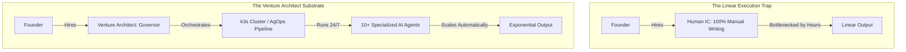

The most important, make-or-break decision a startup founder ever makes is the **First Engineering Hire**. 

In the pre-AI era, the standard advice was simple: find a "Full-Stack Rockstar" who can write code faster than they can talk, who will work 80 hours a week, and who can churn out features in Node.js or React without needing spec documents or design meetings.

But as we sit here in May 2026, that traditional advice is not just outdated; it is a direct recipe for building an expensive, slow-moving, and linear-growth department. 

In an AI-augmented startup, your first engineering hire should absolutely not be a "Writer of Code." They should be a **Governor of Outcomes**—a **Venture Architect**.

## The Execution Trap vs. The Exponential Factory

If your first technical hire is a brilliant Individual Contributor (IC) who spends 100% of their time manually writing syntax, typing code, and managing database migrations, you have built a massive, structural bottleneck directly into the center of your company. 

Every single time you need to scale your operations, add a new integration, or launch a sister feature, that human IC will run out of hours. To scale, you will have to hire another IC, and then another. 

Before you know it, you have built a traditional, high-overhead 20th-century factory where productivity is strictly bounded by human headcount.

The real opportunity of 2026 is to build an **Exponential Factory**. 

This is a model where human headcount remains extremely lean while output scales exponentially. You achieve this by hiring a technical leader who does not measure their value by the lines of code they write, but by the efficiency and reliability of the automation they govern.

## The First Hire: The Venture Architect

The ideal first hire in the agentic era is a **Venture Architect**. 

This is a senior technical professional—think a seasoned Staff Engineer, a Principal Architect, or a hands-on VP of Engineering—who has the [Domain Expertise](./knowledge-work-and-ai.md) to know exactly *what* to build, and the [Judgment](./forty-years-of-engineering-transitions.md) to know *how* it should be governed.

A Venture Architect does not sit in a corner churning out raw React boilerplate. Instead, they design and manage the **Substrate** that powers your entire company:

### 1. Orchestrating the Machine

They set up the lightweight, [Kubernetes-based lab](./docker-compose-to-kubernetes-migration.md) and the [AgOps frameworks](./ai-agent-governance-over-tools.md) that allow autonomous AI agents to handle the mechanical drudgery of software development. 

They establish the deployment pipelines, container registries, and environment configurations so that agents can build and test software autonomously.

### 2. Defining the Guidance

They spend their time writing high-fidelity, machine-readable [Behavioral Guidance](./beyond-system-prompt-behavioral-guidance.md) specifications. 

They define the API boundaries, security constraints, database structures, and styling guides that ensure your autonomous agent teams stay perfectly aligned with your business goals, producing uniform, high-quality code.

### 3. Exercising Quality Gates

They act as the final, authoritative checkpoint. They do not waste time reviewing syntax spacing or basic compiler errors—they let the agent teams self-correct. 

Instead, they focus on reviewing high-level architectural alignment, system security, and product-market fit, signing off on merges only when the automated quality gates are satisfied.

## One Hire, Ten Agents

A single Venture Architect, augmented by an [orchestrated agent team](./ai-agent-teams-vs-individual-assistants.md), can deliver the raw operational output of a traditional 10-person engineering department. 

For a startup founder, this represents an incredible competitive advantage:
- **Radical Burn Rate Reduction**: You are paying one premium salary instead of ten mid-level salaries plus benefits.
- **Extreme Velocity**: AI agents execute tasks in minutes, running 24/7 without timezone lag or developer fatigue.
- **M&A-Ready Standards**: Because your Venture Architect enforces strict, automated standards from day one, your codebase is built with enterprise-grade [M&A-ready standards](./building-for-acquisition-due-diligence.md). It is clean, documented, and fully ready for technical due diligence.

## The Mentor's Advice

If you are a founder launching a company in 2026, don't hire a coder and build a department. Hire a **Venture Architect** and build an **Empowerment Engine**.

If you start with a governor of outcomes, you aren't just building a software product; you are building a scalable, automated enterprise that you can actually control, defend, and scale to heights that were completely impossible just a few short years ago.

---

*I help founders identify, recruit, and mentor the 'Venture Architects' they need to lead their AI-driven engineering teams.*
