If you’ve been following my series on [Zero-Dollar Infrastructure](./zero-dollar-infrastructure-stack.md), you know that I’m a firm believer in building for resilience from day one. But "resilience" doesn't mean "expensive."

In our self-hosted AI lab, we’ve standardized on a specific unit of compute: the **Three-Node Kubernetes Cluster**. 

To a cloud-native purist, three nodes might sound like a "toy." But in 2026, for a two-person team managing production AI agents, those three nodes represent **Minimum Viable Production (MVP)**. It is the smallest footprint that delivers the core promise of Kubernetes: self-healing infrastructure that stays up when the world (or your hardware) goes down.

## Why Three? (The Power of Quorum)

In distributed systems, the number three is magic because it is the smallest odd number greater than one. 

When you run a distributed database (like our [Rook-Ceph](./open-source-ai-landscape-2026.md) storage) or a control plane (like the Kubernetes `etcd` store), the system needs to reach a **Quorum**—a majority vote on the state of the truth. 

- **One Node**: No resilience. If the node dies, you’re down.
- **Two Nodes**: No quorum. If one node dies, the survivor has 50% of the vote. It doesn't know if it’s the winner or if it’s been "partitioned" from the truth. The system freezes to protect data integrity.
- **Three Nodes**: True High Availability (HA). If one node fails (a power supply pops, a memory stick fails, or you just want to upgrade the OS), the other two form a majority. The system remains operational, the [Durable Workflows](./durable-execution-ai-agents.md) continue, and your business stays live.

## Surviving the "3 AM Alarm"

The real value of a three-node cluster isn't "scaling to a million users." it's **surviving a Saturday night**.

I’ve spent 40+ years in this industry. I’ve lived through enough 3 AM on-call alarms to know that "manual intervention" is a failure state. By using a three-node K8s cluster on our AMD mini-PCs, we’ve effectively eliminated the hardware alarm.

If Node 1 locks up at 2 AM, Kubernetes notices. It sees that the [Agentic Orchestrator](./multi-agent-coordination-management-challenge.md) and the [Reasoning Models](./running-llms-locally-2026.md) that were running on Node 1 are now gone. It immediately reschedules those pods onto Node 2 and Node 3. 

The system heals itself. I sleep through the night. I fix the hardware on Monday morning over coffee. That is "Minimum Viable Production."

```mermaid
flowchart TD
    subgraph Cluster[Three-Node K8s Cluster]
        N1[Node 1: Master/Worker]
        N2[Node 2: Master/Worker]
        N3[Node 3: Master/Worker]
    end
    
    A[Task Request] --> B{MetalLB / Ingress}
    B -->|Health Check| Cluster
    N1 -->|Fails| C[Self-Healing Triggered]
    C -->|Reschedule| N2
    C -->|Reschedule| N3
    
    style N1 fill:#1e1e2e,stroke:#ef4444
    style N2 fill:#1e1e2e,stroke:#10b981
    style N3 fill:#1e1e2e,stroke:#10b981
```

## The Hardware Economics

In 2026, building this "MVP Production" environment is cheaper than a single month of mid-tier AWS fees. 

We use three AMD Ryzen AI mini-PCs. Each has a 50+ TOPS NPU, 64GB of RAM, and a quiet form factor. We’ve configured them as a unified cluster using **RKE2** (a production-grade, security-hardened K8s distribution). 

- **Capital Expense**: ~$1,800 total (one-time).
- **Monthly OpEx**: ~$15 (electricity).
- **Resilience**: Can lose any 1 node without downtime.

Compare that to a "Single Instance" cloud setup that costs $500/month and has zero hardware resilience. The math isn't just about saving money; it’s about **Risk Management**.

## The Bottom Line

If you are a startup leader in 2026, don't build on a single "snowflake" server. And don't wait until you're "big enough" to need a cloud architect.

Start with three nodes. Use a production-grade K8s distribution. Bake your resilience into the foundation. It is the only way to build an autonomous business that is truly autonomous—one that doesn't require you to be its full-time mechanic.

---

*40+ years of engineering has taught me that infrastructure is like a foundation: it's much harder to fix once the house is built. Start with three nodes. Build for the failure that is coming. Your future self (at 3 AM) will thank you.*
