By February 2026, the industry has seen enough "Agentic Breaches" to finally get serious about security. 

We’ve seen agents that were given unrestricted access to a shell and then "hallucinated" a `rm -rf /` command to fix a disk space issue. We’ve seen agents with "Database Access" that inadvertently exposed PII data because they weren't restricted to a specific schema. 

In [Article #1](./ai-agent-governance-over-tools.md), I argued that the most-starred GitHub project in history taught us that ecosystem breadth without a trust model is a liability. Nowhere is this more true than in **Tool Governance**.

## The Problem: The "All-Access" Agent

Most AI agent platforms are built with a "Capability First" mindset. The goal is to make the agent as powerful as possible. They give the agent a "Toolkit" that includes everything from web searching to code execution to database querying.

But in the enterprise, an "All-Access" agent is a ticking time bomb. 

If you’ve spent 40+ years in this industry, you know the principle of **Least Privilege**. A user (or a process) should only have the minimum level of access required to perform its job. Why should we treat our AI agents any differently?

## The Solution: Strict Tool Allowlisting

When we built [Kaigents](https://github.com/jensjohansen/kaigents), we made Tool Allowlisting a first-class feature of the infrastructure. 

In Kaigents, an agent doesn't "choose" its tools from a global library. Instead, the [Operational Steward](./multi-agent-coordination-management-challenge.md) defines a **Strict Policy** for each agent. This policy explicitly allowlists the specific tools—and the specific parameters—the agent is authorized to use.

### The "Sourcing Agent" Example:
- **Allowlisted**: `search_suppliers`, `analyze_tariffs`, `generate_summary`
- **Blocked**: `execute_shell`, `write_to_db`, `access_customer_data`

If the agent’s reasoning engine tries to call `execute_shell` to "debug a connection issue," the Kaigents execution plane blocks the call and records a [Governance Alert](./ai-agent-observability.md) in the audit trail. The agent is forced to stay within its defined boundaries.

```mermaid
flowchart TD
    A[Agent Reasoning] --> B{Tool Gateway}
    B -->|Allowlisted| C[Execute Tool]
    B -->|Blocked| D[Record Governance Alert]
    D --> E[Human-in-the-Loop]
    C --> F[Return Result]
    
    style B fill:#1e1e2e,stroke:#3b82f6,stroke-width:2px
    style D fill:#1e1e2e,stroke:#ef4444,stroke-width:2px
```

## Why This is the Key to Compliance

For any organization pursuing **SOC 2 or ISO 27001**, Tool Allowlisting isn't just a security feature; it’s a compliance requirement. 

You must be able to prove to an auditor that your autonomous systems are governed. You must show that you have control over what the agents can touch and how they can touch it. A versioned, allowlisted policy file in a [GitOps workflow](./gitops-for-small-teams-2026.md) is the "Proof of Governance" that auditors look for.

## The Bottom Line

Tool Allowlisting is unglamorous. It doesn't make for a "cool demo." But it is the unglamorous work that makes enterprise AI possible. 

If your AI platform doesn't give you granular control over tool access, it isn't ready for your production data. Stop giving your agents the "Keys to the Kingdom." Give them an allowlist. It’s the only way to build a business that is both intelligent and safe.

---

*40+ years of engineering has taught me that the most dangerous bugs are the ones you gave permission to exist. Don't let your agents have more authority than your junior engineers. Lock down your tools, and you'll sleep better at night.*
