By February 2026, the "Year of the Pilot" (2025) has given way to the "Year of the Reality Check." 

According to recent industry data, nearly 90% of AI agent pilots never make it to production. Most of these initiatives follow a predictable path: the Proof of Concept (POC) is a smashing success, leadership is impressed, the project is greenlit, and then... it stalls. It hits a wall of edge cases, silent failures, and unmanageable complexity.

I’ve spent 40+ years in software engineering, much of it in technical turnarounds. I’ve seen this exact pattern repeat across every major technology cycle—from client-server to cloud to mobile. The names of the tools change, but the reason the POC fails in production is always the same.

**The POC was built for the 'Happy Path.' Production is a 'Messy Reality.'**

## The Fragility of the Demo

A POC is usually a "well-engineered simple solution" (as one of my former colleagues put it) that works perfectly for a narrow set of inputs. It’s designed to show *possibility*. 

In an AI agent context, a POC usually has:
- **Clean Inputs**: Curated documents or mock data.
- **Patient Stakeholders**: People who are willing to ignore a slow response or a minor hallucination.
- **Manual Oversight**: A developer standing by to "nudge" the agent if it gets stuck.

Production has none of these things. Production has real customer data (which is always messier than you think), adversarial inputs, strict SLAs, and the expectation that the system will behave correctly at 2 AM on a Saturday when no one is watching.

## The Three Walls of Production

When you try to move that "Happy Path" agent into production, you hit three walls:

### 1. The Observability Wall
In a POC, you can "look at the logs." In production, you need [Durable Observability](./ai-agent-observability.md). You need to know not just what the agent did, but *why* it did it, which tool it used, and where the reasoning drift started. If you can't see the path of reasoning, you can't trust the output.

### 2. The Governance Wall
A POC can play fast and loose with [Tool Governance](./ai-agent-governance-over-tools.md). In production, an agent with access to your shell or your database is a security risk. You need explicit tool allowlisting, behavioral guidance, and quality gates that are baked into the infrastructure, not added as an afterthought.

### 3. The State Wall
Most POCs are "stateless." They handle a single prompt and return a single result. But real work is a [Durable Workflow](./durable-execution-ai-agents.md) that might take days. If your agent loses its state because a pod restarted or an API timed out, the production deployment fails.

```mermaid
flowchart TD
    A[POC Success] --> B{Production Wall}
    B -->|Silent Failures| C[Trust Collapse]
    B -->|State Loss| D[Process Failure]
    B -->|Security Gaps| E[Governance Breach]
    C --> F[Project Stalls]
    D --> F
    E --> F
    
    style B fill:#1e1e2e,stroke:#ef4444,stroke-width:2px
    style F fill:#1e1e2e,stroke:#ef4444,stroke-width:2px
```

## The "Turnaround" Fix: Engineering Discipline

When I’m called in to fix a "stalled" AI project, my advice is always the same: **Stop building 'AI' and start building 'Software.'**

The reason I’ve had success in turnarounds is that I insist on the same engineering discipline that has made software reliable for generations:
- **Simple Architectures**: Shrink the process and the tech stack until you can actually reason about it.
- **Repeatable Processes**: Use PRDs, Technical Designs, and Implementation Plans to define the "Future State" before you write a single line of code.
- **Quality by Design**: Build the quality gates and the audit trails into the platform itself, as we’ve done with [Kaigents](https://github.com/jensjohansen/kaigents).

## The Bottom Line

A successful AI agent in production isn't a "smarter" version of your POC. it's a **disciplined** version of it. 

If you want to close the gap between your demo and your deployment, stop looking for a more powerful model. Start looking at your management controls, your observability, and your durable state. The magic is in the engineering, not the LLM.

---

*40+ years of engineering has taught me that 'simple and well-engineered' is the only thing that scales. In the agentic era, that's the difference between a project that stalls and a project that transforms your business.*
