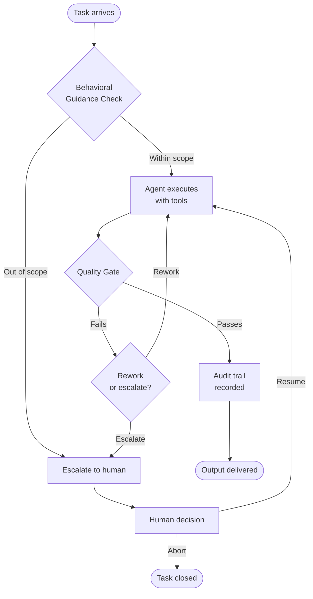

By the time January 2026 arrived, the numbers were striking enough to pause on. According to McKinsey, 45% of Fortune 500 companies had autonomous AI agents running in production — up from 8% just a year earlier. At the same time, research from Digital Applied found that 88% of AI agent pilots never make it to production at all.

Those two statistics exist simultaneously. Adoption is accelerating sharply. And most efforts are still failing to cross the line.

The gap between those numbers is not a technology story. It is a management story. Understanding it starts with getting clear on what we actually mean when we say "autonomous AI agent."

## What "Autonomous" Actually Means — and What It Doesn't

The word autonomous tends to make people nervous. The cultural baggage it carries — AI that sets its own goals, operates outside human control, optimizes for objectives we didn't intend — is a real concern in some research contexts. But it is not what we are talking about when we discuss autonomous AI agents in enterprise settings.

An autonomous AI agent, as the term is used in production systems today, is a software process that executes defined tasks using AI reasoning, tools, and judgment — within explicitly defined boundaries — without requiring a human to manually trigger each individual step.

The "autonomous" part means it runs on its own schedule, reacts to inputs, and makes decisions within its scope without waiting for someone to click a button. It does not mean it decides its own goals, expands its own authority, or operates without oversight. Those are design failures, not features.

The better mental model is a well-managed team member with a specific job description, defined tools, performance expectations, and a clear escalation path for decisions outside their authority. The management controls that make a human team member reliable are the same controls that make an AI agent reliable. The technology is different. The management principles are not.

## What Actually Changed Between 2024 and 2026

For most of 2023 and 2024, AI agents were primarily a research and experimentation topic. Teams built impressive proofs of concept. Demos ran in controlled environments with curated inputs. The results were genuinely exciting. But production stayed out of reach for most organizations.

What changed in 2025 and accelerated into 2026 was the maturation of the infrastructure layer — the plumbing that makes agents reliable enough to trust with real work. IBM launched enterprise-grade agentic AI for governance and compliance. Salesforce shipped Slackbot as a production personal agent for work. Elastic announced general availability of Agent Builder with enterprise data context. These were not betas or previews. They were generally available products backed by production SLAs.

The vocabulary shifted with them. Orchestration, durable execution, human-in-the-loop, audit trails — these terms moved from research papers into enterprise procurement conversations. That vocabulary shift matters because it signals that the conversation moved from "can we build this?" to "how do we govern this?"

## Why 88% of Pilots Still Fail

Given that infrastructure, why are nearly nine out of ten pilots still failing to reach production?

The answer, consistently, is not the model and not the tools. It is the absence of the management layer that sits above them.

A proof of concept runs in a controlled environment with clean inputs, patient stakeholders, and a developer standing by to handle anything unexpected. Production does not offer those conditions. Production has real customer data, adversarial inputs, compliance requirements, and the expectation that the system will behave correctly at 2 AM on a Saturday when no one is watching.

What is missing in most failed pilots is not better AI. It is:

**Behavioral guidance** — a clear, versioned specification of what each agent is supposed to do and, equally important, what it is not supposed to do. A system prompt is a starting point, not a governance artifact.

**Quality gates** — defined criteria for when an agent's output is good enough to proceed, with a structured path when it isn't. Human approval for high-stakes decisions. Automated checks for structural correctness. Not as overhead, but as the same quality assurance discipline that software engineering learned over 40 years.

**Audit trails** — a complete record of every tool invocation, every model call, every human approval decision. Not for bureaucracy, but for the moment when something goes wrong and you need to understand what happened.

**Escalation design** — explicit logic for when the agent should stop and ask for human judgment rather than proceeding. An agent that never escalates is not capable. It is overconfident.

These are not new ideas. They are standard management controls, applied to a new kind of team member.

## The Frame That Changes Everything

The organizations that successfully moved AI agents from pilot to production in 2025 shared a common framing: they treated it as a management challenge, not a technology challenge.

They asked: *Who owns this agent's behavior? Who reviews its outputs? Who is responsible when it makes a mistake?* They defined job descriptions for their agents — explicit behavioral guidance — the same way they would for a new hire in a regulated role. They built quality gates the same way a software team builds a CI/CD pipeline: not because they distrust the developer, but because structured checkpoints produce better outcomes than hoping everything worked.

Critically, they did not try to replace their existing teams with AI agents. They used AI agents to extend what their existing teams could accomplish. The customer support team handled more volume. The engineering team reviewed more code. The operations team monitored more systems. The humans stayed in the roles that required judgment, context, and accountability. The agents handled the execution work that followed clear process definitions.

## The Process Insight Worth Building On

There is a useful design principle that emerges from organizations doing this well: **the best processes are not "AI processes" or "human processes." They are well-defined processes that can be executed by either.**

If a process is well enough documented, well enough specified, and well enough governed that an AI agent can run it reliably, then it is almost certainly also well enough structured for a new human team member to learn it quickly. The discipline of making a process agent-ready — clear inputs, defined decision criteria, explicit escalation points, measurable outputs — is the same discipline that makes a process transferable, auditable, and improvable.

Looked at this way, the work of deploying AI agents is partly the work of improving your processes. The agent can run the process once it is well-defined. The human team members are freed to focus on the work that requires judgment, creativity, and the kind of contextual understanding that process documentation cannot fully capture.

One artifact pattern I've found consistently valuable: treating each project as requiring five documents before implementation begins — a Product Requirements Document, a Technical Design, an Implementation Plan, a Testing Plan, and a Definition of Done with coding standards. Those documents serve a purpose beyond the usual planning value: they create a shared, explicit understanding of scope that applies equally to human engineers and AI agent contributors. The AI doesn't need to guess at intent. The human doesn't need to translate informal expectations into formal standards partway through delivery. Both contributors work from the same specification, and the result is measurably less rework.

## What January 2026 Actually Felt Like From the Inside

I should say something about this from lived experience, not just as analysis.

Entering January 2026, I had spent the previous two months in a frustrating cycle. The models were capable — genuinely impressive on individual tasks — but the workflow around them was fragile. Every hand-off required re-establishing context. Outputs needed significant correction. The overhead of managing the AI collaboration was eating into the productivity gains. There was a lot of rework. There was also — I'll be honest — a fair amount of swearing.

What changed in January was partly the models themselves. Moving from earlier GPT releases to GPT-5.2 and GPT-5.3, and incorporating open-weight models like GPT-OSS 20B and Qwen3 Coder 30B Instruct, produced a noticeable shift in collaborative quality. The models followed complex, multi-step instructions more reliably. They held context across longer exchanges. They were less likely to confidently produce wrong answers and more likely to flag uncertainty.

But the bigger change was the tooling around them. Tools like Windsurf, Cursor, and Kilo Code quietly got better at autonomous operation during this period — not dramatically, but meaningfully. The gap between "AI that can answer questions" and "AI that can execute a defined workflow" narrowed in a way that made the per-project documentation discipline pay off much more clearly.

By the end of January, the combination — better models, better tools, and a consistent project structure — had reduced rework substantially. The AI agent contributors were working from the same specifications as the human contributors, producing outputs that required less correction, and escalating appropriately when something was outside the defined scope. The management process had caught up with the technology.

That experience is what convinces me the management question is not secondary to the technology question. It is prior to it.

## Looking Back From Here

Writing this in early 2026, it is clear that the transition happened. Autonomous AI agents moved from demo to department in 2025 for a meaningful fraction of enterprises — and the pace is accelerating.

What also became clear is that the organizations struggling most are not struggling because the technology failed them. They are struggling because they approached agent deployment as a technology project and discovered, often the hard way, that it is also a management project.

The good news is that the management tools required are not exotic. Standard controls, standard metrics, standard monitoring, standard escalation paths. The same discipline that has made human teams reliable for generations, applied to a new kind of team member.

The agents are ready for production when your management processes are.

---

*I've spent 40+ years building software systems and engineering teams. The patterns I see in AI agent failures are recognizable — they are the same patterns that produce unreliable human teams. [Kaigents](https://github.com/jensjohansen/kaigents) is my attempt to make the management layer a first-class part of the AI agent platform, not an afterthought.*
