If you look at the pitch decks of the 2023-2024 AI wave, you’ll see a common line item: "Infrastructure & Compute." For most startups, this meant burning 40% of their seed round on GPU credits and SaaS subscriptions. They were building on rented land, paying "success taxes" to cloud providers before they even found product-market fit.

In January 2026, we’ve flipped the script. 

We are running a production-grade AI agent platform that would have cost $500,000 a year in 2024 cloud fees—and our monthly software bill is exactly $0. Our secret isn't a massive engineering team. It’s a "Two-Person" team: one senior human engineer and one autonomous AI agent (Zencoder.ai).

Together, we’ve built the **Enterprise Infrastructure on a Shoestring**.

## The New "Two-Person" Team

When I say "Two-Person Startup," I’m not being metaphorical. In early 2026, the unit of productivity has shifted. A seasoned engineer with 40+ years of experience, paired with a sophisticated AI agent that can implement technical designs, plan workflows, and manage SecOps, can outperform an entire traditional department.

We don't spend our time on "plumbing." We delegate the plumbing to the agent. While I focus on the high-level strategy and the [Kairon Retail](./temu-playbook-collapse.md) business model, the agent is managing our Kubernetes clusters, running our security scans, and optimizing our [Lemonade Server](./choosing-on-premises-llms.md) inference.

## The Shoestring Stack: $0 Software, $0 Cloud

How do you achieve enterprise-grade resilience for the cost of a few lunches? You embrace the hardware you own and the software the world built for you.

### 1. The Hardware: AMD Mini-PCs
Instead of renting H100s for $40/hour, we built a local Kubernetes cluster on AMD Ryzen AI mini-PCs. These tiny, power-efficient nodes give us the NPU and GPU horsepower to run 20B and 30B models locally. Our capital expense was a few thousand dollars—once. Our monthly cost is just the electricity.

### 2. The Orchestration: Kubernetes + Kaigents
We don't pay for managed K8s or proprietary agent platforms. We use open-source Kubernetes to achieve self-healing resilience and our own [Kaigents](https://github.com/jensjohansen/kaigents) platform to manage the agentic workloads. If a pod crashes at 2 AM, Kubernetes fixes it. If a sourcing workflow hangs, Temporal (inside Kaigents) ensures it resumes.

### 3. The "Invisible Office" of OSS
We’ve replaced $15,000/month in SaaS tools with an integrated suite of open-source "Hidden Gems":
- **Identity**: Keycloak (Free) instead of Okta ($1,500/mo)
- **Monitoring**: Prometheus & Grafana (Free) instead of Datadog ($2,000/mo)
- **SecOps**: DefectDojo & Ciso Assistant (Free) instead of enterprise GRC tools ($5,000/mo)
- **Storage**: Rook-Ceph (Free) instead of AWS EBS/S3 ($1,000/mo)

```mermaid
graph TD
    A[Human + AI Team] --> B[AMD Mini-PC Cluster]
    B --> C[Kubernetes]
    C --> D[Kaigents Platform]
    D --> E[Product: Kairon Retail]
    D --> F[Product: Engineering Advisory]
    D --> G[Product: MindTheStore.ai]
    
    style B fill:#1e1e2e,stroke:#eab308,stroke-width:2px
    style D fill:#1e1e2e,stroke:#10b981,stroke-width:2px
```

## Why This is the Ultimate Moat

The biggest risk for an AI startup in 2026 isn't competition; it's **Burn Rate**. 

When your infrastructure cost is $0, you have an infinite runway. You can afford to experiment, to pivot, and to wait for the right market moment. You don't have to raise a "bridge round" just to pay your GPU bill.

But there’s a second moat: **IP Sovereignty**. Because our entire stack runs in our own lab, our data and our code never leave our control. We aren't training our competitors' models with our prompts. We own our intelligence from the silicon up.

## The Bottom Line

If you are a two-person team in 2026, you have more power than a Series B startup had in 2024—if you know how to use the tools.

Stop asking for "GPU Credits." Start building your own lab. Embrace the "Human + AI" partnership, automate your plumbing with Kubernetes, and protect your margins with open source. The $0 infrastructure stack isn't just a cost-saving measure; it’s the foundation of a dignified, sustainable business.

---

*40+ years in this industry has taught me that the most resilient businesses are the ones that own their tools. In the AI era, that's more true than ever. If you're building for the future, don't rent it—own it.*
